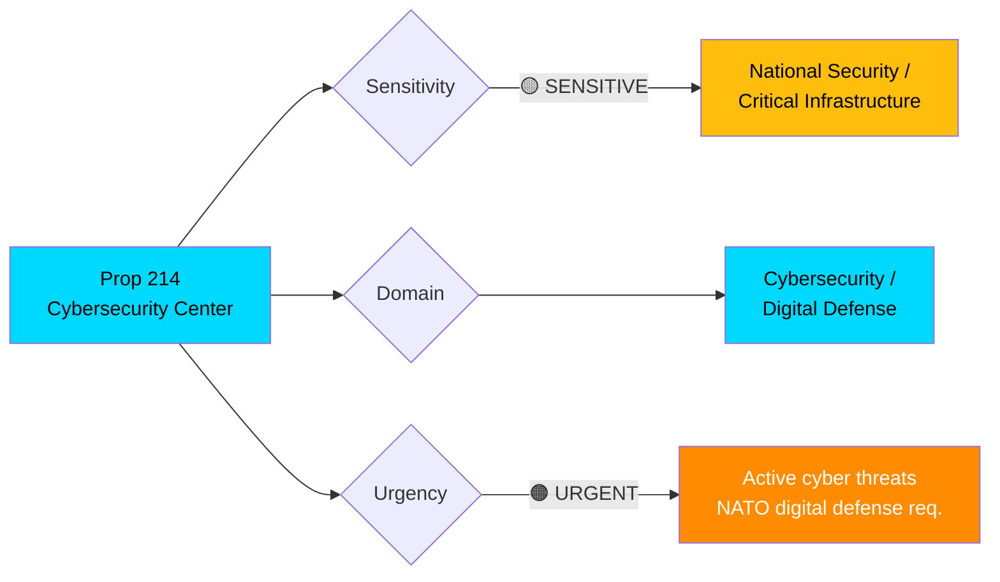
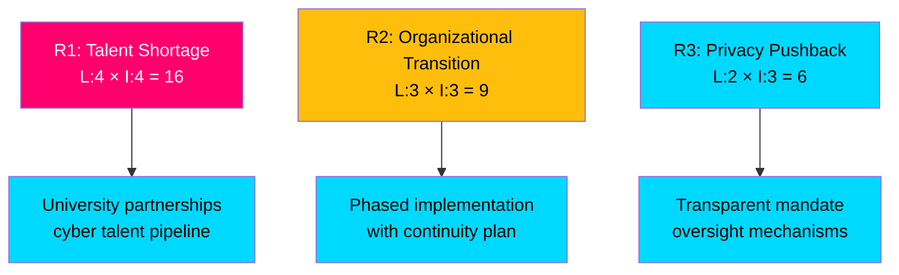

# 🔍 Per-File Political Intelligence Analysis: HD03214

**📋 Document Owner:** CEO | **📄 Version:** 2.1 | **📅 Last Updated:** 2026-04-03 14:16 UTC
**🏢 Owner:** Hack23 AB (Org.nr 5595347807) | **🏷️ Classification:** Public

---

## 📋 Document Identity

| Field | Value |
|-------|-------|
| **Document ID** | `HD03214` |
| **Document Type** | `propositions / prop` |
| **Title** | Lagändringar för ett stärkt nationellt cybersäkerhetscenter |
| **Date** | 2026-04-01 |
| **Riksmöte** | 2025/26 |
| **Responsible Ministry** | Försvarsdepartementet |
| **Responsible Minister** | Carl-Oskar Bohlin (M) |
| **Prime Minister** | Elisabeth Svantesson (M) |
| **Assigned Committee** | FöU (Försvarsutskottet) |
| **Source MCP Tool** | `get_propositioner`, `get_dokument` |
| **Analysis Timestamp** | 2026-04-03 14:16 UTC |
| **Analyst** | news-realtime-monitor |

---

## 🎯 Executive Summary

Proposition 2025/26:214 proposes legislative changes to strengthen Sweden's national cybersecurity center, addressing growing digital threats to critical infrastructure. Minister Carl-Oskar Bohlin (M) presents this under the Defense Ministry, reflecting the securitization of cyber policy. Published alongside the SEK 8.7B GUTE II air defense deal and FöU12 civilian protection report, this forms a comprehensive defense modernization triad: kinetic defense (GUTE II), civilian resilience (FöU12), and digital defense (Prop 214). The proposition will be handled by FöU, enabling coordinated committee consideration of defense-related legislation. **[HIGH]**

---

## 📊 Political Classification

---

## 💼 SWOT Analysis

### ✅ Strengths

| # | Strength Statement | Evidence (dok_id) | Confidence | Impact | Entry Date |
|---|-------------------|-------------------|:----------:|:------:|:----------:|
| S1 | Centralizes cybersecurity authority, reducing coordination gaps between MSB, FRA, and military cyber units | HD03214 | H | H | 2026-04-01 |
| S2 | Forms defense modernization triad with GUTE II (kinetic) and FöU12 (civilian) — comprehensive approach | HD03214, gute-ii-defense-deal, HD01FöU12 | H | H | 2026-04-01 |
| S3 | Expected cross-party support — cybersecurity transcends traditional political divides | HD03214 | M | M | 2026-04-01 |

### ⚠️ Weaknesses

| # | Weakness Statement | Evidence (dok_id) | Confidence | Impact | Entry Date |
|---|-------------------|-------------------|:----------:|:------:|:----------:|
| W1 | Cybersecurity talent shortage in Sweden limits center's operational capacity | HD03214 | M | H | 2026-04-01 |
| W2 | Organizational restructuring may create temporary coordination gaps during transition | HD03214 | M | M | 2026-04-01 |

### 🚀 Opportunities

| # | Opportunity Statement | Evidence (dok_id) | Confidence | Impact | Entry Date |
|---|----------------------|-------------------|:----------:|:------:|:----------:|
| O1 | NATO Cooperative Cyber Defence Centre integration enhances collective digital defense | HD03214 | M | H | 2026-04-01 |
| O2 | Swedish tech industry expertise can be leveraged for public-private cyber defense partnerships | HD03214 | M | H | 2026-04-01 |

### 🔴 Threats

| # | Threat Statement | Evidence (dok_id) | Confidence | Impact | Entry Date |
|---|-----------------|-------------------|:----------:|:------:|:----------:|
| T1 | State-sponsored cyber attacks may outpace legislative/institutional response timelines | HD03214 | H | H | 2026-04-01 |
| T2 | Privacy concerns regarding expanded surveillance authorities within cybersecurity mandate | HD03214 | M | M | 2026-04-01 |

---

## ⚡ Risk Assessment

| Risk ID | Risk | Likelihood (1-5) | Impact (1-5) | Score | Mitigation |
|---------|------|:-----------------:|:------------:|:-----:|------------|
| R1 | Cybersecurity talent shortage limits center effectiveness | 4 | 4 | **16** | University partnerships, competitive salaries |
| R2 | Organizational transition creates temporary capability gaps | 3 | 3 | **9** | Phased implementation with overlap period |
| R3 | Privacy advocacy groups oppose expanded digital surveillance | 2 | 3 | **6** | Transparent oversight, constitutional safeguards |

---

## 👥 Stakeholder Impact

| Stakeholder Group | Impact | Key Concern | Evidence |
|-------------------|:------:|-------------|----------|
| **Citizens** | 🟢 Positive | Enhanced protection of digital infrastructure | HD03214 |
| **Government Coalition** | 🟢 Positive | Demonstrates modern security approach | Defense Ministry priority |
| **Opposition** | 🟢 Supportive | Cross-party consensus on cybersecurity | Historical bipartisan approach |
| **Business/Industry** | 🟢 Positive | Improved cyber threat intelligence sharing | Public-private partnership model |
| **International/NATO** | 🟢 Positive | Meets NATO digital defense obligations | NATO Cooperative Cyber Defence |
| **Judiciary** | 🟡 Monitoring | Expanded authorities require legal oversight | Constitutional proportionality |
| **Civil Society** | 🟡 Cautious | Privacy rights vs. security capabilities | Surveillance balance |
| **Media/Public Opinion** | 🟢 Positive | Public awareness of cyber threats drives support | Ransomware/attack publicity |

---

## 🔮 Forward Indicators

| # | Indicator | Trigger | Timeline | Confidence |
|---|-----------|---------|----------|:----------:|
| F1 | FöU committee schedules hearing on Prop 214 | Committee announcement | April-May 2026 | H |
| F2 | Coordinated FöU consideration with GUTE II oversight | Committee calendar | Q2 2026 | M |
| F3 | Cybersecurity center operational launch | Government announcement | 2027 | M |
| F4 | First NATO cyber defense exercise with strengthened Swedish participation | Defense Ministry | 2026-2027 | M |

---

## 📎 Cross-References

- **gute-ii-defense-deal**: Kinetic defense complement — together form comprehensive defense triad
- **HD01FöU12**: Civilian protection — physical resilience complement to digital resilience
- **HD03228**: Arms export rules — defense industry regulatory modernization
- Defense Minister Pål Jonson USA visit — bilateral cyber defense cooperation potential

---

**Document Control:** Analysis by news-realtime-monitor | 2026-04-03 14:16 UTC | Classification: Public
