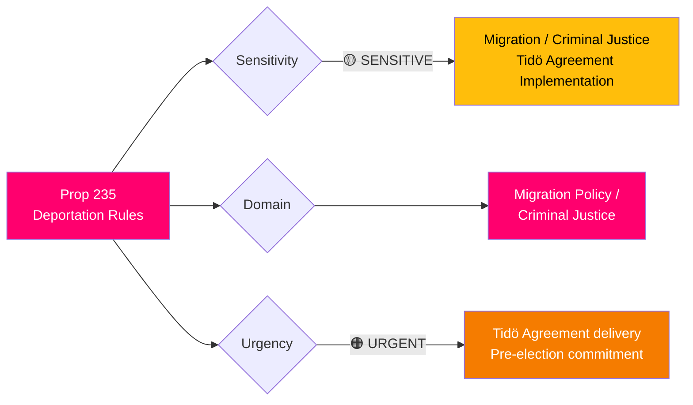
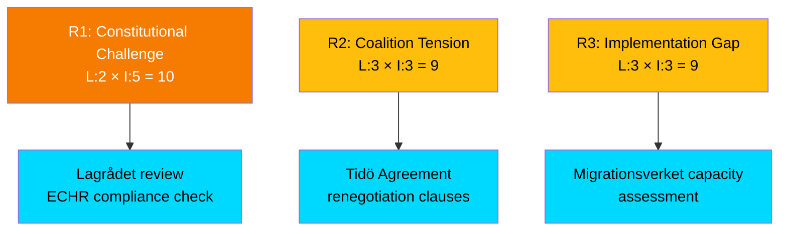

# 🔍 Per-File Political Intelligence Analysis: HD03235

**📋 Document Owner:** CEO | **📄 Version:** 2.1 | **📅 Last Updated:** 2026-04-03 14:16 UTC
**🏢 Owner:** Hack23 AB (Org.nr 5595347807) | **🏷️ Classification:** Public

---

## 📋 Document Identity

| Field | Value |
|-------|-------|
| **Document ID** | `HD03235` |
| **Document Type** | `propositions / prop` |
| **Title** | Skärpta regler om utvisning på grund av brott |
| **Date** | 2026-04-01 |
| **Riksmöte** | 2025/26 |
| **Responsible Ministry** | Justitiedepartementet |
| **Responsible Minister** | Johan Forssell (M) |
| **Prime Minister** | Elisabeth Svantesson (M) |
| **Assigned Committee** | SfU (Socialförsäkringsutskottet) |
| **Source MCP Tool** | `get_propositioner`, `get_dokument` |
| **Analysis Timestamp** | 2026-04-03 14:16 UTC |
| **Analyst** | news-realtime-monitor |

---

## 🎯 Executive Summary

Proposition 2025/26:235 proposes stricter deportation rules for convicted foreign nationals, a key component of the Tidö Agreement between M, KD, L, and SD. Minister Johan Forssell (M) brings this to Riksdagen as part of the coalition's migration-criminal justice policy nexus. The proposition is assigned to SfU, signaling its social insurance/migration dimensions. This represents one of the most politically charged legislative proposals of the 2025/26 session, directly implementing SD's core policy demands within the Tidö coalition framework. **[HIGH]**

---

## 📊 Political Classification

---

## 💼 SWOT Analysis

### ✅ Strengths

| # | Strength Statement | Evidence (dok_id) | Confidence | Impact | Entry Date |
|---|-------------------|-------------------|:----------:|:------:|:----------:|
| S1 | Delivers on core Tidö Agreement commitment, strengthening coalition cohesion between M, KD, L, and SD | HD03235 | H | H | 2026-04-01 |
| S2 | Consolidates government's "law and order" legislative track with parallel criminal justice proposals | HD03235, HD03227, HD01JuU15 | H | H | 2026-04-01 |

### ⚠️ Weaknesses

| # | Weakness Statement | Evidence (dok_id) | Confidence | Impact | Entry Date |
|---|-------------------|-------------------|:----------:|:------:|:----------:|
| W1 | May face constitutional scrutiny regarding proportionality of stricter deportation thresholds | HD03235 | M | H | 2026-04-01 |
| W2 | L (Liberals) historically cautious on migration restrictions — potential intra-coalition tension | HD03235, Tidö Agreement context | M | M | 2026-04-01 |

### 🚀 Opportunities

| # | Opportunity Statement | Evidence (dok_id) | Confidence | Impact | Entry Date |
|---|----------------------|-------------------|:----------:|:------:|:----------:|
| O1 | Bipartisan support possible — S has signaled openness to stricter deportation in recent rhetoric | HD03235 | M | H | 2026-04-01 |

### 🔴 Threats

| # | Threat Statement | Evidence (dok_id) | Confidence | Impact | Entry Date |
|---|-----------------|-------------------|:----------:|:------:|:----------:|
| T1 | ECHR compatibility challenge could delay implementation | HD03235 | L | H | 2026-04-01 |
| T2 | V and MP expected fierce opposition — may dominate media narrative | HD03235 | H | M | 2026-04-01 |

---

## ⚡ Risk Assessment

| Risk ID | Risk | Likelihood (1-5) | Impact (1-5) | Score | Mitigation |
|---------|------|:-----------------:|:------------:|:-----:|------------|
| R1 | Constitutional/ECHR legal challenge | 2 | 5 | **10** | Thorough Lagrådet review |
| R2 | L party internal resistance to strictest provisions | 3 | 3 | **9** | Tidö Agreement framework |
| R3 | Migrationsverket implementation capacity | 3 | 3 | **9** | Agency resource allocation |

---

## 👥 Stakeholder Impact

| Stakeholder Group | Impact | Key Concern | Evidence |
|-------------------|:------:|-------------|----------|
| **Citizens** | 🟡 Mixed | Public safety vs. integration concerns | HD03235 |
| **Government Coalition** | 🟢 Positive | Delivers Tidö Agreement commitment | Prop 235 ministerial ownership |
| **Opposition** | 🔴 Opposed | V, MP strongly against; S may support partly | Historical positions |
| **Business/Industry** | 🟡 Mixed | Labor market impact of deportations | Integration economics |
| **International/EU** | 🟡 Scrutiny | ECHR, EU migration law compliance | European legal framework |
| **Judiciary** | 🟡 Scrutiny | Courts must apply new thresholds; Lagrådet review | Constitutional law |
| **Civil Society** | 🔴 Concerned | Human rights organizations expected to challenge | NGO positions |
| **Media/Public Opinion** | 🟡 Mixed | Polarizing topic — high media interest | Public debate |

---

## 🔮 Forward Indicators

| # | Indicator | Trigger | Timeline | Confidence |
|---|-----------|---------|----------|:----------:|
| F1 | SfU committee deliberation and hearing schedule | Committee announcement | April 2026 | H |
| F2 | Lagrådet opinion on constitutional compliance | Formal referral | Q2 2026 | H |
| F3 | Opposition counter-motions in SfU | Motion deadline | Q2 2026 | H |
| F4 | Riksdag plenary vote on Prop 235 | Parliamentary calendar | Q3-Q4 2026 | M |

---

## 📎 Cross-References

- **HD03229**: En ny mottagandelag (New reception law) — parallel migration legislation
- **HD03215**: Tidsbegränsat boende för nyanlända — temporary housing for immigrants
- **HD01JuU15**: Criminal justice committee report — synergistic policy track
- **HD03227**: Youth crime investigation — parallel criminal justice proposition
- **HD03222**: Ersättningsregler med brottsoffret i fokus — victim-focused compensation

---

**Document Control:** Analysis by news-realtime-monitor | 2026-04-03 14:16 UTC | Classification: Public
