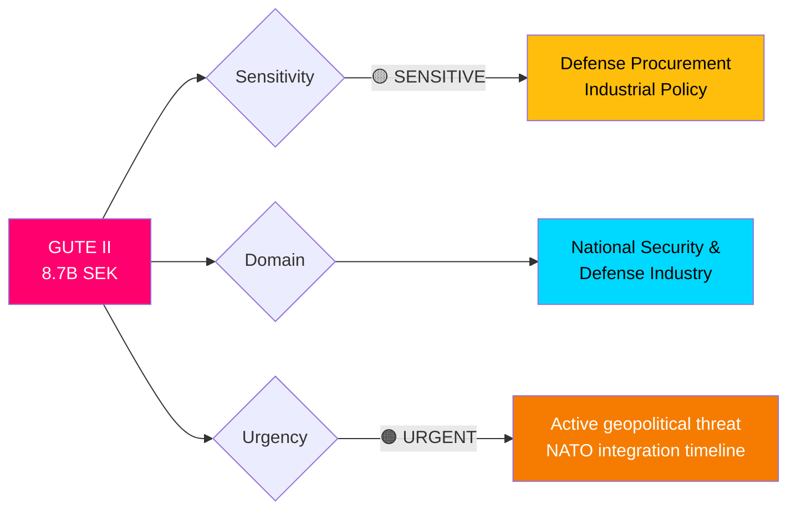
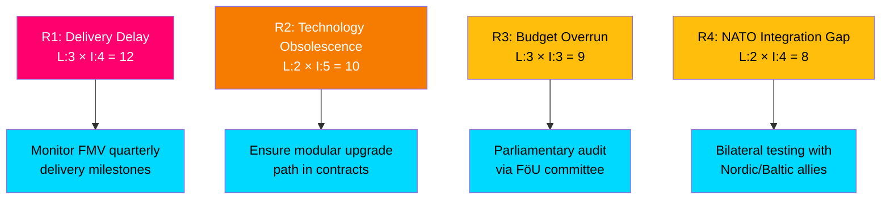

# 🔍 Per-File Political Intelligence Analysis: GUTE II Defense Deal

**📋 Document Owner:** CEO | **📄 Version:** 2.1 | **📅 Last Updated:** 2026-04-03 14:16 UTC
**🏢 Owner:** Hack23 AB (Org.nr 5595347807) | **🏷️ Classification:** Public

---

## 📋 Document Identity

| Field | Value |
|-------|-------|
| **Document ID** | `gute-ii-defense-deal` |
| **Document Type** | `government / pressmeddelanden` |
| **Title** | Luftvärnsavtal på 8,7 miljarder stärker Sveriges anti-drönarförmåga |
| **Date** | 2026-04-02 |
| **Riksmöte** | 2025/26 |
| **Source MCP Tool** | `search_regering`, `get_regering_document` |
| **Analysis Timestamp** | 2026-04-03 14:16 UTC |
| **Analyst** | news-realtime-monitor |

---

## 🎯 Executive Summary

Sweden's government announced SEK 8.7 billion in defense contracts for the GUTE II counter-UAS system, marking the largest single anti-drone procurement in Swedish history. The contracts with Saab, BAE Systems Bofors, SISU, and Nammo implement critical elements of the government's 15B SEK territorial air defense investment announced earlier. Defense Minister Pål Jonson (M) emphasized the urgency of air defense in the current geopolitical climate. This signals accelerated Swedish defense modernization as a NATO member, with deliveries planned for 2027-2028. **[HIGH]**

---

## 📊 Political Classification

| Classification | Value | Rationale |
|---------------|-------|-----------|
| **Sensitivity** | 🟡 SENSITIVE | Major defense procurement with industrial policy implications |
| **Domain** | National Security / Defense | Anti-drone capability for territorial defense |
| **Urgency** | 🟠 URGENT | Addresses active drone warfare threats (Ukraine conflict lessons) |
| **Temporal Scope** | Medium-term (2027-2028 delivery) | Implementation over 2 years |

---

## 💼 SWOT Analysis

### ✅ Strengths

| # | Strength Statement | Evidence (dok_id) | Confidence | Impact | Entry Date |
|---|-------------------|-------------------|:----------:|:------:|:----------:|
| S1 | Government demonstrates decisive defense investment with SEK 8.7B commitment, building credibility as NATO member | gute-ii-defense-deal | H | H | 2026-04-02 |
| S2 | Multi-vendor approach (Saab, BAE Systems Bofors, SISU, Nammo) diversifies supply chain and reduces single-vendor dependency | gute-ii-defense-deal | H | M | 2026-04-02 |
| S3 | GUTE II modular design enables both mobile and stationary deployment across the full conflict spectrum (peace to war) | gute-ii-defense-deal | H | H | 2026-04-02 |
| S4 | Domestic defense industry benefits significantly — Saab and BAE Bofors are Swedish-based manufacturers | gute-ii-defense-deal | H | M | 2026-04-02 |

### ⚠️ Weaknesses

| # | Weakness Statement | Evidence (dok_id) | Confidence | Impact | Entry Date |
|---|-------------------|-------------------|:----------:|:------:|:----------:|
| W1 | 2027-2028 delivery timeline means 1-2 year gap in counter-drone capability during heightened threat environment | gute-ii-defense-deal | H | H | 2026-04-02 |
| W2 | 8.7B of planned 15B territorial air defense means 6.3B still uncommitted — execution risk on remainder | gute-ii-defense-deal | M | M | 2026-04-02 |

### 🚀 Opportunities

| # | Opportunity Statement | Evidence (dok_id) | Confidence | Impact | Entry Date |
|---|----------------------|-------------------|:----------:|:------:|:----------:|
| O1 | NATO interoperability — GUTE II systems can integrate with allied air defense networks, strengthening collective security | gute-ii-defense-deal, HD03228 | M | H | 2026-04-02 |
| O2 | Swedish defense industry export potential — Saab and BAE Bofors gain domestic operational references for international sales | gute-ii-defense-deal, HD03228 | M | H | 2026-04-02 |

### 🔴 Threats

| # | Threat Statement | Evidence (dok_id) | Confidence | Impact | Entry Date |
|---|-----------------|-------------------|:----------:|:------:|:----------:|
| T1 | Escalating drone technology may outpace fixed procurement — adversary drones evolving faster than 2-year delivery cycle | gute-ii-defense-deal | M | H | 2026-04-02 |
| T2 | Budget pressure from competing social priorities (healthcare Prop 216, electricity support DS 2026) may squeeze future defense allocations | HD03216, elstöd DS | M | M | 2026-04-02 |

---

## ⚡ Risk Assessment

| Risk ID | Risk | Likelihood (1-5) | Impact (1-5) | Score | Mitigation |
|---------|------|:-----------------:|:------------:|:-----:|------------|
| R1 | Delivery delay beyond 2028 | 3 | 4 | **12** | FMV milestone monitoring, parliamentary FöU oversight |
| R2 | Drone technology outpaces GUTE II capabilities | 2 | 5 | **10** | Modular architecture allows sensor/effector upgrades |
| R3 | Budget overrun on 8.7B contract | 3 | 3 | **9** | Fixed-price components, FMV project management |
| R4 | NATO interoperability gaps | 2 | 4 | **8** | Joint exercises with Nordic allies |

---

## 👥 Stakeholder Impact

| Stakeholder Group | Impact | Key Concern | Evidence |
|-------------------|:------:|-------------|----------|
| **Citizens** | 🟢 Positive | Enhanced protection of critical infrastructure (nuclear plants, cities) | gute-ii-defense-deal: "kärnkraftverk, järnvägsknutar och städer" |
| **Government Coalition (M, KD, L + SD)** | 🟢 Positive | Defense credibility boost ahead of 2026 election year | Pål Jonson quote on priority |
| **Opposition (S, V, MP, C)** | 🟡 Mixed | S generally supports defense; V/MP may question military spending priorities | Historical voting patterns |
| **Business/Industry** | 🟢 Positive | Saab, BAE Bofors, SISU, Nammo receive major contracts | gute-ii-defense-deal: contractor list |
| **International/EU/NATO** | 🟢 Positive | Demonstrates Swedish commitment as new NATO member | Context: NATO membership since 2024 |
| **Judiciary/Constitutional** | ⚪ Neutral | Standard procurement — no constitutional issues | N/A |
| **Media/Public Opinion** | 🟢 Positive | Drone defense resonates with public security concerns | Post-Ukraine awareness |
| **Civil Society** | 🟡 Mixed | Security vs. social spending tension | Budget competition with healthcare/education |

---

## 🔮 Forward Indicators

| # | Indicator | Trigger | Timeline | Confidence |
|---|-----------|---------|----------|:----------:|
| F1 | FöU committee debate on FöU12 (civilian protection) will reference GUTE II | Parliamentary calendar | Q2 2026 | H |
| F2 | Opposition parties demand transparency on remaining 6.3B of 15B program | Budget debate season | Autumn 2026 | M |
| F3 | First GUTE II unit delivery triggers media coverage of capabilities | FMV announcement | 2027 | H |
| F4 | NATO joint exercise involving Swedish C-UAS systems | Defense ministry announcement | 2027-2028 | M |

---

## 📎 Cross-References

- **HD01FöU12**: Committee report on civilian protection at heightened preparedness — direct policy linkage
- **HD03214**: Cybersecurity center proposition — complementary defense digitalization
- **HD03228**: Arms export regulation modernization — enables GUTE II technology exports
- Defense Minister Pål Jonson USA visit (2026-04-02) — likely bilateral defense procurement discussions

---

**Document Control:** Analysis by news-realtime-monitor | 2026-04-03 14:16 UTC | Classification: Public
