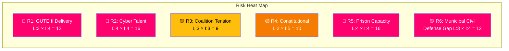

# ⚡ Risk Assessment — Realtime Monitor 1416

**📋 Document Owner:** CEO | **📄 Version:** 2.1 | **📅 Analysis Date:** 2026-04-03 14:16 UTC
**🏢 Owner:** Hack23 AB (Org.nr 5595347807) | **🏷️ Classification:** Public

---

## 📋 Assessment Context

| Field | Value |
|-------|-------|
| **Assessment ID** | `RSK-2026-04-03-001` |
| **Analysis Date** | 2026-04-03 14:16 UTC |
| **Scope** | Swedish defense and security policy cluster — April 2-3, 2026 |
| **Produced By** | news-realtime-monitor |
| **MCP Sources** | `get_propositioner`, `get_betankanden`, `search_regering`, `get_regering_document` |

---

## 📊 Risk Matrix Overview

---

## 📋 Detailed Risk Register

| Risk ID | Risk Description | Likelihood (1-5) | Impact (1-5) | Score | Category | Source | Mitigation |
|---------|-----------------|:-----------------:|:------------:|:-----:|----------|--------|------------|
| R1 | GUTE II delivery delayed beyond 2028, leaving drone defense gap | 3 | 4 | **12** | Defense | gute-ii-defense-deal | FMV quarterly monitoring, penalty clauses |
| R2 | National cybersecurity center hampered by talent shortage | 4 | 4 | **16** | Cyber | HD03214 | University pipeline, competitive salaries |
| R3 | L party tension over Prop 235 deportation rules strains coalition | 3 | 3 | **9** | Political | HD03235 | Tidö Agreement renegotiation framework |
| R4 | ECHR/constitutional challenge to stricter deportation thresholds | 2 | 5 | **10** | Legal | HD03235 | Thorough Lagrådet review process |
| R5 | Prison capacity crisis undermines criminal justice reforms | 4 | 4 | **16** | Criminal Justice | HD01JuU15 | Emergency capacity expansion |
| R6 | Uneven municipal implementation of civilian protection measures | 3 | 4 | **12** | Civil Defense | HD01FöU12 | Central guidance, earmarked funding |

---

## 🔴 Critical Risk Analysis (Score ≥ 12)

### R2: Cybersecurity Talent Shortage (Score: 16)
**Context:** Prop 214 creates legal framework for strengthened cybersecurity center, but Sweden's IT talent market is highly competitive. Government agencies struggle to match private sector salaries. Without adequate staffing, the center will be an empty institutional shell.
**Evidence:** HD03214 — Carl-Oskar Bohlin (M) bringing proposition under Defense Ministry indicates high priority but does not address workforce constraints.
**Trigger:** Monitor job postings and vacancy rates at MSB/FRA cybersecurity units post-legislation.

### R5: Prison Capacity Crisis (Score: 16)
**Context:** JuU15 committee report on criminal justice policy arrives amid documented prison overcrowding. Tougher sentencing policies (Tidö Agreement) drive demand while capacity lags.
**Evidence:** HD01JuU15 — Kriminalvårdsfrågor committee report; HD03235 — stricter deportation adds to detention demand.
**Trigger:** Kriminalvården quarterly capacity reports; new facility construction timelines.

### R1 & R6: Defense Delivery and Municipal Implementation (Score: 12 each)
Both represent execution risks on announced policies. The government gains political credit from announcements but faces accountability if delivery falters.

---

## 🔮 Risk Evolution Forecast

| Period | Expected Change | Key Driver |
|--------|----------------|------------|
| Q2 2026 | R3 (coalition tension) may increase as Prop 235 moves through SfU committee | SfU deliberations, L party positioning |
| Q3 2026 | R1 may decrease as first FMV delivery milestones are reported | FMV project management updates |
| Q4 2026 | R2 remains elevated — cybersecurity center staffing progress uncertain | Recruitment market conditions |
| 2027 | R5 critical threshold — prison capacity must expand before new sentences take effect | Kriminalvården expansion timeline |

---

**Document Control:** Risk Assessment by news-realtime-monitor | 2026-04-03 14:16 UTC | Classification: Public
