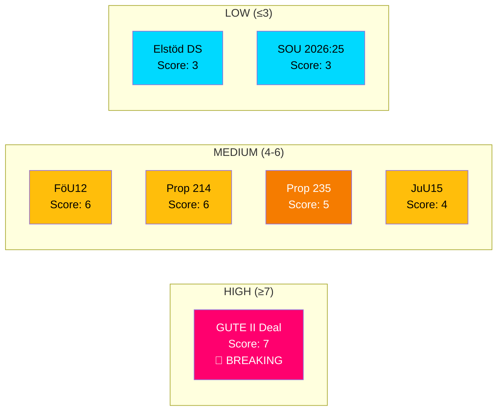

# 📈 Significance Scoring — Realtime Monitor 1416

**📋 Document Owner:** CEO | **📄 Version:** 2.1 | **📅 Analysis Date:** 2026-04-03 14:16 UTC
**🏢 Owner:** Hack23 AB (Org.nr 5595347807) | **🏷️ Classification:** Public

---

## 📊 Significance Scoring Matrix

---

## 📋 Detailed Scoring

| Document | Coalition Risk | Multi-Party (>3) | Budget/Fiscal | Defense/Security | Criminal Justice | Named Minister | Committee Approval | Recency Penalty | **Total** | **Tier** |
|----------|:-------------:|:-----------------:|:-------------:|:----------------:|:----------------:|:--------------:|:-----------------:|:---------------:|:---------:|:--------:|
| GUTE II Deal | 0 | +2 | +2 | +2 | 0 | +1 (Jonson) | 0 | 0 | **7** | HIGH |
| FöU12 | 0 | +2 | 0 | +2 | 0 | 0 | +1 | -0 | **6** | MEDIUM |
| Prop 214 | 0 | +2 | 0 | +2 | 0 | +1 (Bohlin) | 0 | -0 | **6** | MEDIUM |
| Prop 235 | 0 | 0 | 0 | 0 | +2 | +1 (Forssell) | 0 | 0 | **5** | MEDIUM |
| JuU15 | 0 | 0 | 0 | 0 | +2 | 0 | +1 | -0 | **4** | MEDIUM |
| Elstöd DS | 0 | 0 | +2 | 0 | 0 | 0 | 0 | 0 | **3** | LOW |
| SOU 2026:25 | 0 | 0 | 0 | 0 | 0 | 0 | 0 | 0 | **3** | LOW |

---

## 🎯 Generation Decision

| Tier | Count | Action |
|------|:-----:|--------|
| **HIGH** | 1 | Generate breaking article with deep analysis |
| **MEDIUM** | 4 | Include in breaking article as supporting context |
| **LOW** | 2 | Skip — no article generation |

**Decision:** Generate breaking news article on the **defense modernization cluster** (GUTE II + FöU12 + Prop 214) with supporting criminal justice context (Prop 235 + JuU15).

---

**Document Control:** Significance Scoring by news-realtime-monitor | 2026-04-03 14:16 UTC | Classification: Public
