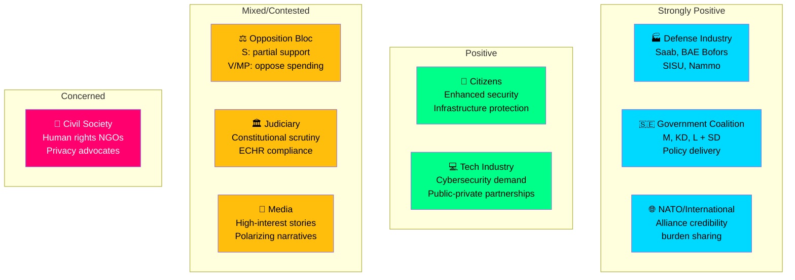

# 👥 Stakeholder Impact Analysis — Realtime Monitor 1416

**📋 Document Owner:** CEO | **📄 Version:** 2.1 | **📅 Analysis Date:** 2026-04-03 14:16 UTC
**🏢 Owner:** Hack23 AB (Org.nr 5595347807) | **🏷️ Classification:** Public

---

## 📊 Stakeholder Impact Map

---

## 📋 Detailed Stakeholder Matrix

| Stakeholder Group | Overall Impact | Key Events Affecting | Primary Concern | Evidence |
|-------------------|:--------------:|---------------------|-----------------|----------|
| **Citizens** | 🟢 Positive | GUTE II, FöU12, Elstöd | Enhanced security; electricity cost relief | gute-ii-defense-deal: protects cities, nuclear plants |
| **Government Coalition (M, KD, L + SD)** | 🟢 Strongly Positive | All events | Policy delivery credibility | 4 propositions, 1 major deal, 12 press releases in 2 days |
| **Opposition Bloc (S, V, MP, C)** | 🟡 Mixed | Prop 235, GUTE II | S may support defense; V/MP oppose | Historical voting patterns on defense/migration |
| **Business/Industry** | 🟢 Positive | GUTE II, Elstöd | Defense contracts, energy cost stability | gute-ii-defense-deal: Saab, BAE, SISU, Nammo contracts |
| **Civil Society** | 🔴 Concerned | Prop 235, Prop 214 | Human rights, privacy implications | Deportation rules and surveillance powers |
| **International/EU/NATO** | 🟢 Positive | GUTE II, Prop 214, FöU12 | Alliance contribution, interoperability | NATO Article 3, 5 obligations |
| **Judiciary/Constitutional** | 🟡 Scrutiny | Prop 235 | ECHR proportionality, constitutional limits | Lagrådet review process for deportation thresholds |
| **Media/Public Opinion** | 🟡 High Interest | All events | Dramatic defense spending, polarizing migration | 8.7B headline figure; deportation debate |

---

## 🎯 Key Stakeholder Dynamics

### Government Coalition Internal Dynamics
- **M (Moderaterna):** Primary driver of both defense (Jonson) and criminal justice (Forssell) agendas — strongest position
- **KD (Kristdemokraterna):** Supportive of defense and social policy — comfortable coalition partner
- **L (Liberalerna):** Supportive of defense and cybersecurity; tension point on Prop 235 deportation rules
- **SD (Sverigedemokraterna):** Critical support party; Prop 235 delivers core SD demand on deportation

### Opposition Dynamics
- **S (Socialdemokraterna):** Historically supports defense spending; cautious on deportation specifics — may offer partial bipartisan support
- **V (Vänsterpartiet):** Likely opposes both defense spending scale and deportation rules — strongest opposition voice
- **MP (Miljöpartiet):** Opposes military spending and deportation — aligned with V
- **C (Centerpartiet):** Mixed — may support defense elements but skeptical of criminal justice approach

---

**Document Control:** Stakeholder Analysis by news-realtime-monitor | 2026-04-03 14:16 UTC | Classification: Public
