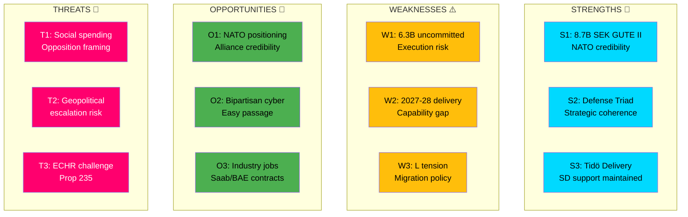

# 💼 Political SWOT Analysis — Realtime Monitor 1416

**📋 Document Owner:** CEO | **📄 Version:** 2.1 | **📅 Last Updated:** 2026-04-03 14:16 UTC
**🏢 Owner:** Hack23 AB (Org.nr 5595347807) | **🏷️ Classification:** Public

---

## 📋 SWOT Context

| Field | Value |
|-------|-------|
| **SWOT ID** | `SWT-2026-04-03-001` |
| **Analysis Date** | 2026-04-03 14:16 UTC |
| **Analysis Scope** | Government Coalition (M, KD, L + SD support) — Defense & Security Policy Push |
| **Reference Period** | 2026-W14 (March 30 – April 5) |
| **Produced By** | news-realtime-monitor |
| **Primary MCP Sources** | `get_propositioner`, `get_betankanden`, `search_regering`, `get_regering_document`, `search_voteringar` |
| **Validity Window** | Entries valid until 2026-04-17 (2-week temporal decay) |

---

## 🏛️ Section 1: Government Coalition SWOT

### ✅ Strengths — Government Coalition

| # | Strength Statement | Evidence (dok_id) | Confidence | Impact | Entry Date |
|---|-------------------|-------------------|:----------:|:------:|:----------:|
| S1 | Coalition demonstrates decisive defense investment with SEK 8.7B GUTE II anti-drone deal, reinforcing credibility as NATO member | gute-ii-defense-deal | H | H | 2026-04-02 |
| S2 | Coordinated "defense modernization triad" (kinetic + civilian + cyber) shows strategic coherence across ministries | gute-ii-defense-deal, HD01FöU12, HD03214 | H | H | 2026-04-02 |
| S3 | Criminal justice reform agenda (Prop 235, JuU15) delivers Tidö Agreement commitments, maintaining SD support | HD03235, HD01JuU15 | H | H | 2026-04-01 |
| S4 | Electricity support measures (Ds, April 2) address consumer concerns ahead of election year | elstöd DS | M | M | 2026-04-02 |

**Coalition Strength Summary:** The Kristersson government is executing a multi-front policy offensive, with defense/security as the flagship narrative. The simultaneous defense, criminal justice, and consumer support actions demonstrate governance capacity.

---

### ⚠️ Weaknesses — Government Coalition

| # | Weakness Statement | Evidence (dok_id) | Confidence | Impact | Entry Date |
|---|-------------------|-------------------|:----------:|:------:|:----------:|
| W1 | 6.3B SEK of 15B territorial air defense program remains uncommitted — execution risk | gute-ii-defense-deal | M | M | 2026-04-02 |
| W2 | GUTE II delivery timeline (2027-2028) leaves capability gap in current heightened threat environment | gute-ii-defense-deal | H | H | 2026-04-02 |
| W3 | Prop 235 deportation rules may strain L (Liberals) coalition unity on migration | HD03235 | M | M | 2026-04-01 |

**Coalition Weakness Summary:** Implementation timelines and coalition management on migration policy remain vulnerabilities. The gap between announcement and capability delivery exposes the government to opposition criticism.

---

### 🚀 Opportunities — Government Coalition

| # | Opportunity Statement | Evidence (dok_id) | Confidence | Impact | Entry Date |
|---|----------------------|-------------------|:----------:|:------:|:----------:|
| O1 | NATO membership amplifies defense procurement narrative — positions Sweden as serious alliance contributor | gute-ii-defense-deal, HD01FöU12 | H | H | 2026-04-02 |
| O2 | Bipartisan support on cybersecurity (Prop 214) enables smooth legislative passage | HD03214 | M | M | 2026-04-01 |
| O3 | Defense industry contracts (Saab, BAE Bofors) generate domestic economic/employment benefits | gute-ii-defense-deal | H | M | 2026-04-02 |

---

### 🔴 Threats — Government Coalition

| # | Threat Statement | Evidence (dok_id) | Confidence | Impact | Entry Date |
|---|-----------------|-------------------|:----------:|:------:|:----------:|
| T1 | Opposition may argue defense spending crowds out healthcare/social services investment | HD03216, gute-ii-defense-deal | M | M | 2026-04-02 |
| T2 | Escalating geopolitical tensions could expose inadequacy of current defense capabilities before GUTE II delivery | gute-ii-defense-deal | L | H | 2026-04-02 |
| T3 | ECHR/constitutional challenge to Prop 235 deportation rules could embarrass government | HD03235 | L | H | 2026-04-01 |

---

## 📊 SWOT Quadrant Mapping

---

## 🔄 TOWS Strategic Options

| Strategy | Combination | Description |
|----------|------------|-------------|
| **SO: Leverage NATO for accelerated delivery** | S1 + O1 | Use NATO partnership mechanisms to fast-track GUTE II interoperability testing and potentially accelerate delivery through allied technology sharing |
| **WO: Bipartisan defense consensus** | W3 + O2 | Channel L's concerns about migration into cybersecurity support, where bipartisan consensus is strongest |
| **ST: Pre-emptive defense narrative** | S2 + T1 | Frame defense triad as protecting social services (civilian protection, critical infrastructure) rather than competing with them |
| **WT: Interim capability gap closure** | W2 + T2 | Negotiate interim C-UAS solutions or allied coverage until GUTE II delivery in 2027 |

---

## 🔗 Cross-SWOT Interference

The government's **strength** in demonstrating defense investment (S1) directly amplifies the **opportunity** of NATO positioning (O1) — each reinforces the other. However, the **weakness** of the delivery gap (W2) amplifies the **threat** of geopolitical escalation (T2) — the government has announced capability it cannot yet field. The criminal justice **strength** (S3) creates a potential **weakness** (W3) with L, illustrating the inherent tension in the M-KD-L+SD coalition structure.

---

## 📊 Strategic Implications

### Key Watch Items
1. **FöU committee scheduling** of Prop 214 and FöU12 debate — May indicate government's preferred timeline
2. **Opposition response** to 8.7B defense deal — S position on defense spending will signal bipartisan or contested framing
3. **L party communication** on Prop 235 — Internal dissent indicators
4. **Defense minister USA visit outcomes** — Bilateral announcements

### Forward Indicators
- Next FMV procurement announcement (remaining 6.3B of 15B program)
- Riksdag defense debate scheduling (FöU calendar)
- Budget bill 2027 defense allocation (autumn 2026)

---

**Document Control:** SWOT Analysis by news-realtime-monitor | 2026-04-03 14:16 UTC | Classification: Public
