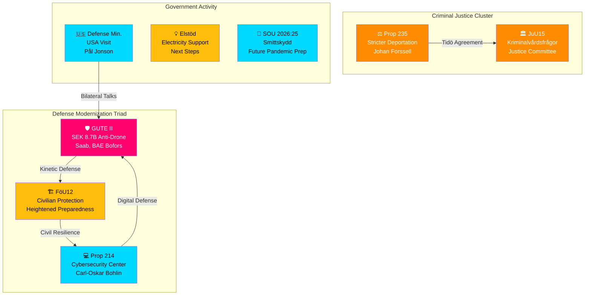

# 📊 Synthesis Summary — Realtime Monitor 1416

**📋 Document Owner:** CEO | **📄 Version:** 2.1 | **📅 Analysis Date:** 2026-04-03 14:16 UTC
**🏢 Owner:** Hack23 AB (Org.nr 5595347807) | **🏷️ Classification:** Public

---

## 🎯 Executive Intelligence Summary

Sweden's defense posture underwent a significant escalation on April 2-3, 2026, with three coordinated policy actions forming a **defense modernization triad**: (1) SEK 8.7 billion GUTE II anti-drone air defense procurement with Saab/BAE Systems Bofors, (2) FöU12 committee report strengthening civilian protection during heightened preparedness, and (3) Prop 2025/26:214 establishing a strengthened national cybersecurity center. In parallel, the government advanced criminal justice reforms including Prop 2025/26:235 on stricter deportation rules and JuU15 on correctional services. This represents the most concentrated defense-security policy push of the 2025/26 riksmöte.

**Overall Confidence:** HIGH | **Risk Level:** ELEVATED | **Key Actor:** Defense Minister Pål Jonson (M)

---

## 📊 Event Cluster Map

---

## 📋 Key Findings

| # | Finding | Severity | Confidence | Primary Source |
|---|---------|:--------:|:----------:|---------------|
| 1 | SEK 8.7B GUTE II contracts signal Sweden's largest anti-drone investment as NATO member | HIGH | H | gute-ii-defense-deal |
| 2 | Defense modernization triad (kinetic + civilian + cyber) represents coordinated total defense strategy | HIGH | H | gute-ii-defense-deal, HD01FöU12, HD03214 |
| 3 | Criminal justice reform acceleration with deportation rules and correctional services review | MEDIUM | H | HD03235, HD01JuU15 |
| 4 | Defense Minister Pål Jonson USA visit coincides with major procurement — potential bilateral dimension | MEDIUM | M | search_regering |
| 5 | 12 government press releases in single day indicates pre-Easter policy communication push | MEDIUM | H | search_regering |

---

## 🔄 Cross-Document Intelligence

The clustering of defense-related actions (GUTE II + FöU12 + Prop 214 + USA visit) is not coincidental. This represents a deliberate government communication strategy to demonstrate comprehensive security capability building. The defense minister's simultaneous USA visit suggests bilateral procurement or technology discussions may complement the GUTE II deal. The criminal justice cluster (Prop 235 + JuU15) runs on a parallel track, delivering Tidö Agreement commitments while the defense narrative dominates media attention.

---

## 📊 Data Sources Summary

| Source | Tool Used | Items Found | Date Range |
|--------|-----------|:-----------:|------------|
| Committee Reports | `get_betankanden` | 20 | 2025/26 rm |
| Propositions | `get_propositioner` | 20 | 2025/26 rm |
| Government Documents | `search_regering` | 18 | 2026-04-02–03 |
| Votes | `search_voteringar` | 20 | Latest: 2026-03-04 |
| Debates | `search_anforanden` | 20 | NU17 Elmarknadsfrågor |
| Documents | `search_dokument` | 30 | 2026-04-02–03 |

---

**Document Control:** Synthesis by news-realtime-monitor | 2026-04-03 14:16 UTC | Classification: Public
