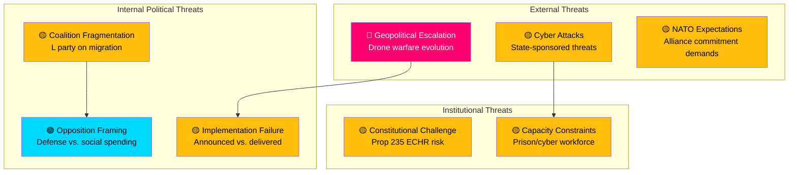

# 🔴 Threat Analysis — Realtime Monitor 1416

**📋 Document Owner:** CEO | **📄 Version:** 2.1 | **📅 Analysis Date:** 2026-04-03 14:16 UTC
**🏢 Owner:** Hack23 AB (Org.nr 5595347807) | **🏷️ Classification:** Public

---

## 📋 Assessment Context

| Field | Value |
|-------|-------|
| **Assessment ID** | `THR-2026-04-03-001` |
| **Analysis Date** | 2026-04-03 14:16 UTC |
| **Scope** | Political threats from defense/security policy cluster |
| **Produced By** | news-realtime-monitor |

---

## 📊 Threat Landscape

---

## 📋 Threat Register

| # | Threat | Category | Severity | Likelihood | Impact | Source Evidence |
|---|--------|----------|:--------:|:----------:|:------:|----------------|
| THR-1 | Drone technology evolution outpaces GUTE II 2-year delivery cycle | External/Military | 🔴 HIGH | 3/5 | 5/5 | gute-ii-defense-deal: 2027-2028 delivery |
| THR-2 | State-sponsored cyber attack before Prop 214 cybersecurity center operational | External/Cyber | 🟡 MEDIUM | 3/5 | 4/5 | HD03214: legislative timeline |
| THR-3 | L party exit threat over Prop 235 migration policy | Internal/Coalition | 🟡 MEDIUM | 2/5 | 4/5 | HD03235: Tidö Agreement tension |
| THR-4 | Constitutional court challenge delays deportation implementation | Institutional/Legal | 🟡 MEDIUM | 2/5 | 4/5 | HD03235: ECHR proportionality |
| THR-5 | Prison overcrowding crisis before capacity expansion | Institutional/Capacity | 🔴 HIGH | 4/5 | 4/5 | HD01JuU15: Kriminalvårdsfrågor |

---

## 🛡️ Threat Mitigation Matrix

| Threat | Current Controls | Recommended Enhancement |
|--------|-----------------|------------------------|
| THR-1 | Modular GUTE II design allows upgrades | Fast-track interim C-UAS from allied stocks |
| THR-2 | Existing MSB/FRA cyber defense | Accelerated Prop 214 implementation timeline |
| THR-3 | Tidö Agreement framework | L-specific policy concessions in other areas |
| THR-4 | Lagrådet review process | Proactive ECHR compatibility assessment |
| THR-5 | Kriminalvården expansion program | Emergency prefab facility construction |

---

**Document Control:** Threat Analysis by news-realtime-monitor | 2026-04-03 14:16 UTC | Classification: Public
