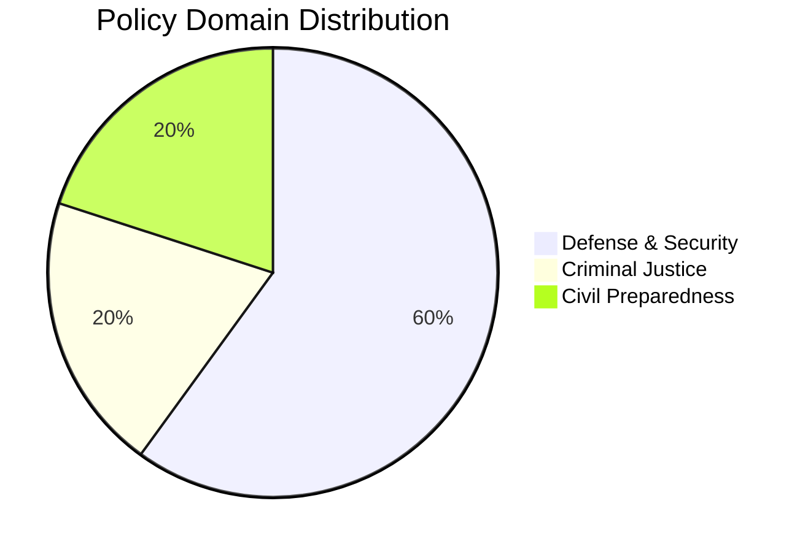

# 🏷️ Political Classification Results — 2026-04-03

## 📋 Classification Context

| Field | Value |
|-------|-------|
| **Classification ID** | CLS-2026-04-03-2200 |
| **Analysis Date** | 2026-04-03 22:00 UTC |
| **Documents Classified** | 5 |
| **Produced By** | news-realtime-monitor |

## 📊 Classification Results

| dok_id | Title | Primary Domain | Secondary Domain | Significance |
|--------|-------|---------------|-----------------|:------------:|
| GUTE-II-2026-04-02 | Luftvärnsavtal 8,7 miljarder | Defense & Security | Industrial Policy | 9/10 |
| HD03228 | Regelverk för krigsmateriel | Defense & Foreign Affairs | Trade Policy | 8/10 |
| HD03214 | Nationellt cybersäkerhetscenter | Defense & Cybersecurity | Digital Policy | 7/10 |
| HD01FöU12 | Civilbefolkningen vid höjd beredskap | Civil Preparedness | Defense | 7/10 |
| HD03235 | Utvisning på grund av brott | Criminal Justice | Migration Policy | 7/10 |

## 📋 Key Finding

The dominant policy cluster is **Defense & Security** (60% of classified documents), reflecting a coordinated government push on military capability, arms regulation, and cybersecurity — consistent with Sweden's first full year as a NATO member.
