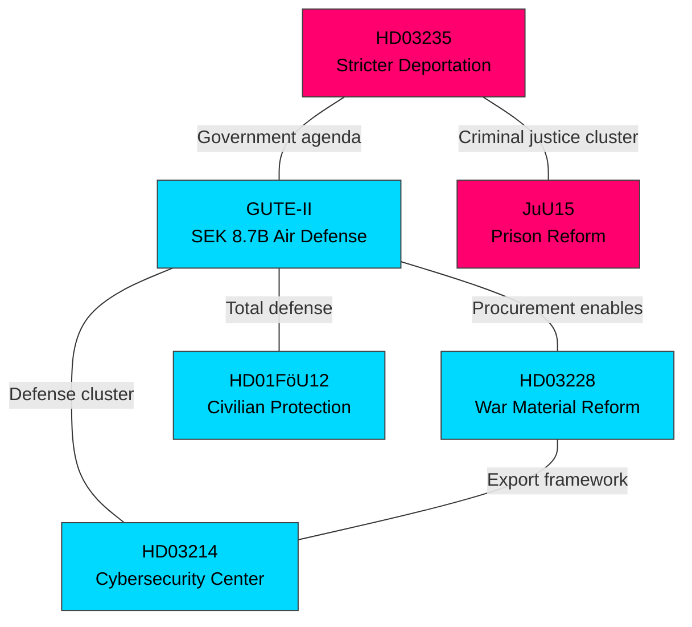

# 🔗 Cross-Reference Map — 2026-04-03

## 📋 Cross-Reference Context

| Field | Value |
|-------|-------|
| **Map ID** | XRF-2026-04-03-2200 |
| **Analysis Date** | 2026-04-03 22:00 UTC |
| **Documents Mapped** | 5 |
| **Produced By** | news-realtime-monitor |

## 📊 Document Relationship Network

## 🔗 Cross-Reference Matrix

| From → To | GUTE-II | HD03228 | HD03214 | HD01FöU12 | HD03235 |
|-----------|:-------:|:-------:|:-------:|:---------:|:-------:|
| **GUTE-II** | — | STRONG | MEDIUM | STRONG | WEAK |
| **HD03228** | STRONG | — | MEDIUM | WEAK | WEAK |
| **HD03214** | MEDIUM | MEDIUM | — | MEDIUM | WEAK |
| **HD01FöU12** | STRONG | WEAK | MEDIUM | — | WEAK |
| **HD03235** | WEAK | WEAK | WEAK | WEAK | — |

## 📋 Key Clusters

1. **Defense Cluster** (GUTE-II + HD03228 + HD03214 + HD01FöU12): Tightly interconnected defense/security reform package
2. **Criminal Justice Cluster** (HD03235 + JuU15 + HD03213 + HD03227): Parallel criminal justice reform stream
3. **Cross-Cluster Link**: Both clusters share coalition dynamics and pre-election context
