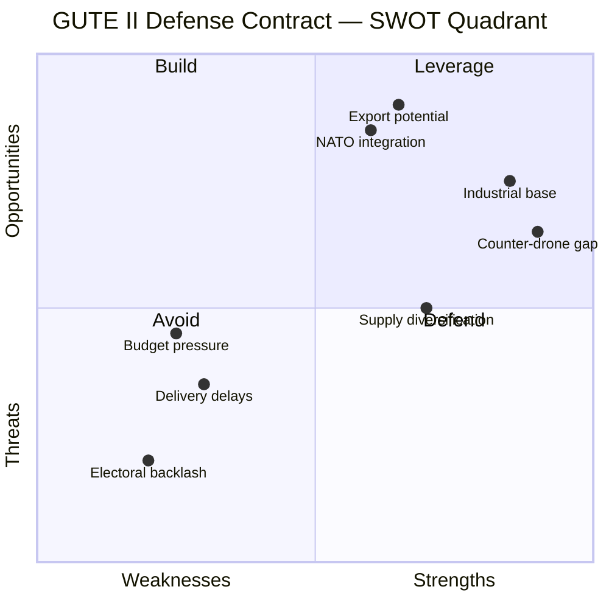
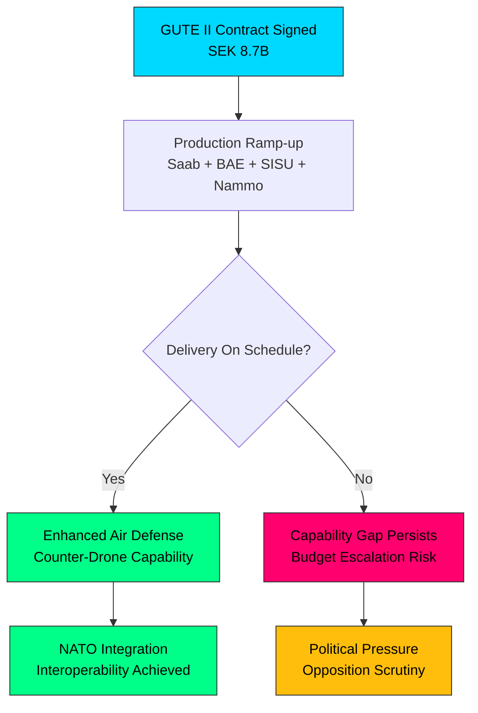

# 🔍 Per-File Political Intelligence Analysis

## 📋 Document Identity

| Field | Value |
|-------|-------|
| **Document ID** | `GUTE-II-2026-04-02` |
| **Document Type** | Government Press Release |
| **Title** | Luftvärnsavtal på 8,7 miljarder stärker Sveriges anti-drönarförmåga |
| **Date** | 2026-04-02 |
| **Riksmöte** | 2025/26 |
| **Source MCP Tool** | search_regering |
| **Analysis Timestamp** | 2026-04-03 22:00 UTC |
| **Analyst** | news-realtime-monitor |

## 🎯 Executive Summary

Sweden's government has signed an SEK 8.7 billion air defense contract under the GUTE II system designation, involving Saab, BAE Systems Bofors, SISU (vehicles), and Nammo (ammunition). Defense Minister Pål Jonson (M) emphasized this as the government's highest priority investment in counter-drone capabilities. This represents one of the largest single defense procurement packages in recent Swedish history and signals accelerated military buildup in response to the changed European security landscape post-Ukraine. The timing—concurrent with Jonson's visit to NATO's Norfolk headquarters and Pentagon—underscores Sweden's deepening transatlantic defense integration as a new NATO member. **Confidence: HIGH**

## 📊 Political Classification

| Dimension | Assessment | Evidence |
|-----------|------------|----------|
| **Policy Domain** | Defense & Security | Air defense procurement, counter-drone capability |
| **Significance Score** | 9/10 | SEK 8.7B budget impact, multi-company procurement, NATO alignment |
| **Coalition Impact** | Strengthening | M, KD, L unified on defense spending; SD supportive |
| **Opposition Relevance** | Moderate | S historically supportive of defense; V, MP critical of arms spending |

## 💼 SWOT Analysis

### ✅ Strengths

| # | Statement | Evidence | Confidence | Impact |
|---|-----------|----------|:----------:|:------:|
| S1 | Massive industrial investment strengthens Swedish defense industry (Saab, Bofors) | GUTE-II-2026-04-02 | HIGH | HIGH |
| S2 | Addresses critical capability gap in counter-drone warfare identified in Ukraine conflict | GUTE-II-2026-04-02 | HIGH | HIGH |
| S3 | Multi-company approach (Saab, BAE, SISU, Nammo) diversifies supply chain risk | GUTE-II-2026-04-02 | HIGH | MEDIUM |

### ⚠️ Weaknesses

| # | Statement | Evidence | Confidence | Impact |
|---|-----------|----------|:----------:|:------:|
| W1 | SEK 8.7B represents significant fiscal commitment amid competing budget pressures | Budget analysis | MEDIUM | HIGH |
| W2 | Delivery timelines for complex defense systems typically face delays | Historical precedent | MEDIUM | MEDIUM |

### 🌟 Opportunities

| # | Statement | Evidence | Confidence | Impact |
|---|-----------|----------|:----------:|:------:|
| O1 | NATO interoperability potential — GUTE II could integrate with allied air defense networks | Jonson's Norfolk visit | MEDIUM | HIGH |
| O2 | Export potential for Swedish defense industry as European demand surges | HD03228 war material reform | HIGH | HIGH |

### 🔴 Threats

| # | Statement | Evidence | Confidence | Impact |
|---|-----------|----------|:----------:|:------:|
| T1 | Escalating arms spending could trigger electoral backlash from V/MP voters | Political dynamics | LOW | MEDIUM |
| T2 | Supply chain dependencies on international partners (BAE Systems UK, Nammo Norway) | Contract structure | MEDIUM | MEDIUM |

## ⚠️ Risk Assessment

| Risk ID | Risk | Likelihood (1-5) | Impact (1-5) | L×I | Trend |
|---------|------|:-----------------:|:------------:|:---:|:-----:|
| R1 | Budget overrun on GUTE II procurement | 3 | 4 | 12 | ↑ |
| R2 | Delivery delays reducing capability timeline | 3 | 3 | 9 | → |
| R3 | Opposition framing as "militarism" in 2026 election | 2 | 3 | 6 | → |
| R4 | Dependency on foreign sub-contractors | 2 | 4 | 8 | ↑ |

## 👥 Stakeholder Impact

| Stakeholder | Impact | Assessment |
|-------------|:------:|------------|
| **Citizens** | MEDIUM | Enhanced national security; fiscal cost borne by taxpayers |
| **Government Coalition (M, KD, L, SD)** | HIGH | Demonstrates defense commitment; SD supportive on military spending |
| **Opposition (S)** | MEDIUM | S generally supportive of defense; limited attack surface |
| **Opposition (V, MP)** | HIGH | Likely criticism of arms spending priorities over welfare |
| **Business/Industry** | HIGH | Saab, BAE Systems Bofors, SISU, Nammo — major revenue; jobs in defense sector |
| **International/NATO** | HIGH | Signals Swedish commitment to alliance burden-sharing |
| **Media** | HIGH | Major procurement story; likely front-page coverage |

## 🔮 Forward Indicators

| Indicator | Trigger | Timeline | Confidence |
|-----------|---------|----------|:----------:|
| Riksdag debate on defense budget allocation | Committee referral of related propositions | Q2 2026 | HIGH |
| Opposition interpellations on procurement costs | Post-recess Riksdag session | April 2026 | MEDIUM |
| NATO capability review including Swedish contributions | NATO summit | 2026 | HIGH |
| Saab quarterly earnings reflecting GUTE II contract | Q2 earnings | July 2026 | HIGH |
