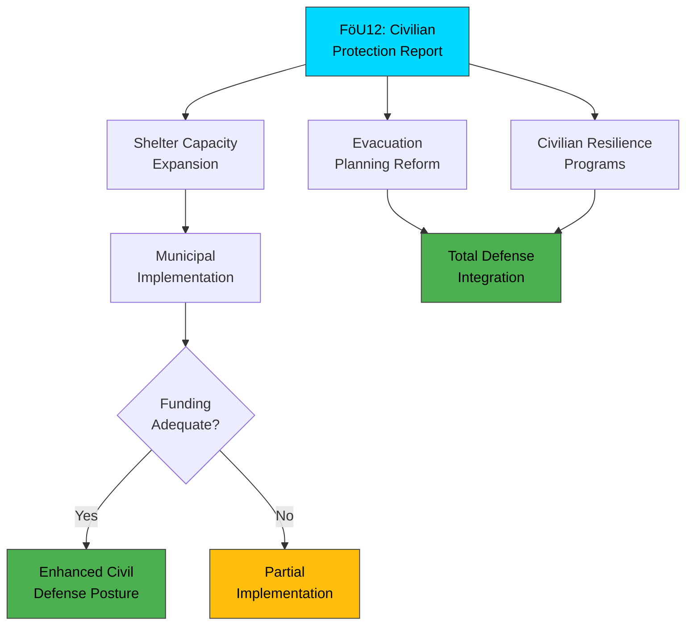

# 🔍 Per-File Political Intelligence Analysis

## 📋 Document Identity

| Field | Value |
|-------|-------|
| **Document ID** | `HD01FöU12` |
| **Document Type** | Betänkande (Committee Report) |
| **Title** | Ett starkare skydd för civilbefolkningen vid höjd beredskap |
| **Date** | 2026-04-02 |
| **Riksmöte** | 2025/26 |
| **Source MCP Tool** | get_betankanden |
| **Analysis Timestamp** | 2026-04-03 22:02 UTC |
| **Analyst** | news-realtime-monitor |

## 🎯 Executive Summary

The Defense Committee (FöU) reports on measures to strengthen civilian protection during heightened military preparedness. Published April 2, this committee report is part of the broader defense reform cluster that includes the GUTE II air defense contract and propositions on cybersecurity (HD03214) and war material (HD03228). The report addresses shelter capacity, evacuation planning, and civilian resilience — critical gaps identified after Russia's full-scale invasion of Ukraine exposed NATO countries' insufficient civil defense infrastructure. This signals the government's comprehensive approach to total defense (totalförsvaret). **Confidence: HIGH**

## 📊 Political Classification

| Dimension | Assessment | Evidence |
|-----------|------------|----------|
| **Policy Domain** | Defense / Civil Preparedness | Civilian protection, total defense |
| **Significance Score** | 7/10 | Direct citizen safety impact, totalförsvaret policy |
| **Coalition Impact** | Positive | Broad support across governing parties |
| **Opposition Relevance** | Low-Medium | S generally supportive; critique may focus on speed/adequacy |

## 💼 SWOT Analysis

### ✅ Strengths

| # | Statement | Evidence | Confidence | Impact |
|---|-----------|----------|:----------:|:------:|
| S1 | Addresses critical gap in civilian protection identified post-Ukraine invasion | HD01FöU12 | HIGH | HIGH |
| S2 | Part of integrated totalförsvaret (total defense) strategy | Defense reform package | HIGH | HIGH |
| S3 | Broad cross-party consensus on civil defense need | Parliamentary pattern | HIGH | MEDIUM |

### ⚠️ Weaknesses

| # | Statement | Evidence | Confidence | Impact |
|---|-----------|----------|:----------:|:------:|
| W1 | Years of underinvestment in shelter infrastructure cannot be reversed quickly | Historical deficit | HIGH | HIGH |
| W2 | Municipal implementation capacity varies greatly across Sweden | Local government capacity | MEDIUM | MEDIUM |

### 🌟 Opportunities

| # | Statement | Evidence | Confidence | Impact |
|---|-----------|----------|:----------:|:------:|
| O1 | EU civil protection mechanism integration | EU defense cooperation | MEDIUM | MEDIUM |
| O2 | Public awareness and voluntary preparedness surge | Post-Ukraine public sentiment | HIGH | MEDIUM |

### 🔴 Threats

| # | Statement | Evidence | Confidence | Impact |
|---|-----------|----------|:----------:|:------:|
| T1 | Funding competition with military procurement (GUTE II etc.) | Budget allocation | MEDIUM | HIGH |
| T2 | Public complacency if threat perception diminishes | Social dynamics | LOW | MEDIUM |

## ⚠️ Risk Assessment

| Risk ID | Risk | L (1-5) | I (1-5) | L×I | Trend |
|---------|------|:-------:|:-------:|:---:|:-----:|
| R1 | Municipal underfunding leads to uneven civil protection | 4 | 4 | 16 | ↑ |
| R2 | Shelter infrastructure timeline too slow for threat environment | 3 | 4 | 12 | ↑ |
| R3 | Public fatigue with preparedness messaging | 2 | 2 | 4 | → |

## 👥 Stakeholder Impact

| Stakeholder | Impact | Assessment |
|-------------|:------:|------------|
| **Citizens** | HIGH | Direct safety impact — shelter access, evacuation planning |
| **Government Coalition** | MEDIUM | Demonstrates commitment to total defense |
| **Opposition (S)** | LOW | Generally supportive; may push for faster implementation |
| **Business/Industry** | MEDIUM | Construction sector benefits from shelter expansion |
| **International/NATO** | MEDIUM | Demonstrates civilian resilience component of NATO commitment |
| **Media** | HIGH | Resonates with public concern about security environment |

## 🔮 Forward Indicators

| Indicator | Trigger | Timeline | Confidence |
|-----------|---------|----------|:----------:|
| Municipal budget allocations for civil defense | Budget cycle | Q3 2026 | HIGH |
| MSB shelter inventory update | Agency report | 2026 | HIGH |
| Public preparedness awareness metrics | Survey data | Ongoing | MEDIUM |
