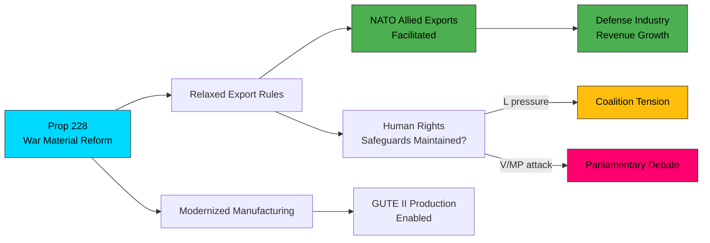

# 🔍 Per-File Political Intelligence Analysis

## 📋 Document Identity

| Field | Value |
|-------|-------|
| **Document ID** | `HD03228` |
| **Document Type** | Proposition (prop) |
| **Title** | Ett modernt och anpassat regelverk för krigsmateriel |
| **Date** | 2026-04-01 |
| **Riksmöte** | 2025/26 |
| **Source MCP Tool** | get_propositioner |
| **Analysis Timestamp** | 2026-04-03 22:02 UTC |
| **Analyst** | news-realtime-monitor |

## 🎯 Executive Summary

The government (Prop. 2025/26:228) proposes modernizing Sweden's war material export and manufacturing regulations. Led by Foreign Minister Benjamin Dousa (KD, Utrikesdepartementet), this reform arrives at a critical juncture: Sweden is a new NATO member, European demand for defense equipment is surging, and the GUTE II contract (SEK 8.7B) demonstrates expanding domestic production. The proposition likely relaxes restrictions to facilitate allied exports while maintaining human rights safeguards — a delicate balance with coalition partners. **Confidence: HIGH**

## 📊 Political Classification

| Dimension | Assessment | Evidence |
|-----------|------------|----------|
| **Policy Domain** | Defense & Foreign Affairs | War material export regulation reform |
| **Significance Score** | 8/10 | NATO alignment, defense industry impact, export policy shift |
| **Coalition Impact** | Moderately Positive | KD/M aligned; L may push for human rights safeguards |
| **Opposition Relevance** | High | V/MP strongly oppose arms exports; S nuanced position |

## 💼 SWOT Analysis

### ✅ Strengths

| # | Statement | Evidence | Confidence | Impact |
|---|-----------|----------|:----------:|:------:|
| S1 | Aligns Swedish defense export rules with NATO membership obligations | HD03228 | HIGH | HIGH |
| S2 | Strengthens competitive position of Saab, Bofors in European market | HD03228 + GUTE-II contract | HIGH | HIGH |
| S3 | Government presents unified position (M+KD via Dousa, SD supportive) | Coalition dynamics | MEDIUM | MEDIUM |

### ⚠️ Weaknesses

| # | Statement | Evidence | Confidence | Impact |
|---|-----------|----------|:----------:|:------:|
| W1 | Potential erosion of Sweden's traditional neutrality brand | Historical foreign policy | MEDIUM | MEDIUM |
| W2 | L's traditional emphasis on human rights may create coalition friction | L party platform | MEDIUM | LOW |

### 🌟 Opportunities

| # | Statement | Evidence | Confidence | Impact |
|---|-----------|----------|:----------:|:------:|
| O1 | European defense spending surge creates massive export market | EU defense policy context | HIGH | HIGH |
| O2 | Combined with Prop 214 (cybersecurity), creates comprehensive defense reform package | HD03214 | HIGH | MEDIUM |

### 🔴 Threats

| # | Statement | Evidence | Confidence | Impact |
|---|-----------|----------|:----------:|:------:|
| T1 | V/MP will mount strong opposition framing as "arms dealer nation" | Parliamentary debate patterns | HIGH | MEDIUM |
| T2 | Risk of weapons reaching conflict zones damaging Sweden's international reputation | International precedent | LOW | HIGH |

## ⚠️ Risk Assessment

| Risk ID | Risk | L (1-5) | I (1-5) | L×I | Trend |
|---------|------|:-------:|:-------:|:---:|:-----:|
| R1 | Parliamentary opposition delays or amends proposition | 3 | 3 | 9 | → |
| R2 | Reputational damage from weapons exports to problematic states | 2 | 5 | 10 | ↑ |
| R3 | L internal dissent weakens coalition unity on vote | 2 | 3 | 6 | → |

## 👥 Stakeholder Impact

| Stakeholder | Impact | Assessment |
|-------------|:------:|------------|
| **Citizens** | LOW | Indirect impact via defense industry jobs and security |
| **Government Coalition** | HIGH | Core defense reform agenda; demonstrates NATO commitment |
| **Opposition (V, MP)** | HIGH | Will mount principled opposition; election issue |
| **Business/Industry** | HIGH | Saab, BAE Systems, defense sector benefits directly |
| **International/NATO** | HIGH | Signals reliability as alliance defense equipment partner |
| **Judiciary/Constitutional** | MEDIUM | Export oversight mechanism requires legal framework |

## 🔮 Forward Indicators

| Indicator | Trigger | Timeline | Confidence |
|-----------|---------|----------|:----------:|
| Committee referral and hearing schedule | Riksdag proceedings | April 2026 | HIGH |
| V/MP coordinated opposition statements | Press conferences | Days | HIGH |
| L internal position on human rights safeguards | Party caucus | Weeks | MEDIUM |
| Defense industry stock reaction | Market opening | April 2 | HIGH |
