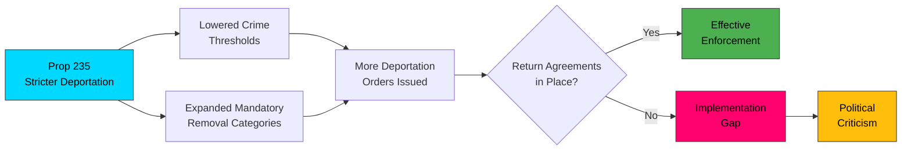

# 🔍 Per-File Political Intelligence Analysis

## 📋 Document Identity

| Field | Value |
|-------|-------|
| **Document ID** | `HD03235` |
| **Document Type** | Proposition (prop) |
| **Title** | Skärpta regler om utvisning på grund av brott |
| **Date** | 2026-04-01 |
| **Riksmöte** | 2025/26 |
| **Source MCP Tool** | get_propositioner |
| **Analysis Timestamp** | 2026-04-03 22:02 UTC |
| **Analyst** | news-realtime-monitor |

## 🎯 Executive Summary

Justice Minister Johan Forssell (M) advances Prop. 2025/26:235 to tighten deportation rules for foreign nationals convicted of crimes. This is part of the government's hardline criminal justice agenda, which also includes prison reform (JuU15), honor-based violence legislation (HD03213), and investigating juvenile offenders (HD03227). The proposition lowers thresholds for deportation and expands the categories of crimes triggering mandatory removal — a core campaign promise of the M-KD-L government with SD support. This will face sharp opposition from V and MP on human rights grounds while S navigates a nuanced position. **Confidence: HIGH**

## 📊 Political Classification

| Dimension | Assessment | Evidence |
|-----------|------------|----------|
| **Policy Domain** | Criminal Justice / Migration | Deportation reform |
| **Significance Score** | 7/10 | Multiple parties affected, human rights implications, election issue |
| **Coalition Impact** | Strengthening | Core agenda for M, SD cooperation; KD, L aligned |
| **Opposition Relevance** | HIGH | V, MP will strongly oppose; S in difficult position |

## 💼 SWOT Analysis

### ✅ Strengths

| # | Statement | Evidence | Confidence | Impact |
|---|-----------|----------|:----------:|:------:|
| S1 | Delivers on core government campaign promise — strengthens credibility | HD03235, coalition agreement | HIGH | HIGH |
| S2 | SD support secured — reinforces coalition cooperation model | SD voting pattern on crime | HIGH | HIGH |
| S3 | Part of comprehensive criminal justice reform package | HD03227, HD03213, JuU15 | HIGH | MEDIUM |

### ⚠️ Weaknesses

| # | Statement | Evidence | Confidence | Impact |
|---|-----------|----------|:----------:|:------:|
| W1 | Human rights organizations will challenge implementation | International precedent | HIGH | MEDIUM |
| W2 | Practical enforcement barriers (no return agreements with some countries) | Administrative reality | HIGH | HIGH |

### 🌟 Opportunities

| # | Statement | Evidence | Confidence | Impact |
|---|-----------|----------|:----------:|:------:|
| O1 | Broad public support for tougher crime measures ahead of 2026 election | Opinion polls | HIGH | HIGH |
| O2 | EU-wide trend toward stricter migration enforcement provides political cover | EU policy context | MEDIUM | MEDIUM |

### 🔴 Threats

| # | Statement | Evidence | Confidence | Impact |
|---|-----------|----------|:----------:|:------:|
| T1 | European Court challenges could delay or block implementation | ECHR precedent | MEDIUM | HIGH |
| T2 | V/MP/civil society mobilization creates political polarization before election | Political dynamics | HIGH | MEDIUM |

## ⚠️ Risk Assessment

| Risk ID | Risk | L (1-5) | I (1-5) | L×I | Trend |
|---------|------|:-------:|:-------:|:---:|:-----:|
| R1 | ECHR challenges block key provisions | 3 | 4 | 12 | ↑ |
| R2 | Return agreement gaps prevent practical enforcement | 4 | 3 | 12 | → |
| R3 | Political polarization damages democratic discourse | 3 | 3 | 9 | ↑ |

## 👥 Stakeholder Impact

| Stakeholder | Impact | Assessment |
|-------------|:------:|------------|
| **Citizens** | MEDIUM | Public safety framing vs. integration concerns |
| **Government Coalition** | HIGH | Core deliverable; coalition unity demonstrated |
| **Opposition (V, MP)** | HIGH | Fundamental rights objections; election mobilization |
| **Opposition (S)** | HIGH | Difficult balance — tough on crime vs. human rights |
| **Civil Society** | HIGH | Human rights organizations, immigrant advocacy groups |
| **International/EU** | MEDIUM | ECHR, EU rights framework scrutiny |
| **Judiciary** | HIGH | Courts will interpret and potentially limit scope |

## 🔮 Forward Indicators

| Indicator | Trigger | Timeline | Confidence |
|-----------|---------|----------|:----------:|
| Committee referral and party positions | JuU proceedings | April 2026 | HIGH |
| ECHR preliminary opinion or challenge | Legal proceedings | Q2-Q3 2026 | MEDIUM |
| S party position announcement | Press conference | Weeks | HIGH |
| Opinion poll impact on crime/migration question | Survey data | Ongoing | HIGH |
