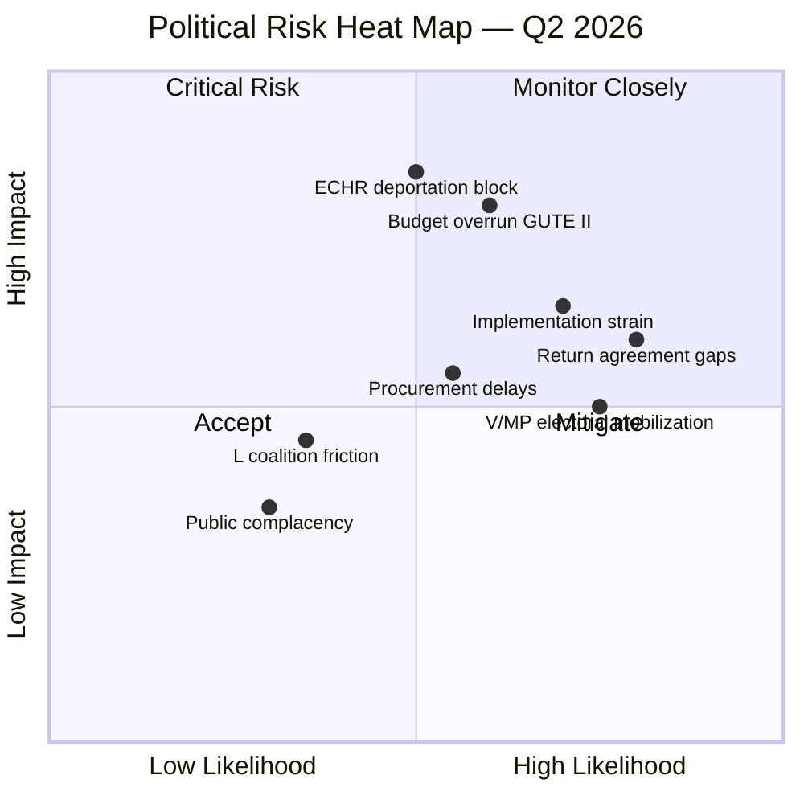
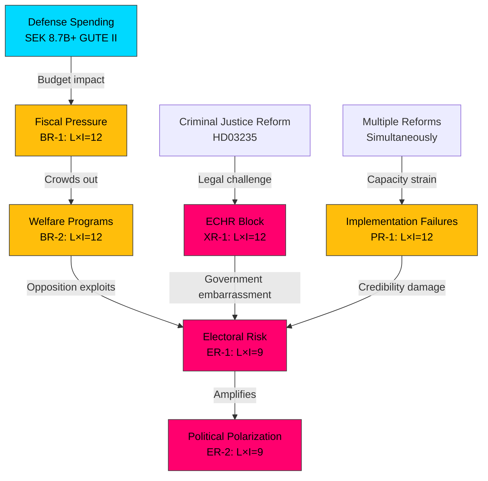

# ⚠️ Political Risk Assessment — 2026-04-03

## 📋 Risk Context

| Field | Value |
|-------|-------|
| **Risk Assessment ID** | RSK-2026-04-03-2200 |
| **Analysis Date** | 2026-04-03 22:00 UTC |
| **Risk Period** | 2026-Q2 (April – June) |
| **Produced By** | news-realtime-monitor |
| **Overall Risk Level** | MEDIUM (Elevated) |
| **Key Driver** | Defense spending + pre-election dynamics |

## 📊 Risk Heat Map

## 🔴 5-Dimension Risk Scoring

### Coalition Risk (Score: 6/25)

| Risk ID | Risk | L (1-5) | I (1-5) | L×I | Evidence |
|---------|------|:-------:|:-------:|:---:|----------|
| CR-1 | L internal dissent on war material export human rights | 2 | 3 | 6 | HD03228 + L platform tension |
| CR-2 | SD demands exceeding coalition tolerance | 1 | 4 | 4 | Low current signal; monitoring |

**Assessment**: Coalition stability is STRONG. All four parties (M, KD, L, SD) aligned on defense and criminal justice. Risk is in L's marginal position on arms exports.

### Policy Implementation Risk (Score: 14/25)

| Risk ID | Risk | L (1-5) | I (1-5) | L×I | Evidence |
|---------|------|:-------:|:-------:|:---:|----------|
| PR-1 | Multi-domain reform overload strains government capacity | 4 | 3 | 12 | 5+ simultaneous major reforms |
| PR-2 | Cybersecurity center inter-agency coordination failure | 3 | 3 | 9 | HD03214 (FRA/MSB/SÄPO) |
| PR-3 | Deportation enforcement gaps (no return agreements) | 4 | 3 | 12 | HD03235 implementation |
| PR-4 | Municipal civil defense implementation unevenness | 4 | 4 | 16 | HD01FöU12 |

### Budget/Fiscal Risk (Score: 14/25)

| Risk ID | Risk | L (1-5) | I (1-5) | L×I | Evidence |
|---------|------|:-------:|:-------:|:---:|----------|
| BR-1 | GUTE II procurement budget overrun | 3 | 4 | 12 | GUTE-II SEK 8.7B |
| BR-2 | Defense spending crowds out welfare programs | 3 | 4 | 12 | Aggregate spending analysis |
| BR-3 | Electricity support (elstöd) adds fiscal pressure | 3 | 3 | 9 | Regering Ds on elstöd |

### Electoral Risk (Score: 10/25)

| Risk ID | Risk | L (1-5) | I (1-5) | L×I | Evidence |
|---------|------|:-------:|:-------:|:---:|----------|
| ER-1 | Opposition framing of "guns vs. butter" before 2026 election | 3 | 3 | 9 | V/MP messaging patterns |
| ER-2 | Polarization on migration/crime damages public discourse | 3 | 3 | 9 | HD03235, political dynamics |

### External/Security Risk (Score: 8/25)

| Risk ID | Risk | L (1-5) | I (1-5) | L×I | Evidence |
|---------|------|:-------:|:-------:|:---:|----------|
| XR-1 | ECHR challenge to deportation provisions | 3 | 4 | 12 | HD03235, ECHR precedent |
| XR-2 | Weapons reaching conflict zones damaging reputation | 2 | 5 | 10 | HD03228, export risk |

## 🔗 Cascading Risk Chain

## 🔮 Forward Risk Indicators

| Indicator | Trigger Level | Current | Timeline |
|-----------|:------------:|:-------:|----------|
| Opposition interpellations on defense budget | >5 in single session | 2 | April 2026 |
| L public dissent on arms exports | Any minister statement | None | Weeks |
| ECHR preliminary opinion | Filing accepted | Not filed | Q2-Q3 2026 |
| Municipal civil defense budget shortfall | >50% underfunded | Unknown | Q3 2026 |

## 📋 Document Control

| Version | Date | Author | Changes |
|---------|------|--------|---------|
| 1.0 | 2026-04-03 | news-realtime-monitor | Initial risk assessment based on Apr 1-3 data |
