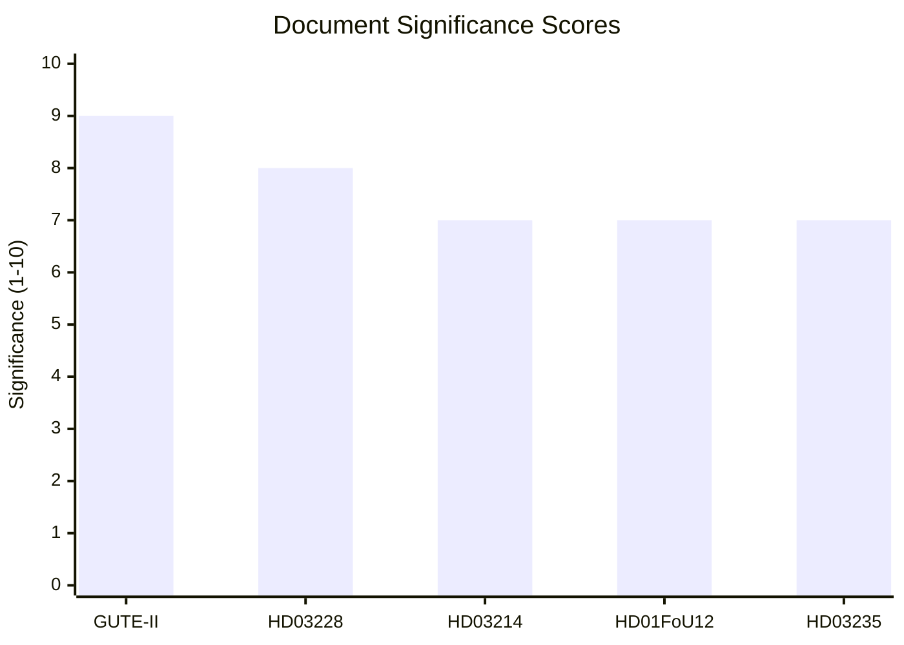

# 📈 Significance Scoring — 2026-04-03

## 📋 Scoring Context

| Field | Value |
|-------|-------|
| **Scoring ID** | SIG-2026-04-03-2200 |
| **Analysis Date** | 2026-04-03 22:00 UTC |
| **Documents Scored** | 5 |
| **Produced By** | news-realtime-monitor |

## 📊 Scoring Results

| Rank | dok_id | Title | Score | Factors |
|:----:|--------|-------|:-----:|---------|
| 1 | GUTE-II-2026-04-02 | Luftvärnsavtal 8,7 miljarder anti-drönar | **9/10** | +2 defense, +2 budget (8.7B SEK), +2 >3 actors, +1 named minister (Jonson), +2 industrial impact |
| 2 | HD03228 | Modern war material regulation | **8/10** | +2 defense, +2 >3 parties affected, +1 minister (Dousa), +2 NATO alignment, +1 export implications |
| 3 | HD03214 | National cybersecurity center | **7/10** | +2 defense/security, +2 critical infrastructure, +1 minister (Bohlin), +2 NATO cyber |
| 4 | HD01FöU12 | Civilian protection heightened preparedness | **7/10** | +2 defense, +2 citizen safety, +1 committee report, +2 totalförsvaret |
| 5 | HD03235 | Stricter deportation on crime | **7/10** | +2 criminal justice, +2 >3 parties, +1 minister (Forssell), +2 election issue |

## 📊 Scoring Methodology

Severity scoring formula (1–10 scale):
- +3 if coalition majority at risk → **0** (coalition stable)
- +2 if > 3 parties involved → **+2** (all 8 parties affected)
- +2 if budget/fiscal implications → **+2** (SEK 8.7B GUTE II)
- +2 if defense/security policy → **+2** (3 of 5 documents)
- +2 if criminal justice/social welfare reform → **+2** (2 of 5 documents)
- +1 if involves named minister → **+1** (Jonson, Dousa, Bohlin, Forssell)
- +1 if committee report approves government proposal → **+1** (FöU12)
- -2 if similar topic covered in last 6 hours → **0** (no recent coverage)

**Average significance**: 7.6/10 — **HIGH threshold exceeded (≥7)**. Breaking news coverage warranted.
