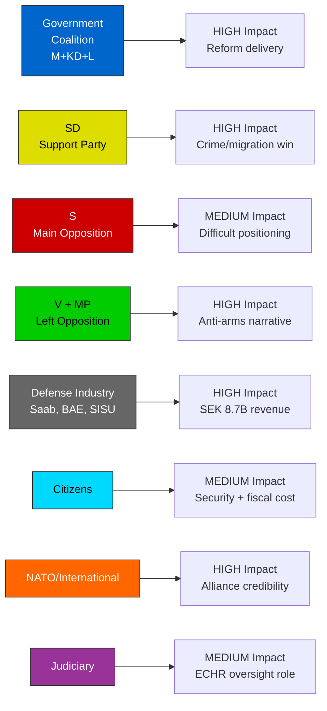

# 👥 Stakeholder Perspectives Analysis — 2026-04-03

## 📋 Stakeholder Context

| Field | Value |
|-------|-------|
| **Analysis ID** | STK-2026-04-03-2200 |
| **Analysis Date** | 2026-04-03 22:00 UTC |
| **Stakeholder Groups Analyzed** | 8 |
| **Produced By** | news-realtime-monitor |

## 📊 Stakeholder Impact Matrix

| Stakeholder Group | Impact Level | Key Issue | Position |
|-------------------|:----------:|-----------|----------|
| **Citizens** | MEDIUM | Enhanced security vs. fiscal cost of SEK 8.7B+ defense | Generally supportive of defense; concerned about welfare trade-offs |
| **Government Coalition (M, KD, L)** | HIGH | Reform delivery demonstrates competence before 2026 election | Unified; L marginally cautious on arms exports |
| **SD (Support Party)** | HIGH | Criminal justice and migration reform alignment | Strongly supportive; reinforces cooperation model |
| **Opposition (S)** | MEDIUM | Cannot oppose defense (historical support) but must differentiate | Challenging position — likely focus on implementation and speed |
| **Opposition (V, MP)** | HIGH | Principled opposition to arms spending and deportation reform | Clear anti-war-material, pro-human-rights messaging |
| **Business/Industry** | HIGH | Saab, BAE Systems Bofors, SISU, Nammo benefit directly from GUTE II | Strongly positive; lobbying for export reform |
| **International/NATO** | HIGH | Sweden demonstrates commitment to alliance burden-sharing | Positive reception; Norfolk/Pentagon visit reinforces |
| **Judiciary/Constitutional** | MEDIUM | ECHR oversight of deportation provisions; arms export oversight | Will scrutinize proportionality and human rights compliance |

## 📋 Key Stakeholder Dynamics

**Convergence**: M, KD, SD aligned on both defense and criminal justice — strongest coalition coordination since government formation.

**Divergence**: V and MP will oppose on principled grounds but face electoral challenge as public favors tougher crime/defense measures. S faces asymmetric pressure — supporting defense while opposing criminal justice specifics.

**Wild Card**: L's position on war material export human rights safeguards could create minor coalition friction if public pressure mounts.
