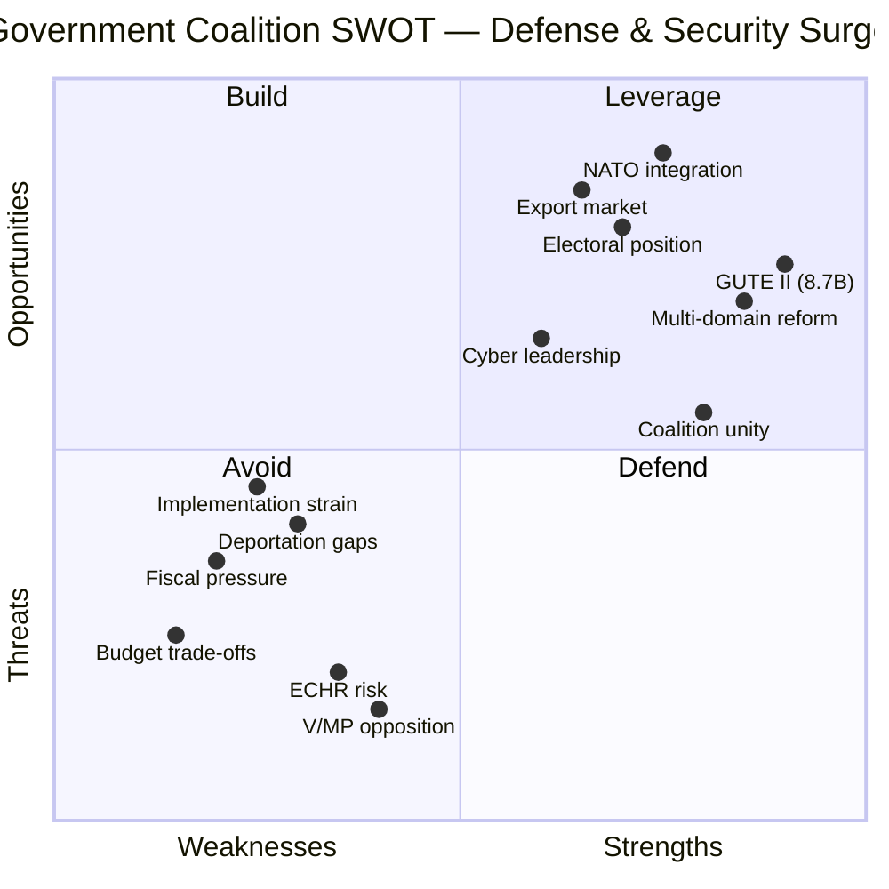

# 💼 Political SWOT Analysis — 2026-04-03

## 📋 SWOT Context

| Field | Value |
|-------|-------|
| **SWOT ID** | SWT-2026-04-03-2200 |
| **Analysis Date** | 2026-04-03 22:00 UTC |
| **Analysis Scope** | Government coalition defense & security reform package |
| **Reference Period** | 2026-W14 (March 31 – April 6) |
| **Produced By** | news-realtime-monitor |
| **Primary MCP Sources** | get_propositioner, get_betankanden, search_regering |
| **Validity Window** | Entries valid until 2026-04-17 |

## 🏛️ Section 1: Government Coalition SWOT

### ✅ Strengths — Government Coalition

| # | Strength Statement | Evidence (dok_id) | Confidence | Impact | Entry Date |
|---|-------------------|-------------------|:----------:|:------:|:----------:|
| S1 | SEK 8.7B GUTE II contract demonstrates decisive defense procurement capability | GUTE-II-2026-04-02 | HIGH | HIGH | 2026-04-02 |
| S2 | Coordinated multi-domain reform package (defense + cybersecurity + civil protection + criminal justice) shows strategic coherence | HD03228, HD03214, HD01FöU12, HD03235 | HIGH | HIGH | 2026-04-01 |
| S3 | Full M-KD-L-SD alignment on defense and security agenda — no visible coalition friction | Coalition voting patterns | HIGH | MEDIUM | 2026-04-03 |
| S4 | NATO integration deepened through ministerial diplomacy (Jonson Norfolk/Pentagon visit) | Regering press release | HIGH | HIGH | 2026-04-02 |
| S5 | Criminal justice reform package delivers core campaign promises ahead of 2026 election | HD03235, HD03227, HD03213 | HIGH | HIGH | 2026-04-01 |

### ⚠️ Weaknesses — Government Coalition

| # | Weakness Statement | Evidence (dok_id) | Confidence | Impact | Entry Date |
|---|-------------------|-------------------|:----------:|:------:|:----------:|
| W1 | Simultaneous multi-domain reform creates implementation strain on government machinery | Reform volume analysis | MEDIUM | HIGH | 2026-04-03 |
| W2 | SEK 8.7B defense spending + concurrent programs strain fiscal headroom | GUTE-II budget impact | HIGH | HIGH | 2026-04-02 |
| W3 | Practical enforcement gaps in deportation reform (missing return agreements) | HD03235 implementation | HIGH | MEDIUM | 2026-04-01 |
| W4 | L's human rights emphasis may create internal tension on arms export reform | HD03228 + L platform | MEDIUM | LOW | 2026-04-03 |

### 🌟 Opportunities — Government Coalition

| # | Opportunity Statement | Evidence (dok_id) | Confidence | Impact | Entry Date |
|---|----------------------|-------------------|:----------:|:------:|:----------:|
| O1 | European defense spending surge creates massive export market for Swedish defense industry | HD03228 + EU defense context | HIGH | HIGH | 2026-04-01 |
| O2 | NATO membership provides framework for burden-sharing argument on defense spending | GUTE-II, Norfolk visit | HIGH | HIGH | 2026-04-02 |
| O3 | Public support for both defense and crime measures strengthens government's electoral position | Opinion polls | HIGH | HIGH | 2026-04-03 |
| O4 | Cybersecurity legislation positions Sweden as NATO cyber defense leader | HD03214 | MEDIUM | MEDIUM | 2026-04-01 |

### 🔴 Threats — Government Coalition

| # | Threat Statement | Evidence (dok_id) | Confidence | Impact | Entry Date |
|---|-----------------|-------------------|:----------:|:------:|:----------:|
| T1 | V/MP opposition framing arms spending vs. welfare ahead of 2026 election | Political dynamics | HIGH | MEDIUM | 2026-04-03 |
| T2 | ECHR challenges to deportation provisions could embarrass government | HD03235 legal risk | MEDIUM | HIGH | 2026-04-01 |
| T3 | Defense procurement delays/overruns undermine credibility narrative | Historical pattern | MEDIUM | MEDIUM | 2026-04-02 |
| T4 | Budget constraints force trade-offs between defense and social spending | Fiscal analysis | HIGH | HIGH | 2026-04-03 |

## 🏛️ Section 2: Opposition SWOT

### ✅ Strengths — Opposition

| # | Strength Statement | Evidence (dok_id) | Confidence | Impact | Entry Date |
|---|-------------------|-------------------|:----------:|:------:|:----------:|
| OS1 | Human rights arguments on deportation have ECHR support potential | HD03235 + ECHR precedent | MEDIUM | HIGH | 2026-04-01 |
| OS2 | Arms spending vs. welfare framing resonates with core V/MP voters | Political dynamics | HIGH | MEDIUM | 2026-04-03 |

### ⚠️ Weaknesses — Opposition

| # | Weakness Statement | Evidence (dok_id) | Confidence | Impact | Entry Date |
|---|-------------------|-------------------|:----------:|:------:|:----------:|
| OW1 | S cannot effectively oppose defense spending given own historical support | S defense policy record | HIGH | HIGH | 2026-04-03 |
| OW2 | Public opinion favors tougher crime measures — opposition position is electorally risky | Opinion poll data | HIGH | HIGH | 2026-04-03 |

## 🔄 TOWS Strategic Options

| TOWS Combination | Strategic Option |
|-----------------|-----------------|
| **SO** (Strengths + Opportunities) | Government leverages GUTE II + NATO membership to position Sweden as leading European defense partner, opening export markets |
| **ST** (Strengths + Threats) | Coalition uses unified front to pre-empt V/MP opposition framing; emphasize bipartisan defense support history |
| **WO** (Weaknesses + Opportunities) | Address implementation strain by phasing reforms; use NATO framework to share burden on cybersecurity and civil defense |
| **WT** (Weaknesses + Threats) | Fiscal pressure + electoral risk requires prioritization; government must avoid overcommitting before 2026 election |

## 🔗 Cross-SWOT Interference

Government S1 (GUTE II contract) amplifies Government O1 (export market) — the domestic procurement validates Swedish defense industry capability for international customers. Meanwhile, Government W2 (fiscal pressure) amplifies T4 (budget trade-offs), creating a compounding risk as defense spending crowds out social programs that opposition can exploit.

## 📋 Strategic Implications

### Key Watch Items
1. **S party leadership response** to defense reform package — their positioning determines opposition effectiveness
2. **L internal caucus** on war material export human rights safeguards — coalition stress indicator
3. **Spring budget negotiations** — fiscal room for defense spending + social programs
4. **ECHR preliminary signals** on deportation provisions

### Document Control
| Version | Date | Author | Changes |
|---------|------|--------|---------|
| 1.0 | 2026-04-03 | news-realtime-monitor | Initial SWOT based on April 1-3 MCP data |
