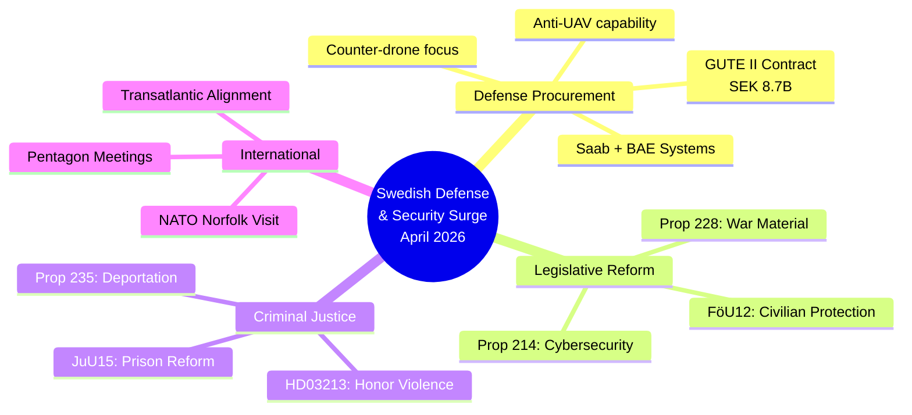
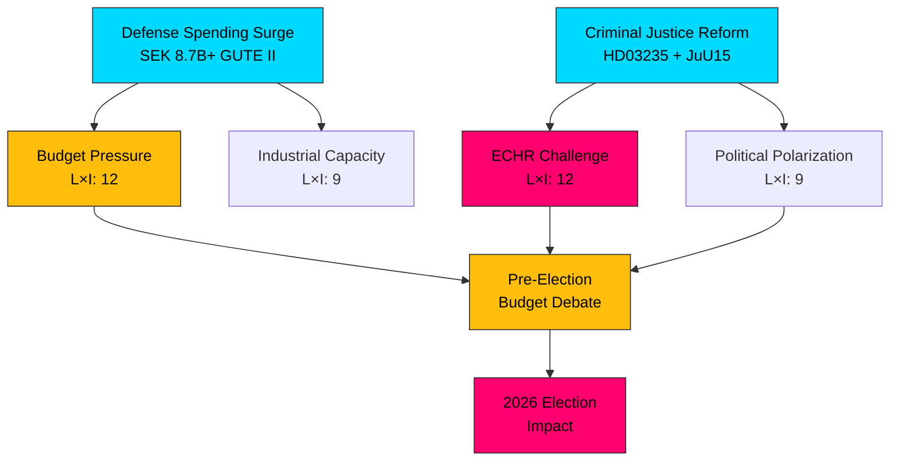

# 🧩 Political Intelligence Synthesis — 2026-04-03

## 📋 Synthesis Context

| Field | Value |
|-------|-------|
| **Synthesis ID** | SYN-2026-04-03-2200 |
| **Analysis Date** | 2026-04-03 22:00 UTC |
| **Documents Analyzed** | 5 |
| **Analysis Period** | 2026-04-01 – 2026-04-03 |
| **Produced By** | news-realtime-monitor |
| **Overall Confidence** | HIGH |

## 📊 Intelligence Dashboard

## 🏛️ Cross-Document Pattern Analysis

### Pattern 1: Coordinated Defense & Security Buildup
The government has launched a **synchronized defense reform offensive** across multiple policy domains within 48 hours:
- **Procurement**: SEK 8.7B GUTE II air defense contract (Saab, BAE Systems Bofors, SISU, Nammo) — GUTE-II-2026-04-02
- **Legislation**: War material export reform (HD03228), cybersecurity center strengthening (HD03214)
- **Civil defense**: Civilian protection during heightened preparedness (HD01FöU12)
- **Diplomacy**: Defense Minister Jonson at NATO HQ Norfolk and Pentagon

This coordination suggests a deliberate strategic communications campaign to signal Sweden's commitment as a new NATO member.

### Pattern 2: Criminal Justice Reform Package
Running parallel to defense reforms, the government advances:
- Stricter deportation for crimes (HD03235, Johan Forssell)
- Prison system reform (HD01JuU15, Justice Committee)
- Honor-based violence legislation (HD03213)
- Juvenile crime investigation improvements (HD03227)

This represents the government's pre-election criminal justice agenda.

### Pattern 3: Coalition Unity Demonstration
All initiatives show **M-KD-L-SD alignment**: defense (M/KD led), criminal justice (M/SD aligned), cybersecurity (consensus). No visible coalition friction points.

## 📊 Top Documents by Significance

| Score | Type | dok_id | Title |
|-------|------|--------|-------|
| 9/10 | Press Release | GUTE-II-2026-04-02 | Luftvärnsavtal på 8,7 miljarder (anti-drönar) |
| 8/10 | Proposition | HD03228 | Modern war material regulation |
| 7/10 | Proposition | HD03214 | National cybersecurity center legislation |
| 7/10 | Committee Report | HD01FöU12 | Civilian protection (heightened preparedness) |
| 7/10 | Proposition | HD03235 | Stricter deportation rules for crimes |

## ⚠️ Aggregate Risk Assessment

| Risk Dimension | Score (1-25) | Trend | Top Driver |
|----------------|:------------:|:-----:|------------|
| **Coalition Stability** | 6 | → | Unified on defense; no visible friction |
| **Policy Implementation** | 12 | ↑ | Multiple simultaneous reforms strain capacity |
| **Budget/Fiscal** | 14 | ↑ | SEK 8.7B GUTE II + concurrent spending |
| **Electoral** | 10 | ↑ | Polarization on crime/migration pre-2026 |
| **External/Security** | 8 | → | NATO integration progressing |

## 🔮 Forward Intelligence

| Indicator | Trigger | Timeline | Confidence |
|-----------|---------|----------|:----------:|
| Riksdag debate on defense budget allocation | Spring budget session | April-May 2026 | HIGH |
| Opposition coordinated response to reform package | S party leadership meeting | Days-weeks | HIGH |
| V/MP joint statement on arms exports | Press conference | Days | HIGH |
| NATO capability review of Swedish contributions | Alliance meeting | Q2 2026 | MEDIUM |
| ECHR challenge to deportation provisions | Legal filing | Q3 2026 | MEDIUM |

## 📋 Implications

**Overall Political Risk Level: MEDIUM** — The government's coordinated defense and security push demonstrates strategic ambition but creates implementation risk through simultaneous multi-domain reform. Budget pressure from SEK 8.7B+ defense procurement combined with pre-election dynamics will test coalition discipline. The opposition faces asymmetric challenges: S must balance support for defense with critique of criminal justice measures, while V/MP are positioned for principled opposition that may not resonate with the median voter.

**Articles should emphasize**: The strategic coordination of the defense reform package, the GUTE II contract's significance as Sweden's largest counter-drone investment, and the criminal justice dimension as a separate but concurrent policy stream.
