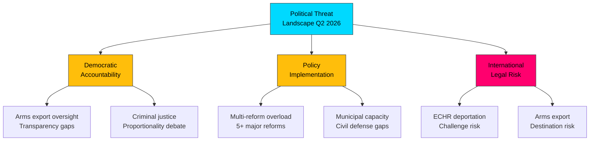

# 🔴 Political Threat Analysis — 2026-04-03

## 📋 Threat Context

| Field | Value |
|-------|-------|
| **Threat Assessment ID** | THR-2026-04-03-2200 |
| **Analysis Date** | 2026-04-03 22:00 UTC |
| **Produced By** | news-realtime-monitor |
| **Threat Level** | MODERATE |

## 🎯 Threat Landscape

## 📊 Threat Assessment Matrix

| Threat ID | Category | Description | Severity | Probability | Evidence |
|-----------|----------|-------------|:--------:|:-----------:|----------|
| T-001 | Democratic Accountability | War material export reform (HD03228) may reduce parliamentary oversight of arms sales | MEDIUM | MEDIUM | HD03228 |
| T-002 | Civil Rights | Stricter deportation rules (HD03235) risk disproportionate impact on vulnerable populations | HIGH | MEDIUM | HD03235 |
| T-003 | Implementation | Cybersecurity center expansion creates surveillance authority expansion (HD03214) | MEDIUM | LOW | HD03214 |
| T-004 | Fiscal Sustainability | SEK 8.7B defense contract + concurrent spending pressures welfare state | HIGH | HIGH | GUTE-II-2026-04-02 |
| T-005 | Electoral Democracy | Pre-election polarization on crime/migration damages democratic discourse | MEDIUM | HIGH | Political dynamics |

## 🛡️ Mitigation Landscape

| Threat | Current Mitigation | Gap Assessment |
|--------|-------------------|----------------|
| T-001 | Riksdag Foreign Affairs Committee oversight | May need strengthened reporting requirements |
| T-002 | Courts and ECHR provide check | Implementation monitoring needed |
| T-003 | Privacy legislation framework | Inter-agency oversight coordination |
| T-004 | Budget framework rules | Spring budget negotiations critical |
| T-005 | Democratic institutions, media | Requires active civic engagement |

## 📋 Implications

The threat environment is **MODERATE** — driven by the scale and pace of reforms rather than any single high-severity threat. The combination of defense spending expansion, criminal justice tightening, and pre-election dynamics creates compound risk. Key monitoring focus: spring budget negotiations and opposition response to the reform package.
