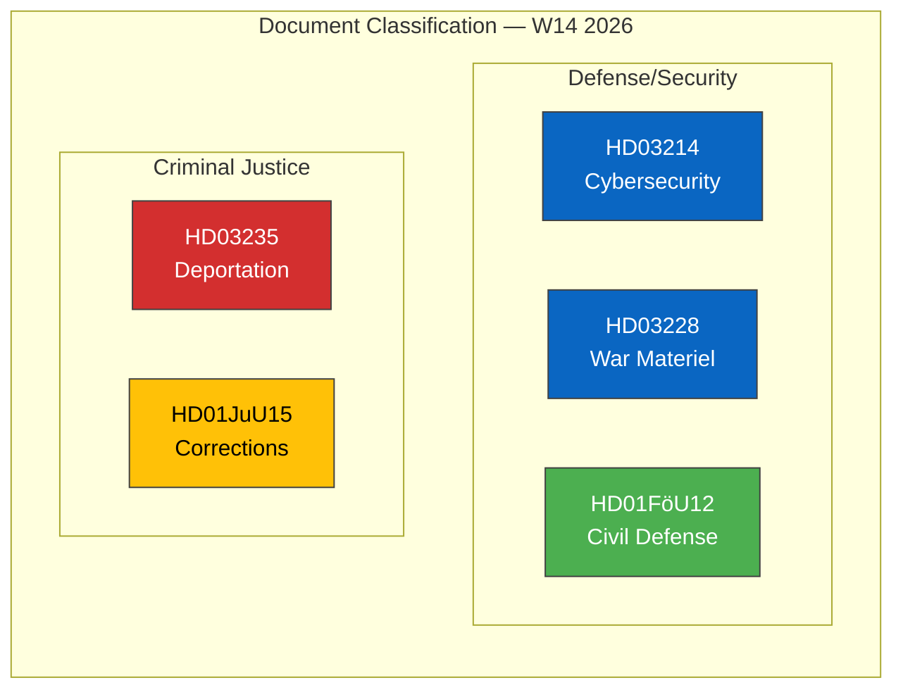

# 🏷️ Political Classification Results — 2026-04-04

## 📋 Classification Context

| Field | Value |
|-------|-------|
| **Classification ID** | `CLS-2026-04-04-001` |
| **Analysis Date** | 2026-04-04 12:15 UTC |
| **Documents Classified** | 5 |
| **Produced By** | news-realtime-monitor |
| **Confidence** | MEDIUM |

---

## 📊 Classification Matrix

---

## 📋 Classification Results

| dok_id | Title | Domain | Sensitivity | Impact | Urgency | Significance |
|--------|-------|--------|:-----------:|:------:|:-------:|:------------:|
| HD03214 | Lagändringar för ett stärkt nationellt cybersäkerhetscenter | Defense/Cyber | PUBLIC | HIGH | HIGH | 7/10 |
| HD03235 | Skärpta regler om utvisning på grund av brott | Criminal Justice/Migration | PUBLIC | HIGH | MEDIUM | 6/10 |
| HD03228 | Ett modernt och anpassat regelverk för krigsmateriel | Defense/Arms Export | PUBLIC | HIGH | MEDIUM | 6/10 |
| HD01FöU12 | Ett starkare skydd för civilbefolkningen vid höjd beredskap | Defense/Civil Defense | PUBLIC | MEDIUM | MEDIUM | 5/10 |
| HD01JuU15 | Kriminalvårdsfrågor | Criminal Justice/Corrections | PUBLIC | MEDIUM | HIGH | 4/10 |

---

## 🔍 Domain Distribution

- **Defense/Security**: 3 documents (HD03214, HD03228, HD01FöU12) — 60% of analyzed corpus
- **Criminal Justice**: 2 documents (HD03235, HD01JuU15) — 40% of analyzed corpus

This concentration indicates a government legislative push on security and justice during the first week of April 2026, consistent with Tidö Agreement implementation priorities.

---

**Document Control:** Classification v1.0 | 2026-04-04 | news-realtime-monitor | Public