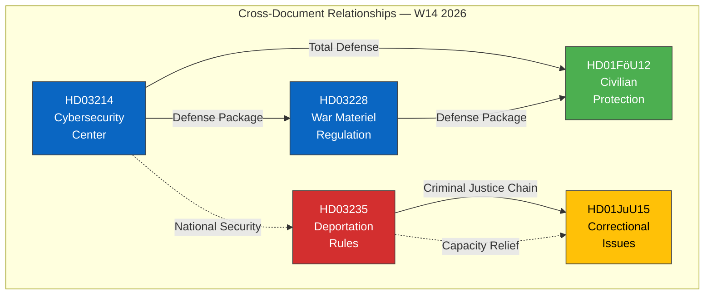

# 🔗 Cross-Reference Map — 2026-04-04

## 📋 Cross-Reference Context

| Field | Value |
|-------|-------|
| **Map ID** | `XRF-2026-04-04-001` |
| **Analysis Date** | 2026-04-04 12:15 UTC |
| **Documents Mapped** | 5 |
| **Relationships Found** | 6 |
| **Produced By** | news-realtime-monitor |
| **Confidence** | MEDIUM |

---

## 📊 Cross-Reference Network

---

## 📋 Relationship Registry

| ID | Source | Target | Relationship Type | Strength | Evidence |
|----|--------|--------|------------------|:--------:|---------|
| XR-01 | HD03214 | HD03228 | Same legislative package — defense modernization | STRONG | Both from April 1, both defense-related propositions |
| XR-02 | HD03214 | HD01FöU12 | Total Defense integration — cyber + civilian | STRONG | Cybersecurity center protects civilian infrastructure |
| XR-03 | HD03228 | HD01FöU12 | Defense supply chain — materiel + civilian readiness | MEDIUM | War materiel regulation supports Total Defense framework |
| XR-04 | HD03235 | HD01JuU15 | Criminal justice pipeline — deportation reduces prison load | STRONG | Deporting convicted foreign nationals addresses overcrowding |
| XR-05 | HD03214 | HD03235 | National security umbrella — cyber + crime | WEAK | Both address security threats, different domains |
| XR-06 | HD03235 | HD01JuU15 | Policy coherence — tougher sentencing creates capacity pressure | STRONG | More convictions + fewer deportations = overcrowding |

---

## 🔍 Key Patterns

1. **Defense Modernization Cluster**: HD03214, HD03228, HD01FöU12 form a tightly coupled defense/security package. Cross-committee coordination (FöU, UU) suggests centralized government strategic planning.

2. **Criminal Justice Feedback Loop**: HD03235 and HD01JuU15 are in tension — stricter criminal policy (deportation) is both a response to AND exacerbator of correctional system strain.

3. **Tidö Agreement Implementation Wave**: All 5 documents align with Tidö Agreement priorities, suggesting a coordinated spring 2026 legislative push before the final year of the parliamentary term.

---

**Document Control:** Cross-Reference Map v1.0 | 2026-04-04 | news-realtime-monitor | Public