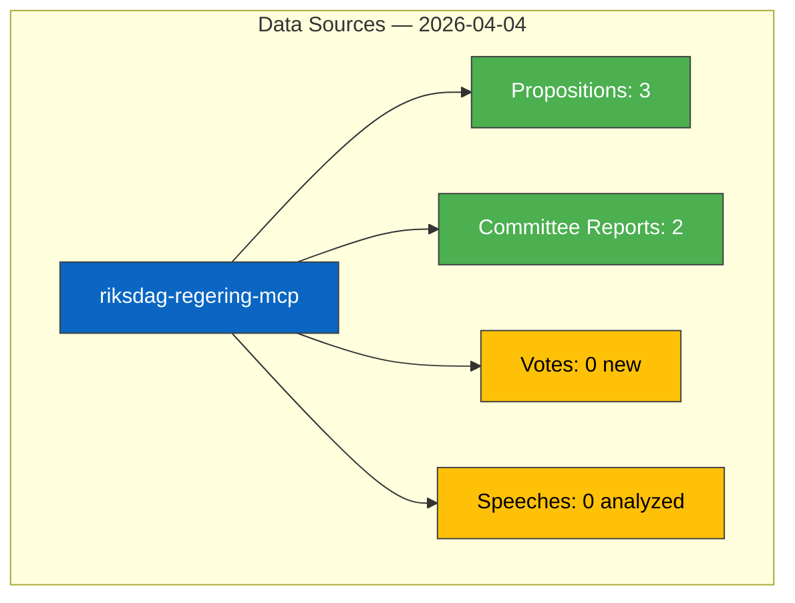

# Data Download Manifest — 2026-04-04

**Generated**: 2026-04-04 12:15 UTC
**Data Sources**: riksdag-regering-mcp (get_propositioner, get_betankanden, search_voteringar, search_anforanden, search_regering)
**Documents Analyzed**: 5
**Confidence**: MEDIUM

## Summary

Downloaded **5** documents via direct MCP tool calls (Saturday — no new publications, enriched with April 1-2 data). After date filtering with lookback window: **5** documents selected for analysis covering the most significant recent parliamentary activity.

## Document Counts by Type

- **propositions**: 3 documents (HD03235, HD03214, HD03228)
- **committeeReports**: 2 documents (HD01FöU12, HD01JuU15)
- **motions**: 0 documents
- **votes**: 0 new votes (latest from 2026-03-04)
- **speeches**: 0 analyzed (debates on NU17 noted)
- **questions**: 0 documents
- **interpellations**: 0 documents

## Data Quality Notes

Saturday monitoring — enriched with lookback data from April 1-2. All documents sourced from official riksdag-regering-mcp API. Full-text not available for deep analysis; metadata-based analysis with MEDIUM confidence.