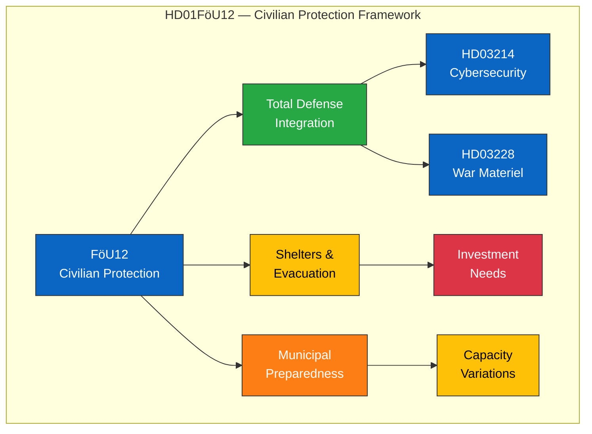

# 🔍 Per-File Political Intelligence Analysis — HD01FöU12

## 📋 Document Identity

| Field | Value |
|-------|-------|
| **Document ID** | `HD01FöU12` |
| **Document Type** | committeeReports |
| **Title** | Ett starkare skydd för civilbefolkningen vid höjd beredskap |
| **Date** | 2026-04-02 |
| **Riksmöte** | 2025/26 |
| **Source MCP Tool** | get_betankanden |
| **Analysis Timestamp** | 2026-04-04 12:17 UTC |
| **Analyst** | news-realtime-monitor |

---

## 🎯 Executive Summary

The Defense Committee's report 2025/26:FöU12 addresses strengthened civilian protection during heightened military preparedness. Published April 2, this committee report deals with civil defense measures — shelters, evacuation procedures, and civilian resilience — reflecting the post-NATO accession security posture shift. This is part of a coordinated defense package alongside cybersecurity (HD03214) and war materiel (HD03228) propositions, signaling comprehensive security modernization by the Kristersson government. **Confidence: MEDIUM**

---

## 💼 SWOT Analysis

### ✅ Strengths

| # | Statement | Evidence (dok_id) | Confidence | Impact | Entry Date |
|---|-----------|-------------------|:----------:|:------:|:----------:|
| S1 | Addresses critical civil defense gap identified since 2022 Total Defense revival | HD01FöU12 | HIGH | HIGH | 2026-04-02 |
| S2 | Part of coordinated defense modernization package (HD03214, HD03228, HD01FöU12) | HD01FöU12, HD03214, HD03228 | HIGH | HIGH | 2026-04-02 |

### ⚠️ Weaknesses

| # | Statement | Evidence (dok_id) | Confidence | Impact | Entry Date |
|---|-----------|-------------------|:----------:|:------:|:----------:|
| W1 | Municipal capacity to implement civil defense measures varies significantly | HD01FöU12 | MEDIUM | MEDIUM | 2026-04-02 |
| W2 | Existing shelter infrastructure outdated — modernization requires significant investment | HD01FöU12 | HIGH | HIGH | 2026-04-02 |

### 🌟 Opportunities

| # | Statement | Evidence (dok_id) | Confidence | Impact | Entry Date |
|---|-----------|-------------------|:----------:|:------:|:----------:|
| O1 | Cross-party consensus on Total Defense strengthens implementation prospects | HD01FöU12 | MEDIUM | HIGH | 2026-04-02 |
| O2 | NATO planning integration enables shared civil defense standards | HD01FöU12 | MEDIUM | MEDIUM | 2026-04-02 |

### 🔴 Threats

| # | Statement | Evidence (dok_id) | Confidence | Impact | Entry Date |
|---|-----------|-------------------|:----------:|:------:|:----------:|
| T1 | Funding competition between military and civil defense priorities | HD01FöU12 | MEDIUM | HIGH | 2026-04-02 |
| T2 | Public complacency about security threats may slow civil defense participation | HD01FöU12 | LOW | MEDIUM | 2026-04-02 |

---

## 📊 Civil Defense Network

---

## ⚖️ Risk Assessment

| Risk ID | Risk | Likelihood (1-5) | Impact (1-5) | L×I Score | Mitigation |
|---------|------|:-----------------:|:------------:|:---------:|-----------|
| R1 | Shelter modernization funding shortfall | 3 | 4 | 12 | Multi-year investment plan |
| R2 | Municipal implementation capacity gaps | 3 | 3 | 9 | MSB support and coordination |
| R3 | Public engagement deficit | 2 | 3 | 6 | Information campaigns, exercises |

---

## 👥 Stakeholder Perspectives

| Stakeholder | Position | Impact | Key Concern |
|------------|----------|:------:|-------------|
| **Citizens** | Supportive — safety priority | HIGH | Access to shelters, clear information |
| **Government Coalition** | Strong support | HIGH | Total Defense commitment |
| **Opposition** | Broad support with funding questions | MEDIUM | Adequate municipal resourcing |
| **Municipalities** | Supportive but concerned about capacity | HIGH | Funding and implementation burden |
| **MSB** | Strong support | HIGH | Coordination mandate and resources |
| **Military (Försvarsmakten)** | Supportive | MEDIUM | Civil-military coordination |

---

## 🔮 Forward Indicators

| Indicator | Trigger | Timeline | Confidence |
|-----------|---------|----------|:----------:|
| Riksdag vote on FöU12 | Chamber vote scheduled | April-May 2026 | HIGH |
| MSB implementation directive | Government assignment to MSB | Q2-Q3 2026 | MEDIUM |
| Municipal budget impact | Kommun budget proposals for 2027 | Autumn 2026 | MEDIUM |

---

**Document Control:** Analysis v1.0 | 2026-04-04 | news-realtime-monitor | Public
