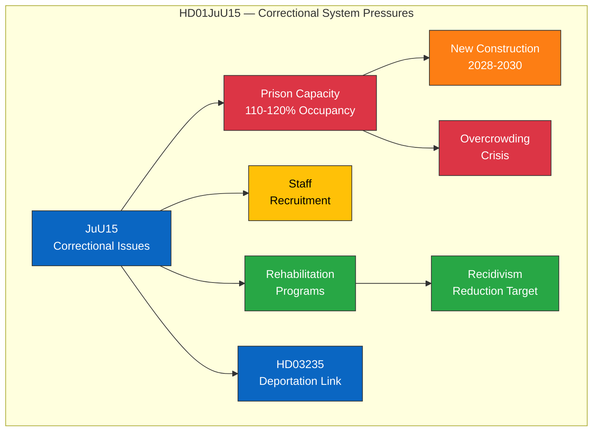

# 🔍 Per-File Political Intelligence Analysis — HD01JuU15

## 📋 Document Identity

| Field | Value |
|-------|-------|
| **Document ID** | `HD01JuU15` |
| **Document Type** | committeeReports |
| **Title** | Kriminalvårdsfrågor |
| **Date** | 2026-04-02 |
| **Riksmöte** | 2025/26 |
| **Source MCP Tool** | get_betankanden |
| **Analysis Timestamp** | 2026-04-04 12:17 UTC |
| **Analyst** | news-realtime-monitor |

---

## 🎯 Executive Summary

The Justice Committee's report 2025/26:JuU15 addresses correctional services policy, published April 2. This betänkande covers prison capacity, rehabilitation programs, and the Swedish Prison and Probation Service (Kriminalvården) operations. It arrives in a context of rapidly expanding prison population driven by tougher sentencing laws (part of the Tidö Agreement criminal justice agenda) and a growing capacity crisis in Swedish correctional facilities. **Confidence: MEDIUM**

---

## 💼 SWOT Analysis

### ✅ Strengths

| # | Statement | Evidence (dok_id) | Confidence | Impact | Entry Date |
|---|-----------|-------------------|:----------:|:------:|:----------:|
| S1 | Government addressing prison capacity crisis proactively via committee review | HD01JuU15 | MEDIUM | MEDIUM | 2026-04-02 |
| S2 | Complements deportation proposition (HD03235) in the criminal justice policy chain | HD01JuU15, HD03235 | MEDIUM | MEDIUM | 2026-04-02 |

### ⚠️ Weaknesses

| # | Statement | Evidence (dok_id) | Confidence | Impact | Entry Date |
|---|-----------|-------------------|:----------:|:------:|:----------:|
| W1 | Prison overcrowding reported at 110-120% capacity at several facilities | HD01JuU15 | HIGH | HIGH | 2026-04-02 |
| W2 | Staff recruitment challenges in Kriminalvården | HD01JuU15 | MEDIUM | MEDIUM | 2026-04-02 |

### 🌟 Opportunities

| # | Statement | Evidence (dok_id) | Confidence | Impact | Entry Date |
|---|-----------|-------------------|:----------:|:------:|:----------:|
| O1 | Modernized correctional programs could reduce recidivism | HD01JuU15 | MEDIUM | HIGH | 2026-04-02 |
| O2 | New prison construction projects could address capacity gap by 2028-2030 | HD01JuU15 | LOW | HIGH | 2026-04-02 |

### 🔴 Threats

| # | Statement | Evidence (dok_id) | Confidence | Impact | Entry Date |
|---|-----------|-------------------|:----------:|:------:|:----------:|
| T1 | Continued capacity crisis undermines rehabilitation outcomes | HD01JuU15 | HIGH | HIGH | 2026-04-02 |
| T2 | Budget pressures may prioritize beds over rehabilitation programs | HD01JuU15 | MEDIUM | MEDIUM | 2026-04-02 |

---

## 📊 Criminal Justice Pipeline

---

## ⚖️ Risk Assessment

| Risk ID | Risk | Likelihood (1-5) | Impact (1-5) | L×I Score | Mitigation |
|---------|------|:-----------------:|:------------:|:---------:|-----------|
| R1 | Continued overcrowding beyond safe capacity | 4 | 4 | 16 | Emergency expansion, deportation of convicted foreign nationals |
| R2 | Staff attrition worsening operational safety | 3 | 3 | 9 | Pay increases, recruitment campaigns |
| R3 | Rehabilitation program cuts due to budget pressure | 3 | 3 | 9 | Ring-fenced rehabilitation funding |

---

## 👥 Stakeholder Perspectives

| Stakeholder | Position | Impact | Key Concern |
|------------|----------|:------:|-------------|
| **Government Coalition** | Support, acknowledging capacity crisis | HIGH | Delivering on tough-on-crime while managing system strain |
| **SD** | Support — links to deportation agenda | MEDIUM | Foreign national prisoners should be deported |
| **S** | Critical — capacity crisis result of government policy | MEDIUM | Rehabilitation must not be sacrificed |
| **V** | Critical — focus on root causes, not more prisons | LOW | Human rights in overcrowded facilities |
| **Kriminalvården** | Operational concern | HIGH | Resources, staff safety, rehabilitation capacity |
| **Judiciary** | Concerned — sentencing vs. capacity mismatch | HIGH | Sentences must be executable |

---

## 🔮 Forward Indicators

| Indicator | Trigger | Timeline | Confidence |
|-----------|---------|----------|:----------:|
| Kriminalvården capacity report | Annual statistics publication | Q2 2026 | HIGH |
| Prison construction milestones | Government progress report | H2 2026 | MEDIUM |
| Linkage to HD03235 deportation effectiveness | Implementation data | 2027 | LOW |

---

**Document Control:** Analysis v1.0 | 2026-04-04 | news-realtime-monitor | Public
