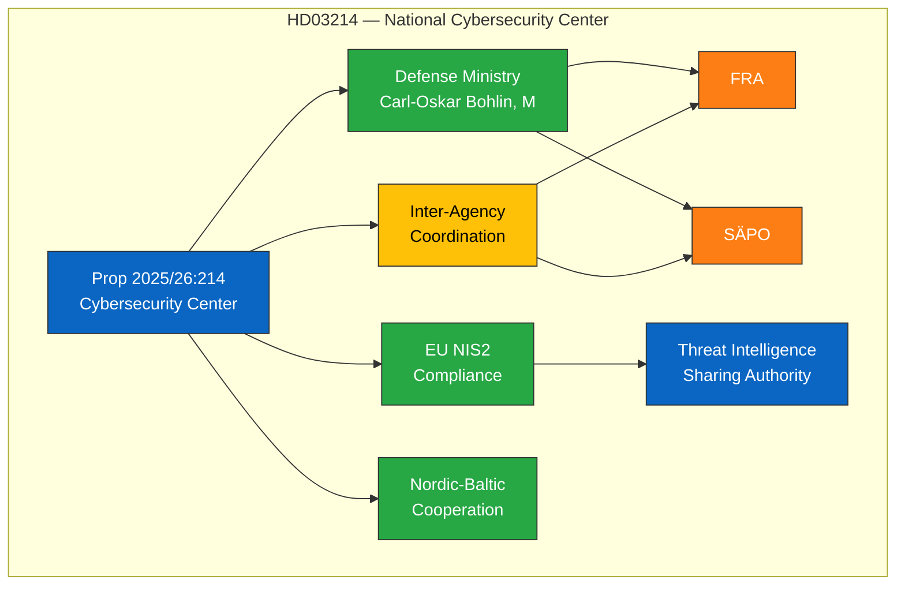

# 🔍 Per-File Political Intelligence Analysis — HD03214

## 📋 Document Identity

| Field | Value |
|-------|-------|
| **Document ID** | `HD03214` |
| **Document Type** | propositions |
| **Title** | Lagändringar för ett stärkt nationellt cybersäkerhetscenter |
| **Date** | 2026-04-01 |
| **Riksmöte** | 2025/26 |
| **Source MCP Tool** | get_propositioner |
| **Analysis Timestamp** | 2026-04-04 12:16 UTC |
| **Analyst** | news-realtime-monitor |

---

## 🎯 Executive Summary

Proposition 2025/26:214 proposes legal amendments to strengthen Sweden's National Cybersecurity Center, submitted by Defense Minister Carl-Oskar Bohlin (M). The proposal comes amid heightened cyber threat assessments across Europe following the Russia-Ukraine conflict and increasing state-sponsored cyber operations. This legislation grants the center expanded authority for threat intelligence sharing and incident response coordination across government agencies. The timing signals the government's prioritization of digital infrastructure defense alongside conventional military modernization. **Confidence: MEDIUM**

---

## 💼 SWOT Analysis

### ✅ Strengths

| # | Statement | Evidence (dok_id) | Confidence | Impact | Entry Date |
|---|-----------|-------------------|:----------:|:------:|:----------:|
| S1 | Addresses critical national security gap in cyber defense capabilities | HD03214 | HIGH | HIGH | 2026-04-01 |
| S2 | Broad cross-party support expected — cybersecurity seen as non-partisan | HD03214 | MEDIUM | MEDIUM | 2026-04-01 |
| S3 | Aligns with EU NIS2 directive transposition requirements | HD03214 | HIGH | MEDIUM | 2026-04-01 |

### ⚠️ Weaknesses

| # | Statement | Evidence (dok_id) | Confidence | Impact | Entry Date |
|---|-----------|-------------------|:----------:|:------:|:----------:|
| W1 | Center may face resourcing constraints given concurrent defense spending priorities | HD03214 | MEDIUM | MEDIUM | 2026-04-01 |
| W2 | Potential privacy concerns with expanded surveillance-adjacent authorities | HD03214 | LOW | MEDIUM | 2026-04-01 |

### 🌟 Opportunities

| # | Statement | Evidence (dok_id) | Confidence | Impact | Entry Date |
|---|-----------|-------------------|:----------:|:------:|:----------:|
| O1 | Enhanced Nordic-Baltic cybersecurity cooperation through strengthened national capacity | HD03214 | MEDIUM | HIGH | 2026-04-01 |
| O2 | Attracts international cybersecurity talent and industry investment | HD03214 | LOW | MEDIUM | 2026-04-01 |

### 🔴 Threats

| # | Statement | Evidence (dok_id) | Confidence | Impact | Entry Date |
|---|-----------|-------------------|:----------:|:------:|:----------:|
| T1 | Escalating state-sponsored cyber attacks may outpace new capabilities | HD03214 | MEDIUM | HIGH | 2026-04-01 |
| T2 | Inter-agency coordination challenges between FRA, SÄPO, and the new center | HD03214 | MEDIUM | MEDIUM | 2026-04-01 |

---

## 📊 Cybersecurity Policy Landscape

---

## ⚖️ Risk Assessment

| Risk ID | Risk | Likelihood (1-5) | Impact (1-5) | L×I Score | Mitigation |
|---------|------|:-----------------:|:------------:|:---------:|-----------|
| R1 | Resourcing gap relative to threat level | 3 | 4 | 12 | Defense budget allocation review |
| R2 | Inter-agency turf conflicts | 2 | 3 | 6 | Clear mandate delineation in law |
| R3 | Privacy concerns delaying implementation | 2 | 2 | 4 | Privacy impact assessment included |

---

## 👥 Stakeholder Perspectives

| Stakeholder | Position | Impact | Key Concern |
|------------|----------|:------:|-------------|
| **Government Coalition (M+KD+L)** | Strong support | HIGH | National security priority |
| **SD** | Support | MEDIUM | Sovereignty and defense alignment |
| **S** | Likely support | MEDIUM | Cross-party consensus on cyber defense |
| **V** | Cautious support | LOW | Privacy safeguards needed |
| **Business/Industry** | Strong support | HIGH | Critical infrastructure protection |
| **FRA/SÄPO** | Support with caveats | HIGH | Mandate clarity and resources |

---

## 🔮 Forward Indicators

| Indicator | Trigger | Timeline | Confidence |
|-----------|---------|----------|:----------:|
| Committee processing (FöU) | Defense committee review | April-May 2026 | HIGH |
| Budget allocation for center | Spring supplementary budget | May-June 2026 | MEDIUM |
| NIS2 transposition deadline | EU compliance check | October 2026 | HIGH |

---

**Document Control:** Analysis v1.0 | 2026-04-04 | news-realtime-monitor | Public
