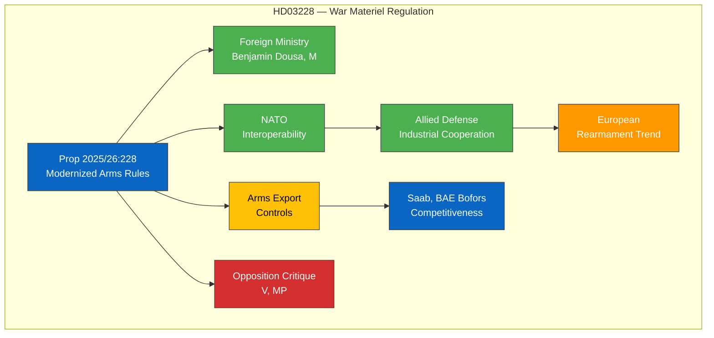

# 🔍 Per-File Political Intelligence Analysis — HD03228

## 📋 Document Identity

| Field | Value |
|-------|-------|
| **Document ID** | `HD03228` |
| **Document Type** | propositions |
| **Title** | Ett modernt och anpassat regelverk för krigsmateriel |
| **Date** | 2026-04-01 |
| **Riksmöte** | 2025/26 |
| **Source MCP Tool** | get_propositioner |
| **Analysis Timestamp** | 2026-04-04 12:16 UTC |
| **Analyst** | news-realtime-monitor |

---

## 🎯 Executive Summary

Proposition 2025/26:228 modernizes Sweden's war materiel regulatory framework, submitted by Foreign Minister Benjamin Dousa (M). This legislative update revises arms export controls and defense industry regulations in the context of Sweden's NATO membership and the broader European rearmament trend. The proposal balances expanded defense industrial cooperation with allied nations against traditional Swedish restrictive arms export policies. This is politically significant as it may ease restrictions on weapons exports to NATO allies and represents a post-NATO-accession normalization of Swedish defense policy. **Confidence: MEDIUM**

---

## 💼 SWOT Analysis

### ✅ Strengths

| # | Statement | Evidence (dok_id) | Confidence | Impact | Entry Date |
|---|-----------|-------------------|:----------:|:------:|:----------:|
| S1 | Aligns regulatory framework with NATO interoperability requirements | HD03228 | HIGH | HIGH | 2026-04-01 |
| S2 | Supports Swedish defense industry competitiveness (Saab, BAE Bofors) | HD03228 | MEDIUM | HIGH | 2026-04-01 |

### ⚠️ Weaknesses

| # | Statement | Evidence (dok_id) | Confidence | Impact | Entry Date |
|---|-----------|-------------------|:----------:|:------:|:----------:|
| W1 | Potential criticism of loosening arms export restrictions | HD03228 | HIGH | MEDIUM | 2026-04-01 |
| W2 | Complex regulatory change may create compliance gaps during transition | HD03228 | LOW | LOW | 2026-04-01 |

### 🌟 Opportunities

| # | Statement | Evidence (dok_id) | Confidence | Impact | Entry Date |
|---|-----------|-------------------|:----------:|:------:|:----------:|
| O1 | Enhanced defense industrial partnerships within NATO | HD03228 | HIGH | HIGH | 2026-04-01 |
| O2 | Export revenue growth for Swedish defense sector | HD03228 | MEDIUM | MEDIUM | 2026-04-01 |

### 🔴 Threats

| # | Statement | Evidence (dok_id) | Confidence | Impact | Entry Date |
|---|-----------|-------------------|:----------:|:------:|:----------:|
| T1 | Opposition (V, MP) may challenge ethics of expanded arms exports | HD03228 | HIGH | MEDIUM | 2026-04-01 |
| T2 | Risk of weapons reaching conflict zones through allied re-exports | HD03228 | LOW | HIGH | 2026-04-01 |

---

## 📊 Defense Policy Framework

---

## ⚖️ Risk Assessment

| Risk ID | Risk | Likelihood (1-5) | Impact (1-5) | L×I Score | Mitigation |
|---------|------|:-----------------:|:------------:|:---------:|-----------|
| R1 | Ethical criticism of eased arms exports | 3 | 3 | 9 | Strong end-use certificates and monitoring |
| R2 | Re-export risk to conflict zones | 2 | 4 | 8 | NATO partner agreements on end-use |
| R3 | Transition compliance gaps | 2 | 2 | 4 | Phased implementation timeline |

---

## 👥 Stakeholder Perspectives

| Stakeholder | Position | Impact | Key Concern |
|------------|----------|:------:|-------------|
| **Government Coalition (M+KD+L)** | Strong support | HIGH | NATO integration, defense industry |
| **SD** | Support | MEDIUM | National sovereignty in defense |
| **S** | Cautious support | MEDIUM | Balancing NATO obligations with export ethics |
| **V** | Oppose | MEDIUM | Arms proliferation concerns |
| **MP** | Oppose | LOW | Peace policy tradition undermined |
| **Defense Industry** | Strong support | HIGH | Regulatory modernization enables growth |
| **International/NATO** | Positive | HIGH | Interoperability enhancement |

---

## 🔮 Forward Indicators

| Indicator | Trigger | Timeline | Confidence |
|-----------|---------|----------|:----------:|
| UU committee review | Foreign affairs committee processing | April-May 2026 | HIGH |
| Defense industry reaction | Saab/BAE quarterly reports | Q2 2026 | MEDIUM |
| NATO coordination mechanisms | First joint procurement under new rules | H2 2026 | LOW |

---

**Document Control:** Analysis v1.0 | 2026-04-04 | news-realtime-monitor | Public
