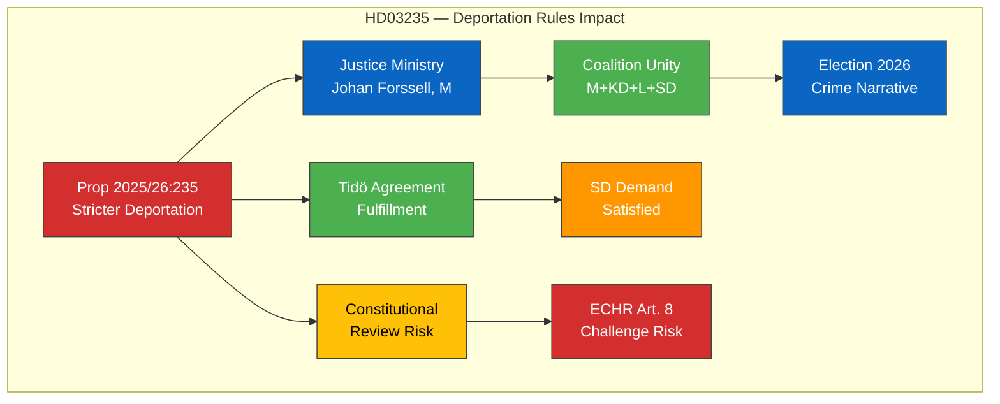

# 🔍 Per-File Political Intelligence Analysis — HD03235

## 📋 Document Identity

| Field | Value |
|-------|-------|
| **Document ID** | `HD03235` |
| **Document Type** | propositions |
| **Title** | Skärpta regler om utvisning på grund av brott |
| **Date** | 2026-04-01 |
| **Riksmöte** | 2025/26 |
| **Source MCP Tool** | get_propositioner |
| **Analysis Timestamp** | 2026-04-04 12:15 UTC |
| **Analyst** | news-realtime-monitor |

---

## 🎯 Executive Summary

The government's proposition 2025/26:235 tightens rules on deportation due to criminal convictions, lowering thresholds for expulsion of foreign nationals convicted of crimes in Sweden. This represents a significant hardening of immigration-crime policy by Justice Minister Johan Forssell (M) and the Tidö coalition. The proposal aligns with SD's longstanding demands and reinforces the government's tough-on-crime narrative ahead of the 2026 election cycle. **Confidence: MEDIUM** — policy direction consistent with Tidö Agreement.

---

## 💼 SWOT Analysis

### ✅ Strengths

| # | Statement | Evidence (dok_id) | Confidence | Impact | Entry Date |
|---|-----------|-------------------|:----------:|:------:|:----------:|
| S1 | Demonstrates coalition unity — M, KD, L, SD aligned on criminal deportation | HD03235 | MEDIUM | HIGH | 2026-04-01 |
| S2 | Fulfills Tidö Agreement commitment on stricter immigration enforcement | HD03235 | HIGH | HIGH | 2026-04-01 |

### ⚠️ Weaknesses

| # | Statement | Evidence (dok_id) | Confidence | Impact | Entry Date |
|---|-----------|-------------------|:----------:|:------:|:----------:|
| W1 | May face constitutional scrutiny regarding proportionality and ECHR Article 8 (right to family life) | HD03235 | MEDIUM | MEDIUM | 2026-04-01 |
| W2 | Opposition parties (S, V, MP) likely to challenge on human rights grounds | HD03235 | HIGH | MEDIUM | 2026-04-01 |

### 🌟 Opportunities

| # | Statement | Evidence (dok_id) | Confidence | Impact | Entry Date |
|---|-----------|-------------------|:----------:|:------:|:----------:|
| O1 | Government can frame policy as crime prevention measure to gain public support | HD03235 | MEDIUM | HIGH | 2026-04-01 |
| O2 | Aligns with EU-wide trend toward stricter migration enforcement | HD03235 | MEDIUM | MEDIUM | 2026-04-01 |

### 🔴 Threats

| # | Statement | Evidence (dok_id) | Confidence | Impact | Entry Date |
|---|-----------|-------------------|:----------:|:------:|:----------:|
| T1 | Potential ECHR challenges could delay or invalidate implementation | HD03235 | LOW | HIGH | 2026-04-01 |
| T2 | Could exacerbate social tensions around migration policy | HD03235 | MEDIUM | MEDIUM | 2026-04-01 |

---

## 📊 Political Impact Analysis

---

## ⚖️ Risk Assessment

| Risk ID | Risk | Likelihood (1-5) | Impact (1-5) | L×I Score | Mitigation |
|---------|------|:-----------------:|:------------:|:---------:|-----------|
| R1 | ECHR proportionality challenge | 3 | 4 | 12 | Government may argue margin of appreciation |
| R2 | Opposition filibuster in committee | 2 | 2 | 4 | Government majority with SD support |
| R3 | Public backlash from civil society | 3 | 3 | 9 | Frame as public safety measure |

---

## 👥 Stakeholder Perspectives

| Stakeholder | Position | Impact | Key Concern |
|------------|----------|:------:|-------------|
| **Government Coalition (M+KD+L)** | Strong support | HIGH | Delivers on Tidö crime pledge |
| **SD** | Strong support | HIGH | Core policy demand fulfilled |
| **S (Opposition)** | Oppose — too broad scope | MEDIUM | Human rights, proportionality |
| **V** | Strongly oppose | MEDIUM | Discriminatory impact on immigrants |
| **MP** | Strongly oppose | LOW | ECHR compatibility concerns |
| **Civil Society** | Mixed — crime victims support, human rights orgs oppose | MEDIUM | Proportionality and fair process |
| **Judiciary** | Cautious — awaiting Lagrådet opinion | HIGH | Constitutional compatibility |

---

## 🔮 Forward Indicators

| Indicator | Trigger | Timeline | Confidence |
|-----------|---------|----------|:----------:|
| Lagrådet opinion on proportionality | Publication of council review | Q2 2026 | HIGH |
| Committee assignment (JuU) | Riksdag processing timeline | April-May 2026 | HIGH |
| Opposition counter-motion | S or V filing alternative proposal | April 2026 | MEDIUM |

---

**Document Control:** Analysis v1.0 | 2026-04-04 | news-realtime-monitor | Public
