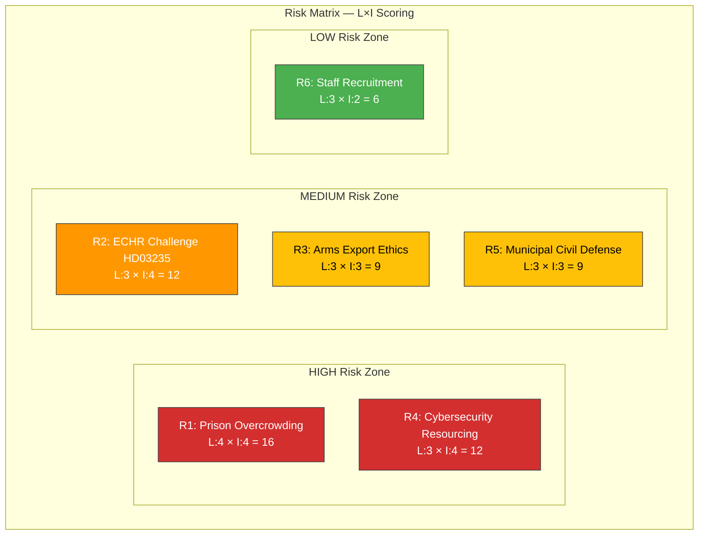

# ⚖️ Political Risk Assessment — 2026-04-04

## 📋 Risk Context

| Field | Value |
|-------|-------|
| **Risk ID** | `RSK-2026-04-04-001` |
| **Analysis Date** | 2026-04-04 12:15 UTC |
| **Documents Analyzed** | 5 |
| **Produced By** | news-realtime-monitor |
| **Overall Risk Level** | MEDIUM |

---

## 📊 Risk Matrix

---

## 📋 Detailed Risk Register

| Risk ID | Risk Description | Source (dok_id) | Likelihood (1-5) | Impact (1-5) | L×I Score | Risk Level | Mitigation |
|---------|-----------------|-----------------|:-----------------:|:------------:|:---------:|:----------:|-----------|
| R1 | Prison overcrowding exceeds safe capacity (110-120%), compromising correctional outcomes | HD01JuU15 | 4 | 4 | 16 | CRITICAL | Emergency expansion, deportation relief (HD03235) |
| R2 | ECHR proportionality challenge to stricter deportation rules delays implementation | HD03235 | 3 | 4 | 12 | HIGH | Margin of appreciation argument, Lagrådet pre-vetting |
| R3 | Arms export ethics criticism from opposition and civil society | HD03228 | 3 | 3 | 9 | MEDIUM | End-use certificates, NATO partner agreements |
| R4 | Cybersecurity center under-resourced relative to threat level | HD03214 | 3 | 4 | 12 | HIGH | Spring supplementary budget allocation |
| R5 | Municipal capacity gaps for civilian protection implementation | HD01FöU12 | 3 | 3 | 9 | MEDIUM | MSB coordination, dedicated funding stream |
| R6 | Kriminalvården staff recruitment challenges | HD01JuU15 | 3 | 2 | 6 | LOW | Pay increases, recruitment campaigns |

---

## 🔗 Risk Interconnections

**Feedback Loop 1 (Criminal Justice):** Tougher sentencing (Tidö Agreement) → prison overcrowding (R1) → reduced rehabilitation → higher recidivism → more prisoners → worsened overcrowding. HD03235 deportation is a partial pressure valve.

**Feedback Loop 2 (Defense Modernization):** NATO obligations → concurrent cybersecurity (R4) + materiel (R3) + civil defense (R5) spending → budget competition → under-resourcing of individual programs.

---

## 🔮 Forward Risk Indicators

| Indicator | Trigger | Timeline | Confidence |
|-----------|---------|----------|:----------:|
| Lagrådet opinion on HD03235 | Published constitutional review | Q2 2026 | HIGH |
| Kriminalvården capacity statistics | Annual report | Q2 2026 | HIGH |
| Spring supplementary budget defense allocation | Budget bill published | May-June 2026 | MEDIUM |
| MSB civil defense readiness report | Annual assessment | H2 2026 | MEDIUM |

---

**Document Control:** Risk Assessment v1.0 | 2026-04-04 | news-realtime-monitor | Public