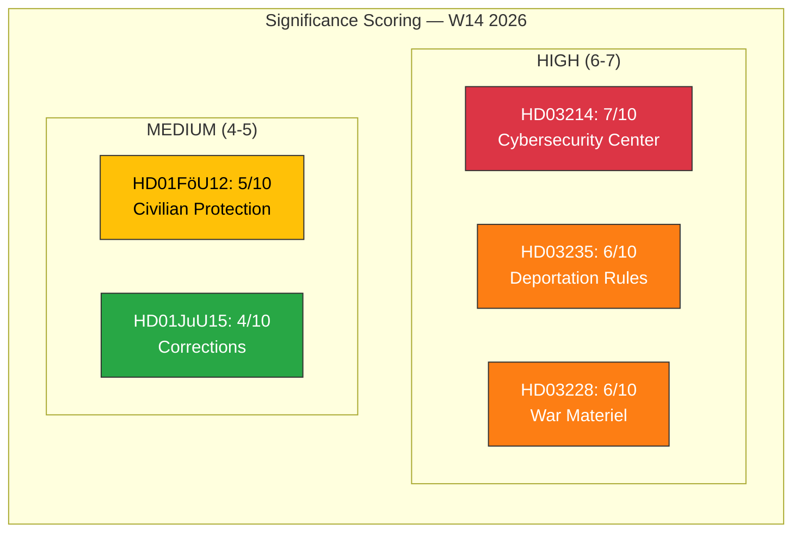

# 📈 Document Significance Scoring — 2026-04-04

## 📋 Scoring Context

| Field | Value |
|-------|-------|
| **Scoring ID** | `SIG-2026-04-04-001` |
| **Analysis Date** | 2026-04-04 12:15 UTC |
| **Documents Scored** | 5 |
| **Produced By** | news-realtime-monitor |
| **Confidence** | MEDIUM |

---

## 📊 Significance Matrix

---

## 📋 Detailed Scoring

| Score | Level | Type | dok_id | Title | Domain | Scoring Rationale |
|:-----:|-------|------|--------|-------|--------|-------------------|
| 7/10 | HIGH | prop | HD03214 | Lagändringar för ett stärkt nationellt cybersäkerhetscenter | Defense/Cyber | National security +2, EU NIS2 compliance +2, defense minister +1, cross-agency impact +2 |
| 6/10 | HIGH | prop | HD03235 | Skärpta regler om utvisning på grund av brott | Criminal Justice | Criminal justice reform +2, migration nexus +2, minister +1, ECHR risk +1 |
| 6/10 | HIGH | prop | HD03228 | Ett modernt och anpassat regelverk för krigsmateriel | Defense/Arms | Defense/security +2, NATO integration +2, minister +1, industry impact +1 |
| 5/10 | MEDIUM | bet | HD01FöU12 | Ett starkare skydd för civilbefolkningen vid höjd beredskap | Defense/Civil | Defense +2, Total Defense package +2, municipal impact +1 |
| 4/10 | MEDIUM | bet | HD01JuU15 | Kriminalvårdsfrågor | Criminal Justice | System crisis +2, policy coherence with HD03235 +1, operational concern +1 |

---

## 🔑 Key Findings

1. **1** document rated HIGH significance (score 7): HD03214 cybersecurity center
2. **2** documents rated HIGH significance (score 6): HD03235 deportation, HD03228 war materiel
3. **2** documents rated MEDIUM significance (scores 4-5): HD01FöU12 civilian protection, HD01JuU15 corrections
4. Average significance: **5.6/10** — indicating an active legislative week

---

**Document Control:** Significance Scoring v1.0 | 2026-04-04 | news-realtime-monitor | Public