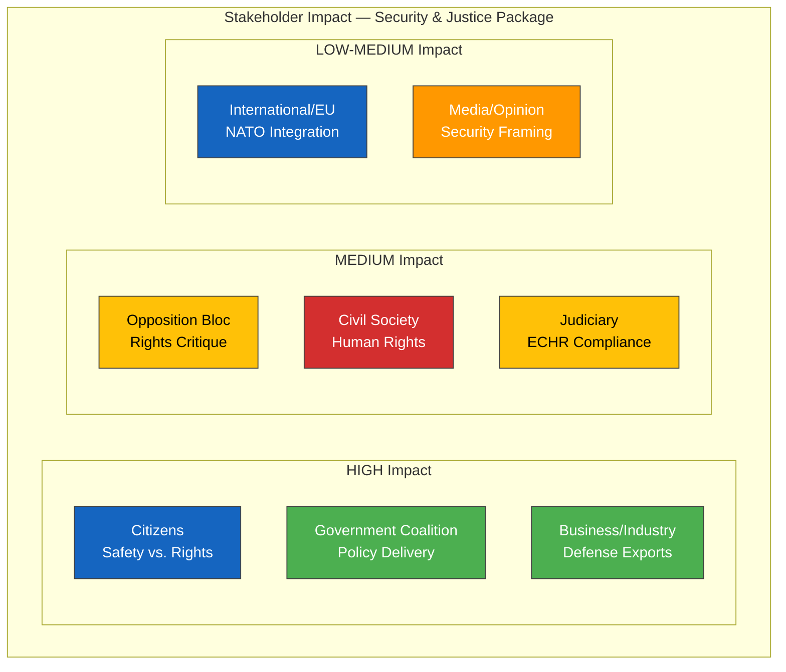

# 👥 Stakeholder Perspective Analysis — 2026-04-04

## 📋 Stakeholder Context

| Field | Value |
|-------|-------|
| **Analysis ID** | `STK-2026-04-04-001` |
| **Analysis Date** | 2026-04-04 12:15 UTC |
| **Documents Analyzed** | 5 |
| **Stakeholder Groups Covered** | 8 of 8 |
| **Produced By** | news-realtime-monitor |
| **Confidence** | MEDIUM |

---

## 📊 Stakeholder Impact Dashboard

---

## 📋 Stakeholder Perspectives by Group

### 1. Citizens

| Document | Impact | Position | Key Concern |
|----------|:------:|----------|-------------|
| HD03235 — Deportation | HIGH | Divided — safety vs. fairness | Effective crime policy vs. proportionality |
| HD03214 — Cybersecurity | HIGH | Supportive | Protection of digital infrastructure |
| HD01FöU12 — Civil Defense | HIGH | Supportive | Access to shelters, emergency information |
| HD01JuU15 — Corrections | MEDIUM | Concerned | Overcrowded prisons, rehabilitation outcomes |

### 2. Government Coalition (M+KD+L)

| Document | Impact | Position | Key Concern |
|----------|:------:|----------|-------------|
| HD03235 — Deportation | HIGH | Strong support — Tidö delivery | Demonstrating action on crime |
| HD03214 — Cybersecurity | HIGH | Strong support | National security priority |
| HD03228 — War Materiel | HIGH | Strong support | NATO alignment, industry support |
| HD01FöU12 — Civil Defense | MEDIUM | Support | Total Defense modernization |

### 3. Opposition Bloc (S, V, MP, C)

| Document | Impact | Position | Key Concern |
|----------|:------:|----------|-------------|
| HD03235 — Deportation | MEDIUM | S cautious; V, MP strongly oppose | ECHR compatibility, proportionality |
| HD03228 — War Materiel | MEDIUM | V, MP oppose; S cautious support | Arms export ethics |
| HD03214 — Cybersecurity | LOW | Broadly supportive | Resourcing adequacy |
| HD01JuU15 — Corrections | MEDIUM | Critical of capacity crisis | Government-created problem |

### 4. Business/Industry

| Document | Impact | Position | Key Concern |
|----------|:------:|----------|-------------|
| HD03228 — War Materiel | HIGH | Strong support (Saab, BAE Bofors) | Regulatory modernization for exports |
| HD03214 — Cybersecurity | HIGH | Supportive | Critical infrastructure protection |

### 5. Civil Society

| Document | Impact | Position | Key Concern |
|----------|:------:|----------|-------------|
| HD03235 — Deportation | MEDIUM | Human rights organizations oppose | ECHR Article 8 (family life) concerns |
| HD03228 — War Materiel | MEDIUM | Peace organizations oppose | Arms proliferation risk |

### 6. International/EU

| Document | Impact | Position | Key Concern |
|----------|:------:|----------|-------------|
| HD03214 — Cybersecurity | HIGH | Positive — EU NIS2 alignment | Interoperability and compliance |
| HD03228 — War Materiel | MEDIUM | NATO positive | Allied defense cooperation |

### 7. Judiciary/Constitutional

| Document | Impact | Position | Key Concern |
|----------|:------:|----------|-------------|
| HD03235 — Deportation | HIGH | Lagrådet review pending | Proportionality under Regeringsformen |
| HD01JuU15 — Corrections | MEDIUM | Concerned | Sentencing vs. capacity mismatch |

### 8. Media/Public Opinion

| Document | Impact | Position | Key Concern |
|----------|:------:|----------|-------------|
| HD03235 — Deportation | HIGH | Highly covered | Crime vs. rights framing |
| HD03214 — Cybersecurity | MEDIUM | Positive coverage likely | National security narrative |

---

**Document Control:** Stakeholder Analysis v1.0 | 2026-04-04 | news-realtime-monitor | Public