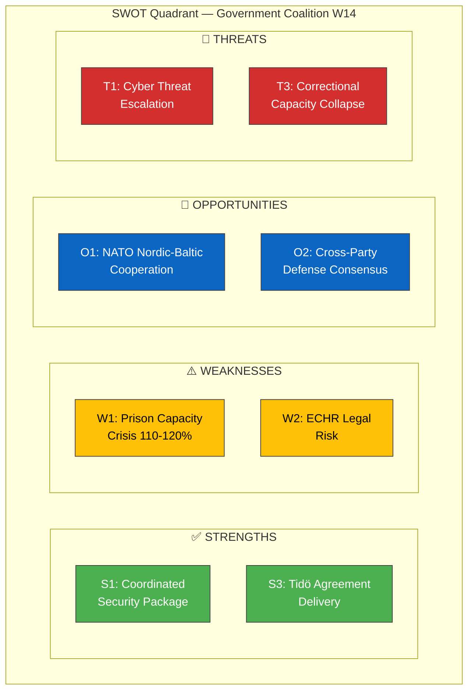

# 💼 Political SWOT Analysis — 2026-04-04

## 📋 SWOT Context

| Field | Value |
|-------|-------|
| **SWOT ID** | `SWT-2026-04-04-001` |
| **Analysis Date** | 2026-04-04 12:15 UTC |
| **Analysis Scope** | Government coalition — security & justice legislative package |
| **Reference Period** | 2026-W14 (March 30 – April 5) |
| **Produced By** | news-realtime-monitor |
| **Primary MCP Sources** | get_propositioner, get_betankanden, search_voteringar |
| **Validity Window** | Entries valid until 2026-04-18 |

---

## 🏛️ Section 1: Government Coalition SWOT

### ✅ Strengths — Government Coalition

| # | Strength Statement | Evidence (dok_id) | Confidence | Impact | Entry Date |
|---|-------------------|-------------------|:----------:|:------:|:----------:|
| S1 | Coordinated multi-ministry security package demonstrates governance capacity (3 propositions + 2 committee reports in one week) | HD03214, HD03228, HD03235 | HIGH | HIGH | 2026-04-01 |
| S2 | Cybersecurity center legislation aligns with EU NIS2, showing international credibility | HD03214 | HIGH | MEDIUM | 2026-04-01 |
| S3 | Criminal deportation proposal delivers on Tidö Agreement, satisfying SD cooperation partner | HD03235 | HIGH | HIGH | 2026-04-01 |
| S4 | War materiel modernization supports defense industry and NATO interoperability | HD03228 | MEDIUM | HIGH | 2026-04-01 |
| S5 | Civilian protection report shows Total Defense strategy advancing systematically | HD01FöU12 | MEDIUM | MEDIUM | 2026-04-02 |

### ⚠️ Weaknesses — Government Coalition

| # | Weakness Statement | Evidence (dok_id) | Confidence | Impact | Entry Date |
|---|-------------------|-------------------|:----------:|:------:|:----------:|
| W1 | Prison capacity crisis (110-120% occupancy) undermines criminal justice credibility | HD01JuU15 | HIGH | HIGH | 2026-04-02 |
| W2 | Deportation rules may face ECHR proportionality challenges, creating legal risk | HD03235 | MEDIUM | MEDIUM | 2026-04-01 |
| W3 | Municipal capacity gaps for civilian protection implementation | HD01FöU12 | MEDIUM | MEDIUM | 2026-04-02 |
| W4 | Multiple concurrent reform fronts strain ministerial and parliamentary capacity | HD03214, HD03228, HD03235 | LOW | MEDIUM | 2026-04-01 |

### 🌟 Opportunities — Government Coalition

| # | Opportunity Statement | Evidence (dok_id) | Confidence | Impact | Entry Date |
|---|----------------------|-------------------|:----------:|:------:|:----------:|
| O1 | NATO membership enables enhanced Nordic-Baltic security cooperation | HD03214, HD03228, HD01FöU12 | HIGH | HIGH | 2026-04-01 |
| O2 | Cross-party support on defense/cybersecurity creates durable policy framework | HD03214, HD01FöU12 | MEDIUM | HIGH | 2026-04-01 |
| O3 | Defense industry exports under modernized rules could boost Swedish economy | HD03228 | MEDIUM | MEDIUM | 2026-04-01 |
| O4 | Deportation of convicted criminals could partially address prison overcrowding | HD03235, HD01JuU15 | LOW | MEDIUM | 2026-04-01 |

### 🔴 Threats — Government Coalition

| # | Threat Statement | Evidence (dok_id) | Confidence | Impact | Entry Date |
|---|-----------------|-------------------|:----------:|:------:|:----------:|
| T1 | Escalating cyber threats may outpace new center's capabilities | HD03214 | MEDIUM | HIGH | 2026-04-01 |
| T2 | Arms export ethics critique from V, MP, and civil society | HD03228 | HIGH | MEDIUM | 2026-04-01 |
| T3 | Correctional capacity crisis worsening faster than construction can address | HD01JuU15 | HIGH | HIGH | 2026-04-02 |
| T4 | ECHR legal challenges to deportation rules could embarrass government | HD03235 | LOW | HIGH | 2026-04-01 |

---

## 📊 Mermaid SWOT Quadrant Mapping

---

## 🔄 TOWS Strategic Options

| TOWS | Strategy | Source |
|------|----------|--------|
| **SO (Strength-Opportunity)** | Leverage coordinated security package (S1) with NATO cooperation (O1) to establish Sweden as Nordic cybersecurity hub | S1+O1 |
| **WO (Weakness-Opportunity)** | Use deportation mechanism (O4) to address prison overcrowding (W1) in the short term while building new capacity | W1+O4 |
| **ST (Strength-Threat)** | Deploy Tidö coalition unity (S3) to maintain political momentum despite ECHR challenges (T4) | S3+T4 |
| **WT (Weakness-Threat)** | Prison capacity crisis (W1) combined with worsening correctional conditions (T3) demands emergency budget allocation | W1+T3 |

---

## 🔀 Cross-SWOT Interference

The defense/security strengths (S1, S2, S4) reinforce the NATO cooperation opportunity (O1), creating a positive feedback loop. However, the criminal justice weaknesses (W1, W2) and threats (T3, T4) create a separate negative feedback loop where tougher sentencing leads to overcrowding, reduced rehabilitation, higher recidivism, and further capacity strain.

---

## 📌 Strategic Implications — Key Watch Items

1. **Lagrådet review of HD03235** — Constitutional council opinion will signal whether deportation rules survive legal scrutiny
2. **Spring supplementary budget** — Defense and correctional funding allocation reveals true priority balance
3. **NIS2 compliance timeline** — October 2026 deadline creates urgency for cybersecurity center operationalization

---

**Document Control:** SWOT v1.0 | 2026-04-04 | news-realtime-monitor | Public