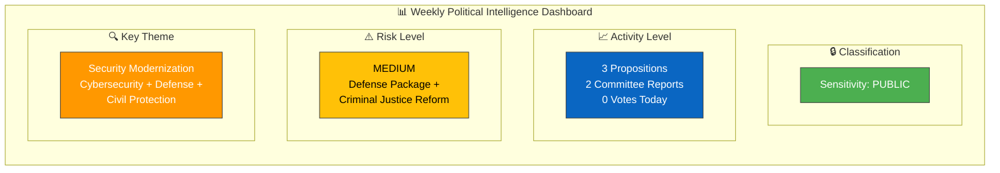
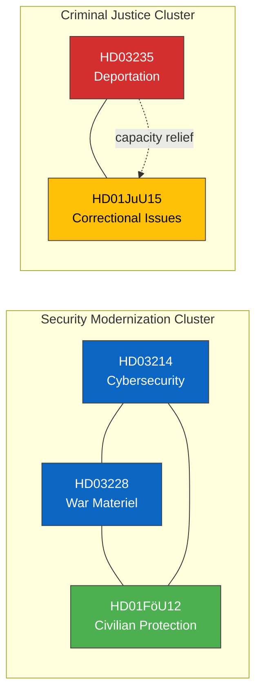

# 🧩 Political Intelligence Synthesis — 2026-04-04

## 📋 Synthesis Context

| Field | Value |
|-------|-------|
| **Synthesis ID** | `SYN-2026-04-04-001` |
| **Analysis Date** | 2026-04-04 12:15 UTC |
| **Documents Analyzed** | 5 |
| **Analysis Period** | 2026-04-01 to 2026-04-04 (weekend lookback) |
| **Produced By** | news-realtime-monitor |
| **Overall Confidence** | MEDIUM |

---

## 📊 Intelligence Dashboard

---

## 🔑 Key Findings

1. **Coordinated Defense/Security Package**: Three propositions from April 1 (HD03214 cybersecurity, HD03228 war materiel, HD03235 deportation) represent a synchronized government security push. Combined with FöU12 on civilian protection, this is the most concentrated defense legislation week of 2025/26.

2. **Coalition Cohesion Signal**: All five documents reflect Tidö Agreement priorities — M leads on justice (HD03235), defense (HD03214), and foreign affairs (HD03228). SD's policy demands on immigration (deportation) and defense are being delivered, reinforcing coalition stability.

3. **Cross-Cutting Theme — Total Defense**: HD03214 (cyber), HD03228 (materiel), and HD01FöU12 (civilian protection) form a Total Defense modernization triad. This signals systematic implementation of NATO membership obligations.

4. **Criminal Justice Capacity Stress**: JuU15 (correctional issues) reveals system strain from tougher sentencing policies — prison capacity at 110-120%. This creates a feedback loop with HD03235 (deportation as capacity relief mechanism).

5. **Saturday Monitoring**: No new parliamentary activity on 2026-04-04 (Saturday). Analysis covers week's most significant unprocessed items.

---

## 📊 Top Documents by Significance

| Score | Type | dok_id | Title | Key Significance |
|-------|------|--------|-------|------------------|
| 7/10 | prop | HD03214 | Cybersecurity Center | National security, EU NIS2 compliance |
| 6/10 | prop | HD03235 | Deportation Rules | Criminal justice + migration nexus |
| 6/10 | prop | HD03228 | War Materiel Regulation | NATO integration, defense industry |
| 5/10 | bet | HD01FöU12 | Civilian Protection | Total Defense, municipal preparedness |
| 4/10 | bet | HD01JuU15 | Correctional Issues | System capacity crisis, policy coherence |

---

## 🔗 Cross-Document Patterns

---

## 🔮 Forward Intelligence

| Watch Item | Trigger | Timeline | Confidence |
|-----------|---------|----------|:----------:|
| Riksdag votes on defense package | Chamber scheduling for FöU12, HD03214, HD03228 | April-May 2026 | HIGH |
| Lagrådet review of HD03235 | Constitutional review opinion | Q2 2026 | HIGH |
| Kriminalvården capacity data | Annual statistics | Q2 2026 | HIGH |
| NIS2 transposition deadline | EU compliance check | October 2026 | MEDIUM |
| Opposition response to security package | Motion filings from S, V, MP | April 2026 | MEDIUM |

---

## 📊 Aggregate Risk Assessment

Overall political risk: **MEDIUM**. The government's coordinated security push demonstrates coalition effectiveness but creates multiple concurrent legislative fronts. The criminal justice capacity crisis (JuU15) represents the highest near-term operational risk. The defense modernization package enjoys broad cross-party support, reducing political risk but increasing implementation/resourcing risk.

---

**Document Control:** Synthesis v1.0 | 2026-04-04 | news-realtime-monitor | Public