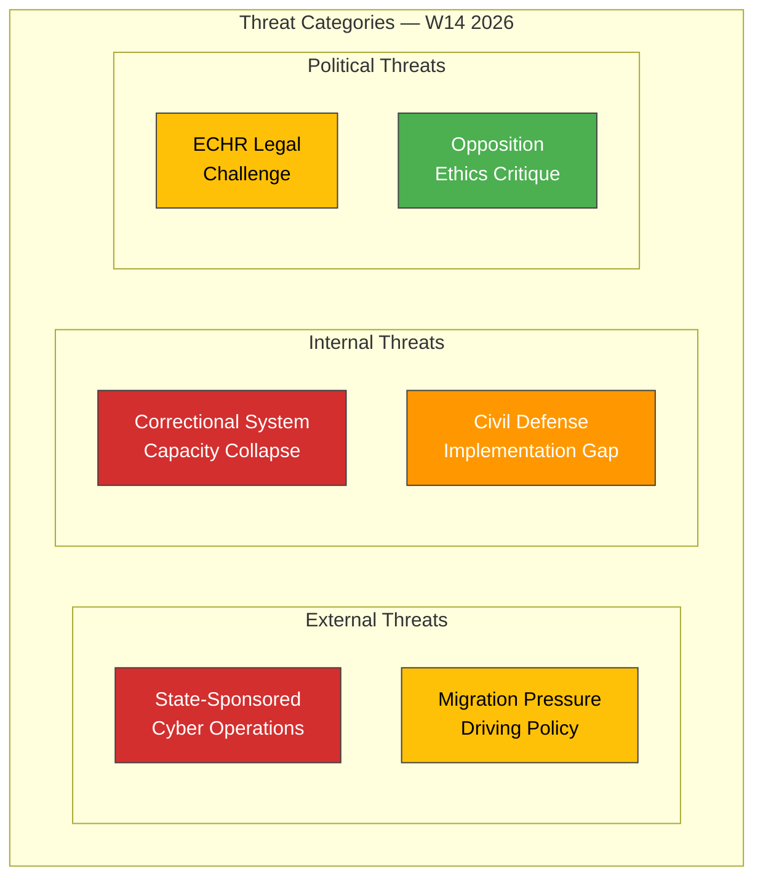

# 🔴 Political Threat Analysis — 2026-04-04

## 📋 Threat Context

| Field | Value |
|-------|-------|
| **Threat ID** | `THR-2026-04-04-001` |
| **Analysis Date** | 2026-04-04 12:15 UTC |
| **Documents Analyzed** | 5 |
| **Produced By** | news-realtime-monitor |
| **Overall Threat Level** | MEDIUM |

---

## 📊 Threat Landscape

---

## 📋 Threat Register

| ID | Threat | Category | Source (dok_id) | Severity | Confidence | Status |
|----|--------|----------|-----------------|:--------:|:----------:|--------|
| THR-01 | State-sponsored cyber attacks targeting Swedish infrastructure | External | HD03214 | HIGH | MEDIUM | Active — legislation proposed |
| THR-02 | Prison capacity collapse undermining rule of law | Internal | HD01JuU15 | HIGH | HIGH | Active — crisis ongoing |
| THR-03 | ECHR proportionality challenge to deportation rules | Political | HD03235 | MEDIUM | MEDIUM | Emerging — awaiting Lagrådet |
| THR-04 | Civil defense implementation gap during geopolitical tensions | Internal | HD01FöU12 | MEDIUM | MEDIUM | Active — legislation advancing |
| THR-05 | Arms export reputational risk from loosened controls | Political | HD03228 | LOW | HIGH | Emerging — opposition vocal |

---

## 🔮 Forward Indicators

| Indicator | Trigger | Confidence |
|-----------|---------|:----------:|
| Major cyber incident targeting Swedish critical infrastructure | FRA/SÄPO alert | MEDIUM |
| Kriminalvården emergency capacity declaration | Official capacity report | HIGH |
| European Court case referral on Swedish deportation rules | ECHR filing | LOW |
| MSB readiness assessment for civilian protection | Annual report publication | MEDIUM |

---

**Document Control:** Threat Analysis v1.0 | 2026-04-04 | news-realtime-monitor | Public