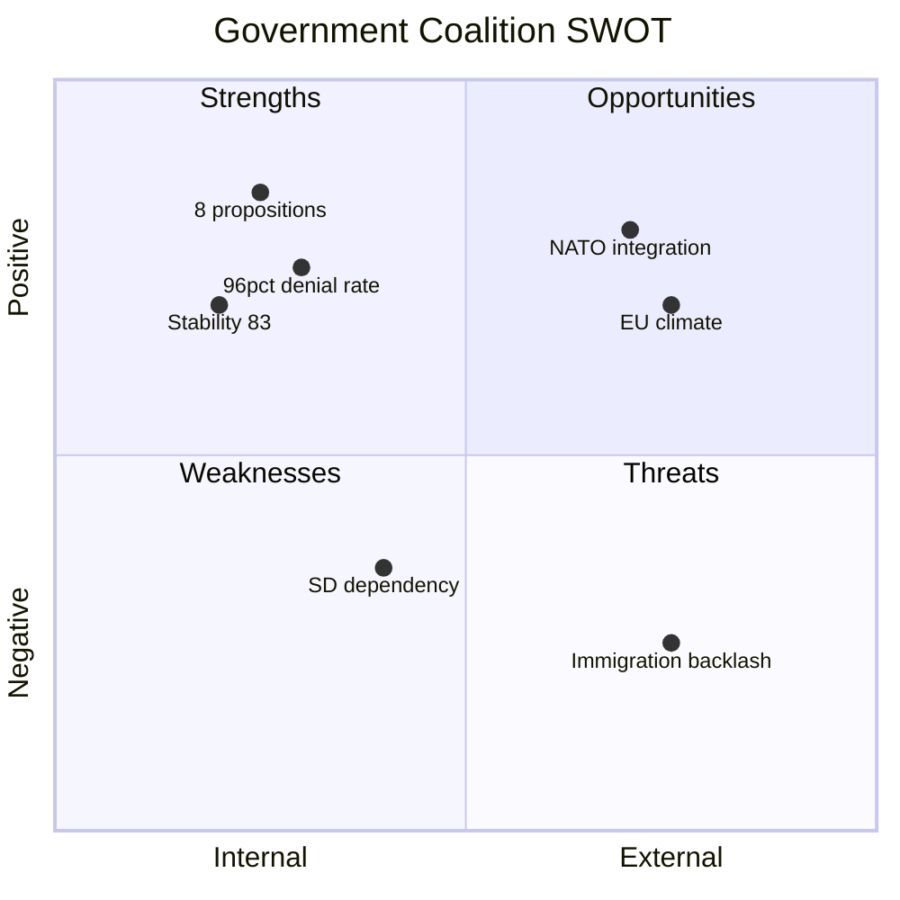

# Political SWOT Analysis — 2026-04-04

**Generated**: 2026-04-04 09:13 UTC | **Updated**: 2026-04-04 14:15 UTC (translate-agent enrichment)
**Data Sources**: get_propositioner, get_motioner, get_betankanden, search_voteringar, search_anforanden, get_fragor, get_interpellationer
**Documents Analyzed**: 70
**Confidence**: MEDIUM

## Summary

SWOT analysis for Government Coalition (M-KD-L + SD support) based on 70 documents.

## SWOT Matrix

### Strengths [HIGH]
| Entry | Evidence |
|-------|----------|
| Legislative output | 8 propositions in one week |
| Motion denial rate | 96% of 50 motions denied |
| Coalition cohesion | KD-M 88.5%, L-M 87.9% alignment |

### Weaknesses [MEDIUM]
| Entry | Evidence |
|-------|----------|
| SD dependency | External support without cabinet seats |
| Data gaps | 0 formal voting records for period |

### Opportunities [MEDIUM]
| Entry | Evidence |
|-------|----------|
| NATO integration | Arms export modernization |
| EU climate alignment | 2030 targets in committee report |
| Cybersecurity | National cybersecurity center |

### Threats [MEDIUM]
| Entry | Evidence |
|-------|----------|
| Immigration backlash | 3 simultaneous reform proposals |
| Alignment shifts | C-L 81.3%, C-KD 80.3% |

## Data Quality Notes

Confidence: **MEDIUM**. Based on 70 documents. CIA metrics supplementary.