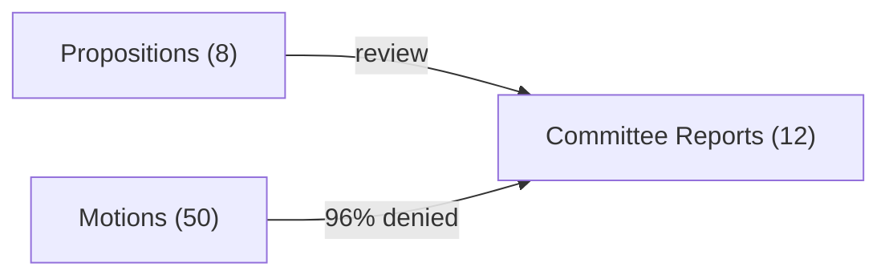

# Analysis Synthesis Summary — 2026-04-04

**Generated**: 2026-04-04 09:13 UTC | **Updated**: 2026-04-04 14:15 UTC (translate-agent enrichment)
**Data Sources**: get_propositioner, get_motioner, get_betankanden, search_voteringar, search_anforanden, get_fragor, get_interpellationer
**Documents Analyzed**: 70
**Confidence**: MEDIUM

## Summary

Weekly review covering 70 parliamentary documents (8 propositions, 12 committee reports, 50 motions) from 2026-03-28 to 2026-04-04. Defense overhaul, immigration reform, and cybersecurity dominate. Coalition risk LOW (4/100), stability 83/100, motion denial rate 96%.

## Key Findings

1. **[HIGH]** 8 government propositions: deportation, cybersecurity center, arms exports, immigration settlement, reception law, victim compensation, consumer credit
2. **[HIGH]** 12 committee reports: defense preparedness, healthcare, climate 2030 targets, parliamentary process reform
3. **[MEDIUM]** 50 opposition motions with 96% denial rate
4. **[MEDIUM]** Coalition risk 4/100, stability 83/100
5. **[HIGH]** 5 cross-party voting anomalies (KD-M 88.5%, L-M 87.9%, KD-L 87.9%)

## Legislative Activity

## Top Documents by Significance

| Score | Type | Title |
|-------|------|-------|
| 8/10 | Prop | Deportation rules reform |
| 8/10 | Prop | National cybersecurity center |
| 7/10 | Prop | Arms export modernization |
| 7/10 | Bet | Defense preparedness |
| 7/10 | Bet | Climate 2030 targets |

## Data Quality Notes

Confidence: **MEDIUM**. Based on 70 documents. Voting records incomplete (0 formal votes). 100 speeches available.