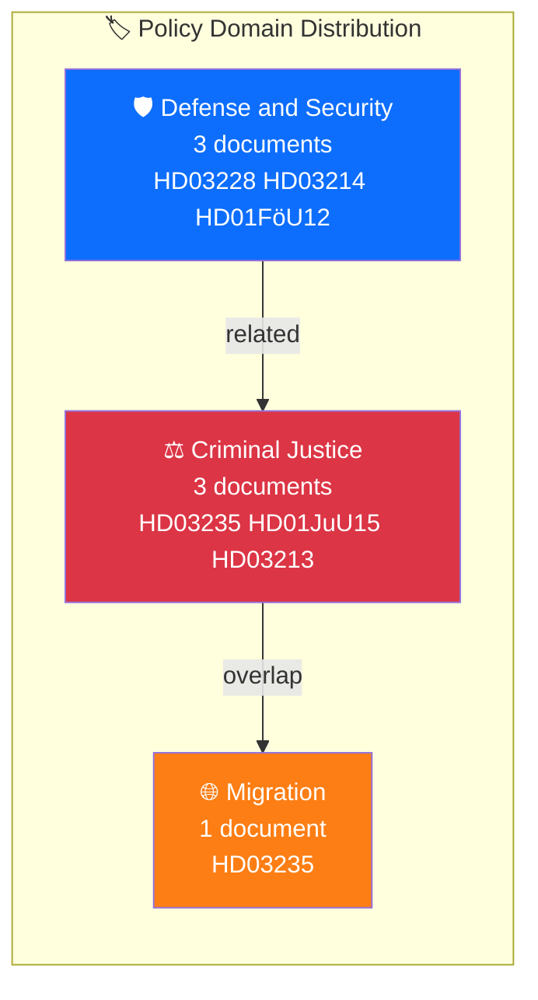

# 🏷️ Political Classification Results — 2026-04-05

## 📋 Classification Context

| Field | Value |
|-------|-------|
| **Classification ID** | CLS-2026-04-05-001 |
| **Analysis Date** | 2026-04-05 12:15 UTC |
| **Documents Classified** | 5 |
| **Produced By** | news-realtime-monitor |

---

## 📊 Classification Summary

| dok_id | Title | Primary Domain | Secondary Domain | Sensitivity |
|--------|-------|---------------|-----------------|:-----------:|
| HD03235 | Skärpta regler om utvisning på grund av brott | Criminal Justice | Migration | 🟡 SENSITIVE |
| HD03228 | Ett modernt och anpassat regelverk för krigsmateriel | Defense and Security | Foreign Affairs | 🟡 SENSITIVE |
| HD03214 | Lagändringar för stärkt nationellt cybersäkerhetscenter | Defense and Security | Digital Infrastructure | 🔴 RESTRICTED |
| HD01FöU12 | Starkare skydd för civilbefolkningen vid höjd beredskap | Defense and Security | Civil Preparedness | 🟡 SENSITIVE |
| HD01JuU15 | Kriminalvårdsfrågor | Criminal Justice | — | 🟡 SENSITIVE |

**Dominant Domains:** Criminal Justice (3 docs), Defense and Security (3 docs) — dual-track legislative strategy.

---

**Document Control:** Template: classification-results.md v2.1 | Classification: Public
