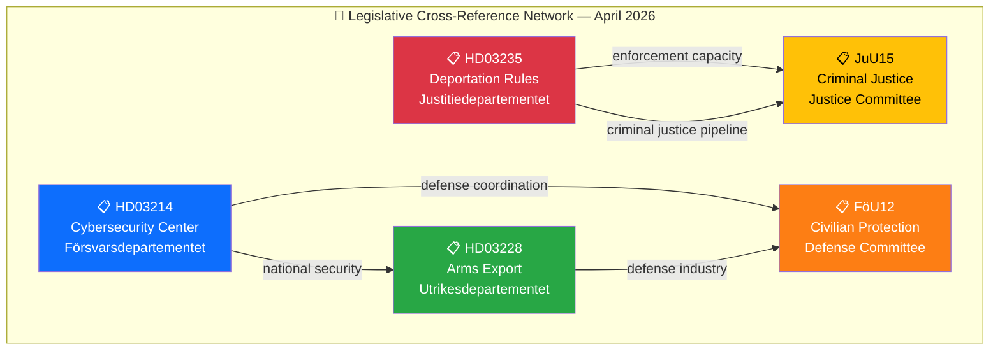

# 🔗 Cross-Reference Map — 2026-04-05

## 📋 Cross-Reference Context

| Field | Value |
|-------|-------|
| **Map ID** | XREF-2026-04-05-001 |
| **Analysis Date** | 2026-04-05 12:15 UTC |
| **Documents Mapped** | 5 |
| **Produced By** | news-realtime-monitor |

---

## 📊 Cross-Reference Network

---

## 📋 Cross-Reference Pairs

| Source | Target | Relationship | Strength |
|--------|--------|-------------|:--------:|
| HD03235 (Deportation) | HD01JuU15 (Criminal Justice) | Deportation requires prison/enforcement capacity addressed in JuU15 | Strong |
| HD03214 (Cybersecurity) | HD01FöU12 (Civilian Protection) | Cyber defense component of total defense in FöU12 | Strong |
| HD03228 (Arms Export) | HD01FöU12 (Civilian Protection) | Defense industrial base supports civil defense equipment | Medium |
| HD03214 (Cybersecurity) | HD03228 (Arms Export) | Both reflect NATO membership integration requirements | Medium |
| HD03235 (Deportation) | HD03228 (Arms Export) | Both represent Tidö Agreement security agenda delivery | Weak |

**Key Finding:** The 5 documents form a coherent legislative cluster centered on security and criminal justice — the government's twin-track strategy for pre-election policy delivery.

---

**Document Control:** Template: cross-reference-map.md v2.1 | Classification: Public
