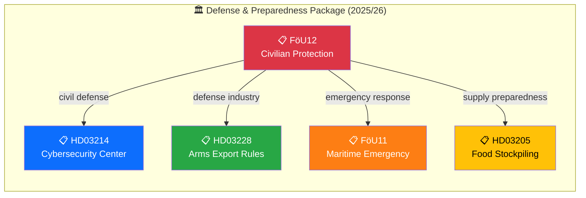

# 🔍 Per-File Political Intelligence Analysis: HD01FöU12

**Document ID:** `HD01FöU12` | **Type:** Betänkande (Committee Report) | **Date:** 2026-04-02
**Title:** Ett starkare skydd för civilbefolkningen vid höjd beredskap
**Riksmöte:** 2025/26 | **Organ:** FöU (Defense Committee)
**Analysis Timestamp:** 2026-04-05 12:15 UTC | **Analyst:** news-realtime-monitor

---

## 🎯 Executive Summary

The Defense Committee (FöU) presents its report on strengthening civilian protection during heightened preparedness. This betänkande evaluates government proposals for enhanced civil defense infrastructure, including expanded shelter capacity, updated population warning systems, and emergency supply stockpiling. The report comes against the backdrop of Sweden's NATO membership and deteriorating European security environment, making civil defense modernization an urgent cross-party priority. FöU12 connects directly to Prop HD03214 (cybersecurity center) and the broader defense preparedness legislative package. **Confidence: HIGH**

---

## 📊 Political Classification

| Dimension | Assessment |
|-----------|-----------|
| **Policy Domain** | Defense & Security (DEF) / Civil Preparedness (PREP) |
| **Sensitivity** | 🟡 SENSITIVE — national security context |
| **Political Alignment** | Broad cross-party consensus on civil defense |
| **Cross-party Impact** | LOW — total defense concept has wide support |
| **Legislative Stage** | Betänkande published → Riksdag chamber debate pending |

---

## 💼 SWOT Analysis

### ✅ Strengths

| # | Statement | Evidence (dok_id) | Confidence | Impact |
|---|-----------|-------------------|:----------:|:------:|
| S1 | Cross-party consensus on total defense modernization — all 8 parties support principles | HD01FöU12 | H | H |
| S2 | Builds on existing Total Defense concept (Totalförsvaret) with concrete legislative measures | HD01FöU12, HD03214 | H | H |

### ⚠️ Weaknesses

| # | Statement | Evidence (dok_id) | Confidence | Impact |
|---|-----------|-------------------|:----------:|:------:|
| W1 | Shelter infrastructure requires massive investment — current capacity covers only fraction of population | HD01FöU12 | H | H |
| W2 | Municipal implementation capacity varies significantly across 290 kommuner | HD01FöU12 | M | M |

### 🚀 Opportunities

| # | Statement | Evidence (dok_id) | Confidence | Impact |
|---|-----------|-------------------|:----------:|:------:|
| O1 | NATO membership enables burden-sharing for Nordic civil defense coordination | HD01FöU12, HD03228 | M | H |
| O2 | Public awareness of preparedness is at record highs, supporting political investment | HD01FöU12 | H | M |

### 🔴 Threats

| # | Statement | Evidence (dok_id) | Confidence | Impact |
|---|-----------|-------------------|:----------:|:------:|
| T1 | Geopolitical escalation could outpace civil defense build-up timeline | HD01FöU12 | M | H |
| T2 | Fiscal constraints may reduce allocated civil defense funding below requirements | HD01FöU12 | M | H |

---

## 📊 Defense Preparedness Legislative Network

---

## ⚖️ Risk Assessment

| Risk ID | Description | Likelihood (1-5) | Impact (1-5) | L×I | Mitigation |
|---------|-------------|:-----------------:|:------------:|:---:|-----------|
| RSK-001 | Civil defense investment falls short of Totalförsvaret requirements | 3 | 4 | 12 | Multi-year budget commitment framework |
| RSK-002 | Municipal implementation gaps create uneven protection levels | 3 | 3 | 9 | Central coordination and funding equalization |
| RSK-003 | Geopolitical escalation before infrastructure ready | 2 | 5 | 10 | NATO collective defense as interim measure |

**Overall Risk Level:** MEDIUM (highest L×I: 12)

---

## 👥 Stakeholder Impact

| Stakeholder | Impact | Direction | Key Driver |
|------------|:------:|:---------:|-----------|
| 🏘️ Citizens | H | Positive | Enhanced protection and preparedness |
| 🏛️ Government Coalition | H | Positive | Security policy delivery |
| 🗳️ Opposition | L | Positive | Cross-party support area |
| 🏭 Business/Industry | M | Positive | Defense procurement opportunities |
| 🤝 Civil Society | M | Positive | Civil protection organizations strengthened |
| 🌍 International/EU | H | Positive | NATO interoperability |
| ⚖️ Judiciary | L | Neutral | Limited impact |
| 📺 Media | M | Amplifying | National security narrative |

---

## 🔮 Forward Indicators

| # | Indicator | Timeline | Source | Priority |
|---|-----------|----------|--------|:--------:|
| 1 | Riksdag chamber debate and vote on FöU12 | 1-2 weeks | Riksdag calendar | 🔴 |
| 2 | Budget allocation for shelter expansion in VÅP 2026 | 2-4 weeks | Budget process | 🟠 |
| 3 | MSB civil defense implementation plan publication | 1-3 months | Government directives | 🟡 |

---

**Document Control:** Template: per-file-political-intelligence.md v2.1 | Classification: Public
