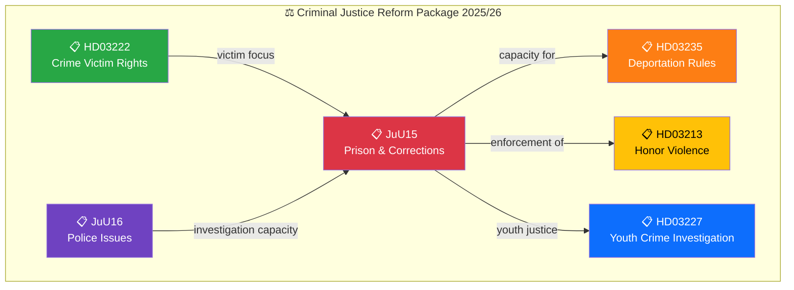

# 🔍 Per-File Political Intelligence Analysis: HD01JuU15

**Document ID:** `HD01JuU15` | **Type:** Betänkande (Committee Report) | **Date:** 2026-04-02
**Title:** Kriminalvårdsfrågor
**Riksmöte:** 2025/26 | **Organ:** JuU (Justice Committee)
**Analysis Timestamp:** 2026-04-05 12:15 UTC | **Analyst:** news-realtime-monitor

---

## 🎯 Executive Summary

The Justice Committee (JuU) presents its comprehensive report on criminal justice system issues, covering prison capacity expansion, rehabilitation program modernization, and correctional services reform. This betänkande sits within the government's broader criminal justice package alongside HD03235 (stricter deportation rules) and reflects the Kristersson government's flagship commitment to combating organized crime. JuU15 evaluates motions from all parties and assesses the adequacy of current Kriminalvården (prison service) capacity given projected inmate population growth resulting from tougher sentencing. **Confidence: MEDIUM**

---

## 📊 Political Classification

| Dimension | Assessment |
|-----------|-----------|
| **Policy Domain** | Criminal Justice (CJ) |
| **Sensitivity** | 🟡 SENSITIVE — justice system reform |
| **Political Alignment** | Government coalition priority; opposition divided |
| **Cross-party Impact** | MEDIUM — S supports some measures, V/MP oppose toughening |
| **Legislative Stage** | Betänkande published → Riksdag chamber debate pending |

---

## 💼 SWOT Analysis

### ✅ Strengths

| # | Statement | Evidence (dok_id) | Confidence | Impact |
|---|-----------|-------------------|:----------:|:------:|
| S1 | Government coalition delivers concrete criminal justice reforms matching voter priorities | HD01JuU15, HD03235 | H | H |
| S2 | JuU committee majority ensures passage of government-aligned proposals | HD01JuU15 | H | M |

### ⚠️ Weaknesses

| # | Statement | Evidence (dok_id) | Confidence | Impact |
|---|-----------|-------------------|:----------:|:------:|
| W1 | Prison overcrowding already at crisis levels — capacity expansion lags behind new sentencing laws | HD01JuU15 | H | H |
| W2 | Rehabilitation program cuts may increase recidivism, undermining long-term crime reduction | HD01JuU15 | M | M |

### 🚀 Opportunities

| # | Statement | Evidence (dok_id) | Confidence | Impact |
|---|-----------|-------------------|:----------:|:------:|
| O1 | Comprehensive criminal justice package positions government as tough-on-crime ahead of election | HD01JuU15, HD03235, HD03213 | H | H |

### 🔴 Threats

| # | Statement | Evidence (dok_id) | Confidence | Impact |
|---|-----------|-------------------|:----------:|:------:|
| T1 | Kriminalvården warns capacity cannot absorb projected inmate growth without massive investment | HD01JuU15 | H | H |
| T2 | International criticism of conditions in overcrowded facilities | HD01JuU15 | M | M |

---

## 📊 Criminal Justice Legislative Pipeline

---

## ⚖️ Risk Assessment

| Risk ID | Description | Likelihood (1-5) | Impact (1-5) | L×I | Mitigation |
|---------|-------------|:-----------------:|:------------:|:---:|-----------|
| RSK-001 | Prison capacity crisis worsens under new sentencing regime | 4 | 4 | 16 | Emergency expansion funding in supplementary budget |
| RSK-002 | Rehabilitation cuts increase recidivism rates over 3-5 year horizon | 3 | 4 | 12 | Evidence-based rehabilitation framework in prop |
| RSK-003 | International scrutiny of detention conditions | 2 | 3 | 6 | Council of Europe compliance monitoring |

**Overall Risk Level:** HIGH (highest L×I: 16)

---

## 👥 Stakeholder Impact

| Stakeholder | Impact | Direction | Key Driver |
|------------|:------:|:---------:|-----------|
| 🏘️ Citizens | H | Mixed | Safety improvements vs. societal cost |
| 🏛️ Government Coalition | H | Positive | Policy delivery on crime agenda |
| 🗳️ Opposition | M | Mixed | S partially supportive; V/MP critical |
| 🏭 Business/Industry | L | Neutral | Limited direct impact |
| 🤝 Civil Society | H | Negative | Rights organizations concerned |
| 🌍 International/EU | M | Negative | Detention conditions scrutiny |
| ⚖️ Judiciary | H | Mixed | Courts managing capacity constraints |
| 📺 Media | H | Amplifying | Crime coverage dominates agenda |

---

## 🔮 Forward Indicators

| # | Indicator | Timeline | Source | Priority |
|---|-----------|----------|--------|:--------:|
| 1 | Riksdag chamber vote on JuU15 | 1-2 weeks | Riksdag calendar | 🔴 |
| 2 | Kriminalvården capacity report Q2 2026 | 2-4 weeks | Agency reports | 🟠 |
| 3 | Spring budget allocation for prison expansion | 2-4 weeks | Budget process | 🔴 |

---

**Document Control:** Template: per-file-political-intelligence.md v2.1 | Classification: Public
