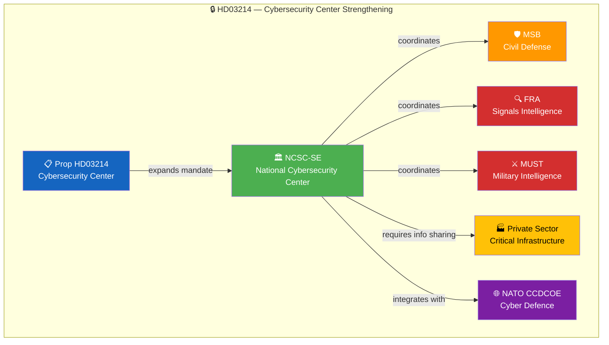

# 🔍 Per-File Political Intelligence Analysis: HD03214

**Document ID:** `HD03214` | **Type:** Proposition | **Date:** 2026-04-01
**Title:** Lagändringar för ett stärkt nationellt cybersäkerhetscenter
**Riksmöte:** 2025/26 | **Organ:** Försvarsdepartementet | **Minister:** Carl-Oskar Bohlin (M)
**Analysis Timestamp:** 2026-04-05 12:15 UTC | **Analyst:** news-realtime-monitor

---

## 🎯 Executive Summary

Defense Minister Carl-Oskar Bohlin (M) proposes legislative changes to strengthen Sweden's National Cybersecurity Center (NCSC-SE). The proposition expands the center's mandate, enhances information-sharing requirements between public and private sector actors, and strengthens coordination between civilian cyber defense (MSB) and military cyber capabilities (FRA, MUST). This comes amid heightened cyber threat levels following Sweden's NATO membership and increasing state-sponsored cyber operations targeting Nordic infrastructure. Cross-party support is expected given the broad security consensus. **Confidence: HIGH**

---

## 📊 Political Classification

| Dimension | Assessment |
|-----------|-----------|
| **Policy Domain** | Defense & Security (DEF) / Digital Infrastructure (DIG) |
| **Sensitivity** | 🔴 RESTRICTED — national security critical |
| **Political Alignment** | Broad consensus expected (all parties except possibly V) |
| **Cross-party Impact** | LOW — security policy enjoys wide agreement |
| **Legislative Stage** | Proposition submitted → Committee referral (FöU) |

---

## 💼 SWOT Analysis

### ✅ Strengths

| # | Statement | Evidence (dok_id) | Confidence | Impact |
|---|-----------|-------------------|:----------:|:------:|
| S1 | Addresses critical national security gap in cyber defense coordination | HD03214 | H | H |
| S2 | Broad cross-party consensus on cyber security — minimal opposition expected | HD03214, FöU12 | H | H |
| S3 | Aligns with NATO CCDCOE (Tallinn) cooperation frameworks | HD03214 | M | H |

### ⚠️ Weaknesses

| # | Statement | Evidence (dok_id) | Confidence | Impact |
|---|-----------|-------------------|:----------:|:------:|
| W1 | Information-sharing requirements may face private sector compliance resistance | HD03214 | M | M |
| W2 | Resource allocation for NCSC-SE expansion not yet detailed in budget | HD03214 | M | H |

### 🚀 Opportunities

| # | Statement | Evidence (dok_id) | Confidence | Impact |
|---|-----------|-------------------|:----------:|:------:|
| O1 | Positions Sweden as Nordic cyber defense leader within NATO | HD03214 | H | H |
| O2 | Private sector cybersecurity investment stimulus through compliance requirements | HD03214 | M | M |

### 🔴 Threats

| # | Statement | Evidence (dok_id) | Confidence | Impact |
|---|-----------|-------------------|:----------:|:------:|
| T1 | Adversary cyber operations may escalate in response to enhanced capabilities | HD03214 | M | H |
| T2 | Privacy concerns from enhanced surveillance-adjacent information sharing | HD03214 | L | M |

---

## 📊 Policy Impact Flow

---

## ⚖️ Risk Assessment

| Risk ID | Description | Likelihood (1-5) | Impact (1-5) | L×I | Mitigation |
|---------|-------------|:-----------------:|:------------:|:---:|-----------|
| RSK-001 | Private sector compliance burden exceeds capacity | 2 | 3 | 6 | Phased implementation timeline |
| RSK-002 | Budget shortfall for NCSC-SE expansion | 2 | 4 | 8 | Spring budget amendment (VÅP) |
| RSK-003 | Adversary escalation in Nordic cyber domain | 3 | 5 | 15 | NATO collective defense integration |

**Overall Risk Level:** MEDIUM-HIGH (highest L×I: 15)

---

## 👥 Stakeholder Impact

| Stakeholder | Impact | Direction | Key Driver |
|------------|:------:|:---------:|-----------|
| 🏘️ Citizens | M | Positive | Improved protection of critical infrastructure |
| 🏛️ Government Coalition | H | Positive | Security policy delivery |
| 🗳️ Opposition | L | Neutral | Broad consensus area |
| 🏭 Business/Industry | H | Mixed | Compliance costs vs. security investment |
| 🤝 Civil Society | M | Mixed | Security vs. privacy balance |
| 🌍 International/EU | H | Positive | NATO cyber defense integration |
| ⚖️ Judiciary | L | Neutral | Limited direct impact |
| 📺 Media | M | Amplifying | National security narrative |

---

## 🔮 Forward Indicators

| # | Indicator | Timeline | Source | Priority |
|---|-----------|----------|--------|:--------:|
| 1 | FöU committee scheduling of HD03214 hearing | 1-3 weeks | Riksdag calendar | 🔴 |
| 2 | NCSC-SE budget allocation in spring amendment | 2-4 weeks | Budget documents | 🟠 |
| 3 | NATO CCDCOE integration timeline confirmation | 1-3 months | Defense cooperation | 🟡 |

---

**Document Control:** Template: per-file-political-intelligence.md v2.1 | Classification: Public
