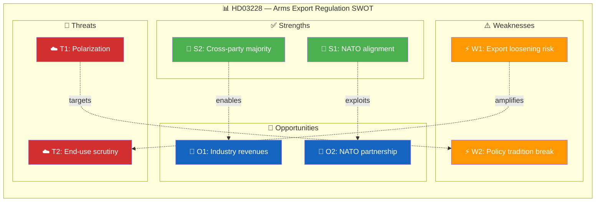

# 🔍 Per-File Political Intelligence Analysis: HD03228

**Document ID:** `HD03228` | **Type:** Proposition | **Date:** 2026-04-01
**Title:** Ett modernt och anpassat regelverk för krigsmateriel
**Riksmöte:** 2025/26 | **Organ:** Utrikesdepartementet | **Minister:** Benjamin Dousa (M)
**Analysis Timestamp:** 2026-04-05 12:15 UTC | **Analyst:** news-realtime-monitor

---

## 🎯 Executive Summary

Minister Benjamin Dousa (M) presents a landmark proposition modernizing Sweden's War Material Act (Krigsmaterielllagen) to reflect the country's new NATO membership status. The proposal streamlines export control procedures for defense equipment, aligns regulatory frameworks with NATO interoperability requirements, and establishes new cooperation pathways with allied nations. This represents Sweden's most significant defense export regulatory reform since NATO accession and directly impacts Sweden's defense industrial base (SAAB, BAE Systems Hägglunds, Nammo). **Confidence: HIGH**

---

## 📊 Political Classification

| Dimension | Assessment |
|-----------|-----------|
| **Policy Domain** | Defense & Security (DEF) / Foreign Affairs (FA) |
| **Sensitivity** | 🟡 SENSITIVE — national security implications |
| **Political Alignment** | Broad cross-party support expected (M, KD, L, SD, S, C) |
| **Cross-party Impact** | MEDIUM — V and MP likely to oppose expanded exports |
| **Legislative Stage** | Proposition submitted → Committee referral (UU) |

---

## 💼 SWOT Analysis

### ✅ Strengths

| # | Statement | Evidence (dok_id) | Confidence | Impact |
|---|-----------|-------------------|:----------:|:------:|
| S1 | Aligns Sweden with NATO standard defense cooperation frameworks post-accession | HD03228 | H | H |
| S2 | Cross-party support likely from M, KD, L, SD, S, C — broad Riksdag majority | HD03228, UU6 | H | H |
| S3 | Strengthens Sweden's defense industrial base competitiveness in allied markets | HD03228 | M | H |

### ⚠️ Weaknesses

| # | Statement | Evidence (dok_id) | Confidence | Impact |
|---|-----------|-------------------|:----------:|:------:|
| W1 | Risk of export controls loosening to non-democratic recipient states | HD03228 | M | H |
| W2 | Potential conflict with Sweden's traditional neutrality-era restrictive export policy | HD03228 | M | M |

### 🚀 Opportunities

| # | Statement | Evidence (dok_id) | Confidence | Impact |
|---|-----------|-------------------|:----------:|:------:|
| O1 | Enhanced NATO cooperation strengthens Swedish defense industry export revenues | HD03228 | H | H |
| O2 | Positions Sweden as key arms technology partner within NATO alliance | HD03228 | M | H |

### 🔴 Threats

| # | Statement | Evidence (dok_id) | Confidence | Impact |
|---|-----------|-------------------|:----------:|:------:|
| T1 | V and MP opposition frames as militarization, potential debate polarization | HD03228 | H | M |
| T2 | International scrutiny if Swedish arms reach conflict zones through NATO partners | HD03228 | M | H |

---

## 📊 SWOT Quadrant Mapping

---

## ⚖️ Risk Assessment

| Risk ID | Description | Likelihood (1-5) | Impact (1-5) | L×I | Mitigation |
|---------|-------------|:-----------------:|:------------:|:---:|-----------|
| RSK-001 | Swedish arms reach conflict zones via NATO partners | 2 | 5 | 10 | End-use certificates and monitoring requirements |
| RSK-002 | V/MP opposition delays UU committee processing | 2 | 2 | 4 | Broad majority ensures timeline |
| RSK-003 | EU defense cooperation frameworks conflict with national rules | 2 | 3 | 6 | EU regulatory alignment provisions in prop |

**Overall Risk Level:** MEDIUM (highest L×I: 10)

---

## 👥 Stakeholder Impact

| Stakeholder | Impact | Direction | Key Driver |
|------------|:------:|:---------:|-----------|
| 🏘️ Citizens | L | Neutral | Indirect impact through defense posture |
| 🏛️ Government Coalition | H | Positive | NATO integration deliverable |
| 🗳️ Opposition | M | Mixed | S supports, V/MP oppose |
| 🏭 Business/Industry | H | Positive | SAAB, BAE Hägglunds benefit from export facilitation |
| 🤝 Civil Society | M | Negative | Peace organizations oppose expansion |
| 🌍 International/EU | H | Positive | Strengthens allied defense cooperation |
| ⚖️ Judiciary | L | Neutral | Limited judicial impact |
| 📺 Media | M | Amplifying | NATO integration narrative |

---

## 🔮 Forward Indicators

| # | Indicator | Timeline | Source | Priority |
|---|-----------|----------|--------|:--------:|
| 1 | UU committee hearing scheduling | 1-3 weeks | Riksdag calendar | 🔴 |
| 2 | Defense industry reaction statements | 1 week | Media/industry | 🟠 |
| 3 | NATO partner responses to regulatory alignment | 1-2 months | Foreign affairs | 🟡 |

---

**Document Control:** Template: per-file-political-intelligence.md v2.1 | Classification: Public
