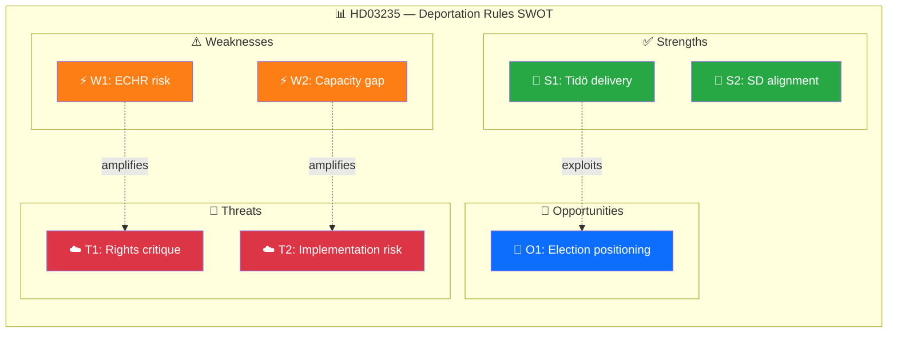

# 🔍 Per-File Political Intelligence Analysis: HD03235

**Document ID:** `HD03235` | **Type:** Proposition | **Date:** 2026-04-01
**Title:** Skärpta regler om utvisning på grund av brott
**Riksmöte:** 2025/26 | **Organ:** Justitiedepartementet | **Minister:** Johan Forssell (M)
**Analysis Timestamp:** 2026-04-05 12:15 UTC | **Analyst:** news-realtime-monitor

---

## 🎯 Executive Summary

The Kristersson government proposes significantly stricter rules for deportation of foreign nationals convicted of crimes in Sweden. Minister Johan Forssell (M) presents legislation lowering deportation thresholds, expanding the catalog of qualifying offenses, and strengthening enforcement mechanisms. This proposition represents a core deliverable of the Tidö Agreement between M, KD, L, and SD, directly addressing the coalition's most prominent policy commitment on criminal justice and migration. The proposal will face scrutiny in SfU (Social Insurance Committee) with expected broad coalition support but strong opposition from S, V, and MP on human rights grounds. **Confidence: HIGH**

---

## 📊 Political Classification

| Dimension | Assessment |
|-----------|-----------|
| **Policy Domain** | Criminal Justice (CJ) / Migration (MIG) |
| **Sensitivity** | 🟡 SENSITIVE — touches fundamental rights |
| **Political Alignment** | Government coalition priority (Tidö Agreement core) |
| **Cross-party Impact** | HIGH — divides bloc lines sharply |
| **Legislative Stage** | Proposition submitted → Committee referral (SfU) |

---

## 💼 SWOT Analysis

### ✅ Strengths

| # | Statement | Evidence (dok_id) | Confidence | Impact |
|---|-----------|-------------------|:----------:|:------:|
| S1 | Coalition demonstrates delivery on flagship Tidö Agreement commitment on deportation | HD03235, Tidö Agreement | H | H |
| S2 | SD fully aligned with M-KD-L on this policy area, reinforcing coalition stability | HD03235, coalition voting pattern AU10 | H | H |
| S3 | Responds to strong public opinion favoring stricter criminal deportation rules | HD03235 | M | H |

### ⚠️ Weaknesses

| # | Statement | Evidence (dok_id) | Confidence | Impact |
|---|-----------|-------------------|:----------:|:------:|
| W1 | European Court of Human Rights (ECHR) compliance risk — may face legal challenges on proportionality | HD03235 | M | H |
| W2 | Enforcement capacity gap — Sweden's Migration Agency already faces processing backlogs | HD03235, SfU18 | M | M |

### 🚀 Opportunities

| # | Statement | Evidence (dok_id) | Confidence | Impact |
|---|-----------|-------------------|:----------:|:------:|
| O1 | Government can frame as delivering concrete results ahead of 2026 election cycle positioning | HD03235 | H | H |
| O2 | Potential for Nordic legislative alignment if Denmark/Norway adopt similar frameworks | HD03235 | L | M |

### 🔴 Threats

| # | Statement | Evidence (dok_id) | Confidence | Impact |
|---|-----------|-------------------|:----------:|:------:|
| T1 | Opposition (S, V, MP) will frame as incompatible with international human rights obligations | HD03235 | H | M |
| T2 | Implementation delays could undermine credibility if deportation numbers don't increase | HD03235 | M | H |

---

## 📊 SWOT Quadrant Mapping

---

## ⚖️ Risk Assessment

| Risk ID | Description | Likelihood (1-5) | Impact (1-5) | L×I | Mitigation |
|---------|-------------|:-----------------:|:------------:|:---:|-----------|
| RSK-001 | ECHR challenge delays implementation | 3 | 4 | 12 | Proportionality analysis built into legislation |
| RSK-002 | Migration Agency processing capacity insufficient | 3 | 3 | 9 | Additional resources in spring budget amendment |
| RSK-003 | Opposition mobilizes constitutional concerns in KU | 2 | 3 | 6 | Committee majority ensures passage |
| RSK-004 | Public expectations exceed deliverable deportation volume | 3 | 4 | 12 | Communication strategy on phased implementation |

**Overall Risk Level:** MEDIUM (highest L×I: 12)

---

## 👥 Stakeholder Impact

| Stakeholder | Impact | Direction | Key Driver |
|------------|:------:|:---------:|-----------|
| 🏘️ Citizens | H | Mixed | Public safety improvement vs. rights concerns |
| 🏛️ Government Coalition | H | Positive | Core policy delivery strengthens cohesion |
| 🗳️ Opposition (S, V, MP) | H | Negative | Forced to respond on rights framing |
| 🏭 Business/Industry | M | Neutral | Limited direct business impact |
| 🤝 Civil Society | H | Negative | Human rights organizations expected to challenge |
| 🌍 International/EU | M | Negative | Scrutiny from ECHR and EU institutions |
| ⚖️ Judiciary | H | Mixed | Courts face new proportionality assessments |
| 📺 Media | H | Amplifying | High-profile policy generates extensive coverage |

---

## 🔮 Forward Indicators

| # | Indicator | Timeline | Source | Priority |
|---|-----------|----------|--------|:--------:|
| 1 | SfU committee hearing date announced | 1-2 weeks | Riksdag calendar | 🔴 |
| 2 | Opposition motion filings against HD03235 | 2-4 weeks | search_dokument | 🟠 |
| 3 | Civil society legal challenge announcements | 1-3 months | Media monitoring | 🟠 |

---

**Document Control:** Template: per-file-political-intelligence.md v2.1 | Classification: Public
