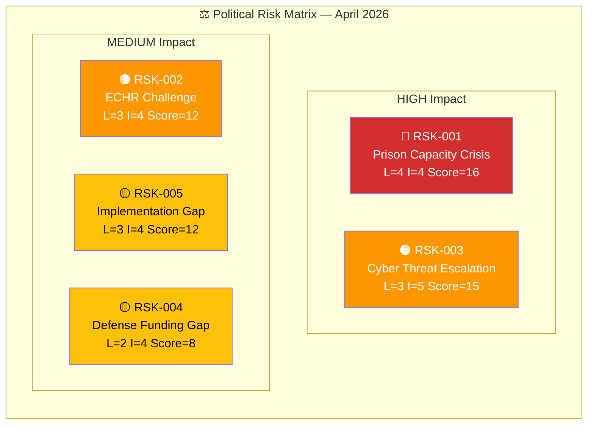

# ⚖️ Political Risk Assessment — 2026-04-05

## 📋 Assessment Context

| Field | Value |
|-------|-------|
| **Assessment ID** | RSK-2026-04-05-001 |
| **Analysis Date** | 2026-04-05 12:15 UTC |
| **Documents Analyzed** | 5 |
| **Produced By** | news-realtime-monitor |
| **Overall Risk Level** | MEDIUM-HIGH |

---

## 📊 Risk Matrix

---

## 🔴 Risk Register

| Risk ID | Description | Likelihood (1-5) | Impact (1-5) | L×I | Source | Mitigation |
|---------|-------------|:-----------------:|:------------:|:---:|--------|-----------|
| RSK-001 | Prison capacity cannot absorb projected inmate growth from new sentencing laws | 4 | 4 | 16 | HD01JuU15 | Emergency supplementary budget for Kriminalvården |
| RSK-002 | ECHR proportionality challenge delays deportation implementation | 3 | 4 | 12 | HD03235 | Proportionality provisions in legislation |
| RSK-003 | State-sponsored cyber operations escalate against Nordic infrastructure | 3 | 5 | 15 | HD03214 | NATO CCDCOE integration and NCSC-SE expansion |
| RSK-004 | Defense and cybersecurity budget allocation falls short | 2 | 4 | 8 | HD03214, HD01FöU12 | Spring budget amendment (VÅP) |
| RSK-005 | Gap between legislation and implementation undermines credibility | 3 | 4 | 12 | HD03235, HD01JuU15 | Communication strategy on phased rollout |

---

## 📈 Risk Trend Summary

| Category | Current Level | Trend | Key Driver |
|----------|:------------:|:-----:|-----------|
| Coalition Stability | LOW | → | SD alignment secure on crime agenda |
| Policy Implementation | HIGH | ↑ | New sentencing laws strain prison system |
| Defense / Security | MEDIUM | ↑ | Geopolitical environment deteriorating |
| Electoral | LOW | → | Government holds initiative on key issues |
| International | MEDIUM | ↑ | ECHR and human rights scrutiny increasing |

**Overall Assessment:** MEDIUM-HIGH — dominant risk is implementation capacity (RSK-001, L×I=16).

---

**Document Control:** Template: risk-assessment.md v2.1 | Classification: Public
