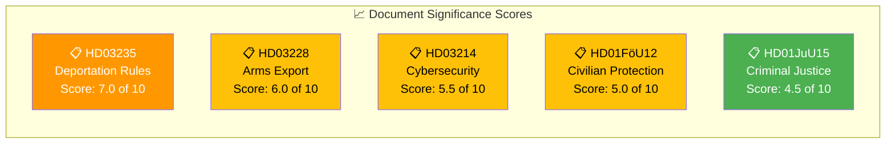

# 📈 Significance Scoring — 2026-04-05

## 📋 Scoring Context

| Field | Value |
|-------|-------|
| **Scoring ID** | SIG-2026-04-05-001 |
| **Analysis Date** | 2026-04-05 12:15 UTC |
| **Documents Scored** | 5 |
| **Produced By** | news-realtime-monitor |

---

## 📊 Significance Scoring Dashboard

---

## 📋 Scoring Details

| Rank | dok_id | Title | Score | Factors | Recommendation |
|:----:|--------|-------|:-----:|---------|----------------|
| 1 | HD03235 | Skärpta regler om utvisning på grund av brott | 7.0 | Criminal justice +2, Migration +2, Named minister +1, Multi-party impact +2 | Priority |
| 2 | HD03228 | Ett modernt och anpassat regelverk för krigsmateriel | 6.0 | Defense/security +2, Budget +2, Named minister +1, NATO +1 | Publish |
| 3 | HD03214 | Lagändringar för stärkt nationellt cybersäkerhetscenter | 5.5 | Defense/security +2, Named minister +1, National security +2 | Publish |
| 4 | HD01FöU12 | Starkare skydd för civilbefolkningen vid höjd beredskap | 5.0 | Defense/security +2, Committee report +1, Budget +2 | Publish |
| 5 | HD01JuU15 | Kriminalvårdsfrågor | 4.5 | Criminal justice +2, Committee report +1, Capacity crisis +1.5 | Monitor |

**Average Significance:** 5.6/10 | **Maximum:** 7.0/10 (HD03235)

---

**Document Control:** Template: significance-scoring.md v2.1 | Classification: Public
