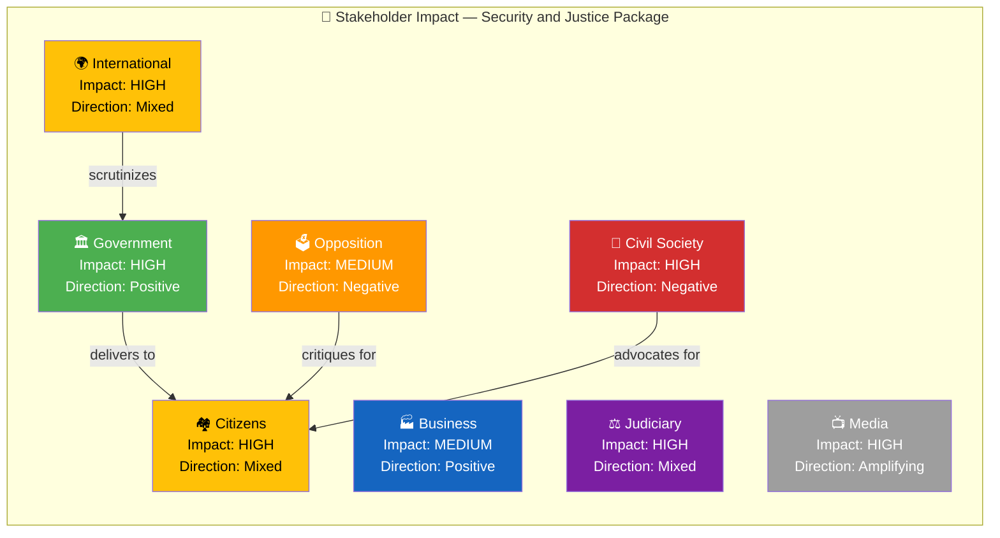

# 👥 Stakeholder Impact Analysis — 2026-04-05

## 📋 Analysis Context

| Field | Value |
|-------|-------|
| **Analysis ID** | STK-2026-04-05-001 |
| **Analysis Date** | 2026-04-05 12:15 UTC |
| **Documents Analyzed** | 5 |
| **Produced By** | news-realtime-monitor |

---

## 📊 Stakeholder Impact Matrix

---

## 📋 Detailed Stakeholder Assessment

| Stakeholder | Impact | Direction | Key Driver | Primary Documents |
|------------|:------:|:---------:|-----------|-------------------|
| 🏘️ Citizens | H | Mixed | Enhanced safety through crime/defense measures vs. rights trade-offs | HD03235, HD01FöU12 |
| 🏛️ Government Coalition | H | Positive | Multi-domain policy delivery strengthens coalition narrative | All 5 documents |
| 🗳️ Opposition (S, V, MP) | M | Negative | Forced into reactive posture; difficult to oppose popular measures | HD03235, HD03228 |
| 🏭 Business/Industry | M | Positive | Defense industry (SAAB, BAE Hägglunds) benefits from export facilitation | HD03228 |
| 🤝 Civil Society | H | Negative | Rights organizations concerned about deportation and detention conditions | HD03235, HD01JuU15 |
| 🌍 International/EU | H | Mixed | NATO integration positive; ECHR scrutiny negative | HD03228, HD03235 |
| ⚖️ Judiciary | H | Mixed | Courts face new proportionality assessments and capacity strain | HD03235, HD01JuU15 |
| 📺 Media/Public Opinion | H | Amplifying | Security agenda dominates media cycle | All 5 documents |

---

## 🎯 Key Stakeholder Dynamics

1. **Government-Citizen axis:** Security package addresses public concerns about crime and preparedness, but deportation rules create civil liberties tension.
2. **Opposition dilemma:** S struggles to oppose popular crime measures without appearing soft; V/MP critique from rights perspective but lack electoral traction.
3. **Defense industry windfall:** HD03228 arms export modernization creates concrete business opportunities for Swedish defense manufacturers in NATO markets.
4. **International scrutiny:** ECHR and Council of Europe will monitor deportation and detention conditions — potential flashpoint within 6-12 months.

---

**Document Control:** Template: stakeholder-perspectives.md v2.1 | Classification: Public
