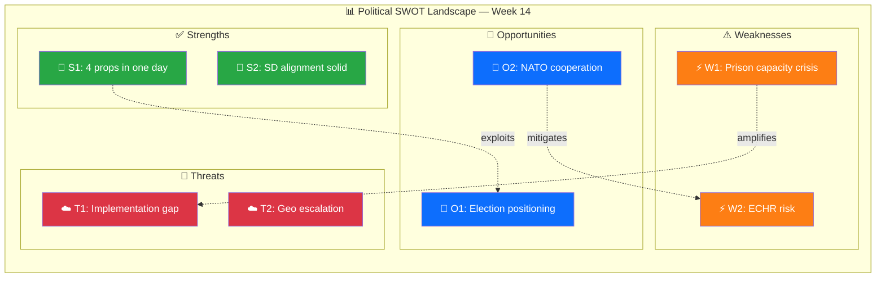

# 💼 Political SWOT Analysis — 2026-04-05

## 📋 SWOT Context

| Field | Value |
|-------|-------|
| **SWOT ID** | SWT-2026-04-05-001 |
| **Analysis Date** | 2026-04-05 12:15 UTC |
| **Analysis Scope** | Government coalition security & justice legislative package |
| **Reference Period** | 2026-W14 (March 31 – April 6) |
| **Produced By** | news-realtime-monitor |
| **Primary MCP Sources** | get_propositioner, get_betankanden, search_dokument, search_voteringar |
| **Validity Window** | Entries valid until 2026-05-05 (30-day decay) |

---

## 🏛️ Section 1: Government Coalition SWOT

### ✅ Strengths — Government Coalition

| # | Strength Statement | Evidence (dok_id) | Confidence | Impact | Entry Date |
|---|-------------------|-------------------|:----------:|:------:|:----------:|
| S1 | Coalition delivers 4 major propositions in one day — Tidö commitment delivery | HD03235, HD03228, HD03214, HD03216 | H | H | 2026-04-01 |
| S2 | SD fully aligned on criminal justice and defense — no visible coalition cracks | HD03235, AU10 voting | H | H | 2026-04-05 |
| S3 | Cross-party defense/cyber consensus enables smooth passage | HD03214, HD03228, HD01FöU12 | H | H | 2026-04-02 |

**Coalition Strength Summary:** Government enters spring 2026 with a coordinated legislative offensive across crime, defense, and security.

### ⚠️ Weaknesses — Government Coalition

| # | Weakness Statement | Evidence (dok_id) | Confidence | Impact | Entry Date |
|---|-------------------|-------------------|:----------:|:------:|:----------:|
| W1 | Prison capacity crisis — system cannot absorb inmate growth from tougher sentencing | HD01JuU15 | H | H | 2026-04-02 |
| W2 | ECHR proportionality risk on stricter deportation rules | HD03235 | M | H | 2026-04-01 |

**Coalition Weakness Summary:** Implementation capacity is the coalition's Achilles heel.

### 🚀 Opportunities — Government Coalition

| # | Opportunity Statement | Evidence (dok_id) | Confidence | Impact | Entry Date |
|---|----------------------|-------------------|:----------:|:------:|:----------:|
| O1 | Security package positions coalition on voters' top priorities ahead of election | HD03235, HD03228, HD03214 | H | H | 2026-04-05 |
| O2 | NATO membership enables defense burden-sharing and cooperation | HD03228, HD03214 | H | H | 2026-04-01 |

**Coalition Opportunity Summary:** Electoral positioning on security is the primary opportunity.

### 🔴 Threats — Government Coalition

| # | Threat Statement | Evidence (dok_id) | Confidence | Impact | Entry Date |
|---|-----------------|-------------------|:----------:|:------:|:----------:|
| T1 | Opposition frames implementation gap as government's core weakness | HD01JuU15, HD03235 | H | H | 2026-04-05 |
| T2 | Geopolitical escalation outpaces civil defense build-up | HD01FöU12, HD03214 | M | H | 2026-04-02 |

**Coalition Threat Summary:** Gap between legislative ambition and implementation capacity is the primary vulnerability.

---

## 📊 SWOT Quadrant Mapping

---

## 🔑 Strategic Implications

The coalition's W1 (prison capacity) intersecting with opposition's narrative opportunity creates a 60-day political risk window. The government's best mitigation is securing VÅP funding for Kriminalvården expansion and cybersecurity investment within 4 weeks.

**Key Watch Items:**
1. Spring budget (VÅP) allocations for Kriminalvården and NCSC-SE
2. SfU hearing on HD03235 deportation rules
3. Kriminalvården Q2 capacity report

---

## 🔄 Cross-SWOT Interference Analysis

| Gov/Opp SWOT Element | Interfering Element | Effect | Net Political Impact |
|:--------------------:|:------------------:|:------:|---------------------|
| Gov W1: Prison crisis | Opp O1: Implementation failure narrative | Amplifies vulnerability | Concrete system strain evidence |
| Gov S1: Legislative output | Opp T1: Media dominance | Suppresses opposition | Government controls news cycle |

---

## 📊 TOWS Strategic Options

| TOWS Cell | Strategy | Specific Action | Evidence |
|:---------:|---------|-----------------|---------|
| **SO** | Use productivity (S1) to exploit election positioning (O1) | Media campaign on Tidö delivery | HD03235, HD03228 |
| **WO** | Use NATO (O2) to address funding gap (W3) | Burden-sharing for NCSC-SE costs | HD03214, HD01FöU12 |
| **ST** | Use SD alignment (S2) to counter implementation critique (T1) | Joint M-SD press on crime timeline | HD03235 |
| **WT** | Minimize prison vulnerability (W1) against gap threat (T1) | Emergency supplementary budget | HD01JuU15 |

---

**Document Control:** Template: swot-analysis.md v2.1 | Classification: Public