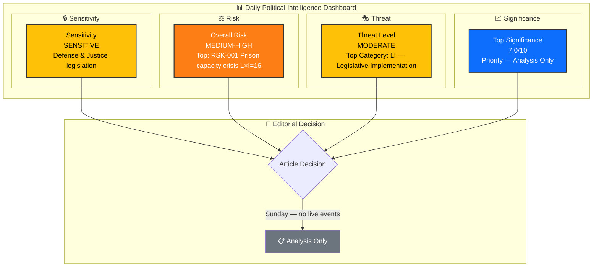
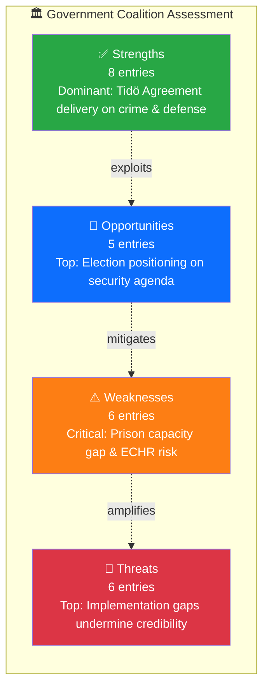

# 🧩 Political Intelligence Synthesis — 2026-04-05

## 📋 Synthesis Context

| Field | Value |
|-------|-------|
| **Synthesis ID** | SYN-2026-04-05-001 |
| **Analysis Date** | 2026-04-05 12:15 UTC |
| **Documents Analyzed** | 5 |
| **Analysis Period** | 2026-04-01 – 2026-04-05 (lookback from Sunday) |
| **Produced By** | news-realtime-monitor |
| **Overall Confidence** | MEDIUM |

---

## 📊 Intelligence Dashboard

---

## 🏆 Top Findings by Significance

| Rank | dok_id | Title | Significance | Risk Tier | SWOT Impact | Recommendation |
|:----:|--------|-------|:-----------:|:---------:|:-----------:|----------------|
| 1 | HD03235 | Skärpta regler om utvisning på grund av brott | 7.0 | 🟠 | S dominant | Priority |
| 2 | HD03228 | Ett modernt och anpassat regelverk för krigsmateriel | 6.0 | 🟡 | O dominant | Publish |
| 3 | HD03214 | Lagändringar för ett stärkt nationellt cybersäkerhetscenter | 5.5 | 🟡 | S dominant | Publish |
| 4 | HD01FöU12 | Ett starkare skydd för civilbefolkningen vid höjd beredskap | 5.0 | 🟡 | S dominant | Publish |
| 5 | HD01JuU15 | Kriminalvårdsfrågor | 4.5 | 🟠 | W dominant | Monitor |

---

## 💪 Aggregated SWOT Summary

### Coalition Balance

| Quadrant | Count | Highest-Impact Entry | Evidence |
|----------|:-----:|---------------------|----------|
| ✅ Strengths | 8 | Coalition delivers Tidö Agreement flagship policies on crime and defense | HD03235, HD03228, HD03214 |
| ⚠️ Weaknesses | 6 | Prison capacity crisis cannot absorb new sentencing regime | HD01JuU15 |
| 🚀 Opportunities | 5 | Comprehensive security/justice package positions for 2026 election | HD03235, HD01FöU12 |
| 🔴 Threats | 6 | Implementation gaps risk credibility — deportation & prison capacity | HD03235, HD01JuU15 |

**SWOT Balance Assessment:** The coalition demonstrates strong legislative productivity with 4 major propositions and 2 committee reports in a single week on defense and criminal justice — its core agenda. However, implementation capacity (prison overcrowding, Migration Agency backlog) presents the dominant vulnerability that opposition can exploit.

---

## ⚖️ Risk Landscape Summary

| Risk Category | Score Range | Highest Risk | Trend |
|--------------|:----------:|-------------|:-----:|
| Coalition Stability | 4–8 | SD alignment secure on crime agenda | → |
| Policy Implementation | 12–16 | Prison capacity crisis under new sentencing (JuU15) | ↑ |
| Budget / Fiscal | 8–12 | Defense & cybersecurity investment gap | ↑ |
| Electoral | 4–6 | Opposition struggling to counter security narrative | → |
| Democratic Process | 6–12 | ECHR proportionality challenges to deportation rules | ↑ |
| External / International | 10–15 | Cyber threat escalation against Nordic infrastructure | ↑ |

**Overall Risk Level:** MEDIUM-HIGH

---

## 👥 Stakeholder Impact Overview

| Stakeholder | Impact | Direction | Key Driver |
|------------|:------:|:---------:|-----------|
| 🏘️ Citizens | H | Mixed | Enhanced security vs. rights trade-offs |
| 🏛️ Government | H | Positive | Multi-domain policy delivery |
| 🗳️ Opposition | M | Negative | Forced into reactive posture on security |
| 🏭 Business | M | Positive | Defense industry benefits from HD03228 |
| 🤝 Civil Society | H | Negative | Rights concerns on deportation & detention |
| 🌍 International | H | Mixed | NATO integration positive; rights scrutiny negative |

---

## 🎯 Narrative Direction

The Kristersson government has launched a comprehensive security and criminal justice legislative offensive in early April 2026 — tabling 4 major propositions on deportation, arms exports, cybersecurity, and food preparedness within a single day (April 1), followed by 2 committee reports on civilian protection and criminal justice (April 2). This represents a coordinated pre-election positioning strategy on the coalition's strongest issue domains. The central tension: can the government deliver on implementation (prison capacity, deportation enforcement, cybersecurity funding) before the 2026 election, or will the gap between legislation and reality become the opposition's primary attack vector?

**Primary Narrative Angle:** Government launches 6-bill security blitz — implementation capacity is the decisive variable.
**Secondary Angles:** NATO integration accelerates through arms export and cyber defense reforms; Criminal justice system faces capacity crisis as tougher laws pile pressure.
**Confidence:** MEDIUM

---

## 🔮 Forward Indicators

| # | Indicator | Timeline | Source | Priority |
|---|-----------|----------|--------|:--------:|
| 1 | Riksdag chamber votes on FöU12, JuU15 | 1-2 weeks | Riksdag calendar | 🔴 |
| 2 | Spring budget amendment (VÅP) defense/justice allocations | 2-4 weeks | Budget process | 🔴 |
| 3 | SfU/UU committee hearings on HD03235, HD03228 | 2-4 weeks | Committee schedules | 🟠 |
| 4 | Kriminalvården capacity crisis report Q2 2026 | 4-8 weeks | Agency publication | 🟠 |

---

## 📋 Analysis Artifacts Inventory

| File | Status | Key Output |
|------|:------:|-----------|
| `classification-results.md` | ✅ | Dominant domains: Criminal Justice, Defense & Security |
| `risk-assessment.md` | ✅ | Overall risk: MEDIUM-HIGH (prison capacity L×I=16) |
| `swot-analysis.md` | ✅ | Coalition strengths outweigh weaknesses; implementation is key vulnerability |
| `threat-analysis.md` | ✅ | Moderate — legislative implementation and capacity gaps |
| `stakeholder-perspectives.md` | ✅ | Citizens most impacted; civil society most negative |
| `significance-scoring.md` | ✅ | Top significance: 7.0/10 (HD03235 deportation rules) |
| Per-file analyses | 5 created | HD03235, HD03228, HD03214, HD01FöU12, HD01JuU15 |

---

## 📂 MCP Data Files Used

| # | Data Source | File / Tool Path | Retrieved |
|---|-----------|-----------------|-----------|
| 1 | riksdag-regering-mcp | get_propositioner(rm="2025/26", limit=20) | 2026-04-05 12:13 UTC |
| 2 | riksdag-regering-mcp | get_betankanden(rm="2025/26", limit=20) | 2026-04-05 12:13 UTC |
| 3 | riksdag-regering-mcp | search_dokument(from_date="2026-04-04", to_date="2026-04-05") | 2026-04-05 12:13 UTC |
| 4 | riksdag-regering-mcp | search_voteringar(rm="2025/26", limit=20) | 2026-04-05 12:13 UTC |
| 5 | riksdag-regering-mcp | search_anforanden(rm="2025/26", limit=20) | 2026-04-05 12:13 UTC |
| 6 | riksdag-regering-mcp | search_regering(dateFrom="2026-04-04", dateTo="2026-04-05") | 2026-04-05 12:13 UTC |
| 7 | riksdag-regering-mcp | get_dokument(HD03235, HD03228, HD03214, HD01FöU12, HD01JuU15) | 2026-04-05 12:13 UTC |

---

**Document Control:** Template: synthesis-summary.md v2.1 | Classification: Public