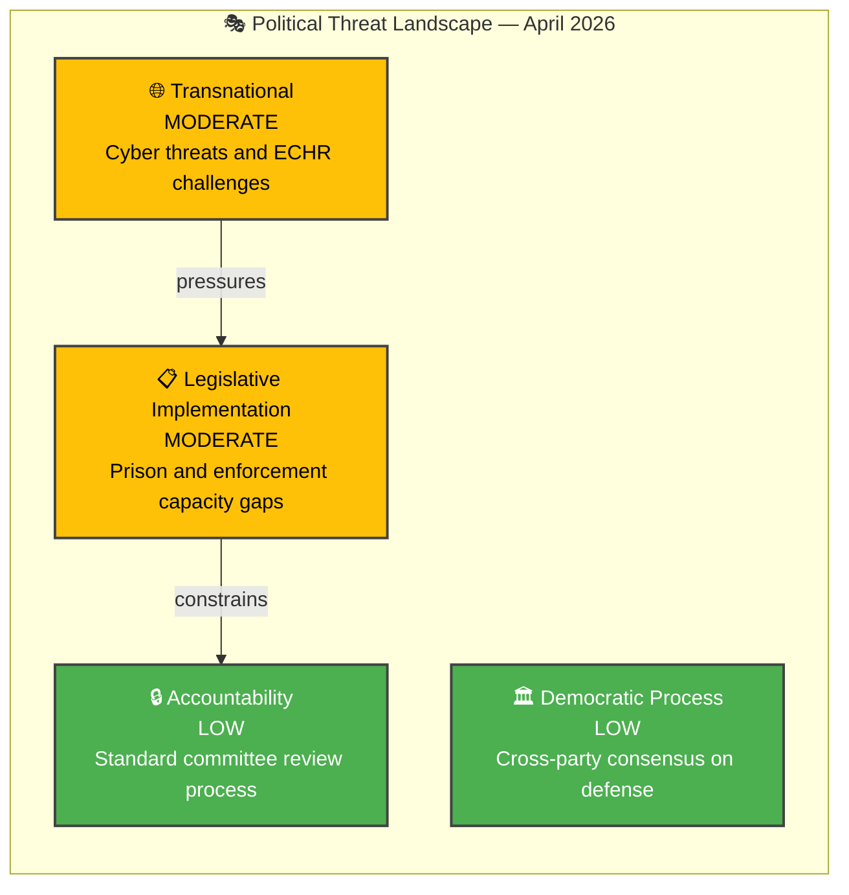

# 🎭 Political Threat Analysis — 2026-04-05

## 📋 Threat Context

| Field | Value |
|-------|-------|
| **Analysis ID** | THR-2026-04-05-001 |
| **Analysis Date** | 2026-04-05 12:15 UTC |
| **Documents Analyzed** | 5 |
| **Produced By** | news-realtime-monitor |
| **Overall Threat Level** | MODERATE |

---

## 📊 Threat Landscape

---

## 🔍 Threat Categories (STRIDE-Political)

| Category | Threat Level | Key Finding |
|----------|:------------:|-------------|
| S — Spoofing (Narrative manipulation) | LOW | No significant disinformation campaigns detected |
| T — Tampering (Legislative process) | LOW | Committee process functioning normally |
| R — Repudiation (Accountability evasion) | LOW | Government transparent on legislative agenda |
| I — Disclosure (Sensitive information) | MODERATE | Defense propositions touch classified capabilities (HD03214, HD03228) |
| D — Denial (Implementation failure) | MODERATE | Prison capacity (HD01JuU15) and enforcement gaps (HD03235) threaten delivery |
| E — Elevation (Power concentration) | LOW | Cross-party consensus prevents excessive executive authority |

**Overall Threat Level:** MODERATE — driven by implementation capacity constraints (D) and defense sensitivity (I).

---

## 🔮 Threat Forward Indicators

| # | Threat Indicator | Timeline | Monitoring Source |
|---|-----------------|----------|-------------------|
| 1 | Kriminalvården capacity alerts or emergency measures | 1-4 weeks | Agency reports |
| 2 | ECHR preliminary assessment of HD03235 provisions | 2-6 months | ECHR communications |
| 3 | State-sponsored cyber incidents targeting Swedish infrastructure | Ongoing | NCSC-SE bulletins |

---

**Document Control:** Template: threat-analysis.md v2.1 | Classification: Public
